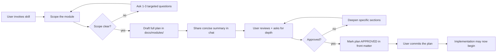

# Module Plan — Granular Per-Module Planning for Octave

> Octave is built one small, fully-understood, self-contained module at a time. Every module is planned to the metal *before* code. The user (and any AI driving Octave through MCP) must understand every nook and corner before approving. **No code ships without an approved plan.**

## 0. Inherits

This skill **inherits the doc-to-dashboard-md skill conventions** for output. Before producing a plan:

1. If `doc-to-dashboard-md` skill instructions are not already loaded in this session, invoke it once via `Skill(doc-to-dashboard-md)`.
2. Then follow the workflow below.

The output document MUST satisfy doc-to-dashboard-md's checklist (front matter, Mermaid for diagrams, KaTeX for math, callouts, sortable tables, glossary, footnotes, no raw HTML, no parens in quadrant labels, no semicolons in sequence-diagram notes).

## 1. When to invoke

Invoke this skill when:

- The user types `/module-plan` or `/module-plan <module-name>`.
- The user says "plan the X module", "let's design X", "I want to understand X before we build it", or anything similar.
- About to write production code for a piece of Octave that does not yet have an approved plan in `docs/modules/`.
- The user asks for a deep dive on one specific subsystem (record audio, MIDI engine, pitch detector, mastering chain, MCP tool, etc.).

**Do NOT invoke this skill when:**

- The user is asking a quick question (use a short answer).
- The user is editing the high-level vision (`PLAN.md` is the right place; this skill is for *modules*, not the whole product).
- The work is documentation, refactoring, bug-fix, or a one-line change.

## 2. Core principles

> [!IMPORTANT]
> The user wants to spend most of the time *understanding* before *implementing*. Do not rush past depth. Do not hand-wave. Do not paraphrase a textbook — show the actual mechanism.

1. **One module per plan.** A module is a single, bounded responsibility. *"Record audio"* is one module. *"Audio engine"* is too broad — it's a layer composed of many modules.
2. **Self-contained.** Every module must articulate its interface boundary. No leaking internals across modules. The plan must explicitly list what is in-scope and what is out-of-scope.
3. **Hardware to API.** Every plan walks the stack from the metal up: physical hardware → driver / kernel → OS abstraction → engine → DSP / algorithm → API → MCP → UI (if any).
4. **Algorithms over hand-waving.** If the module does any non-trivial computation, name the actual algorithm. Cite a paper / standard / reference implementation. Show the math (KaTeX). Discuss alternatives considered.
5. **Performance budgets are concrete numbers.** Latency in samples and ms. Memory in bytes. CPU as % of one core at a stated buffer size and sample rate. No "fast" / "low-latency" without a number.
6. **Real-time discipline.** If the module touches the audio thread, the plan must list which operations are RT-safe and which are not, and where the boundary is enforced.
7. **API-first, MCP-exposed.** Every public operation has a typed API. Every typed API has an MCP tool. State both surfaces in the plan.
8. **Failure modes are first-class.** What hardware can vanish, what buffers can underrun, what formats can be malformed — and what we do about each. Hopeful designs do not ship.
9. **Verify, don't memorize.** When the plan references a real library, standard, or platform API, verify the current spec via Context7 / official docs / live system inspection. Training data on audio APIs and DSP libraries is often outdated.

## 3. Workflow



### Step 1 — Scope the module

If the user gave a name, restate it back. If not, ask. Then confirm:

- The one-line responsibility (what this module does, not what it doesn't).
- The bounding box (in-scope / out-of-scope, with at least 3 explicit "out-of-scope" items).
- Which Octave Phase from `PLAN.md` this module belongs to.
- Upstream dependencies (other modules this consumes) and downstream consumers (other modules that consume this).

Don't draft until the scope is acknowledged. If unclear, ask up to 3 targeted questions in one message — never a wall.

### Step 2 — Draft the plan

Write the full plan to `docs/modules/<slug>.md`. Slug is `kebab-case-of-module-name`. Examples: `record-audio.md`, `polyphonic-pitch-correction.md`, `prompt-to-music-mvp.md`.

Use **all** required sections from §4 below, in that order. Sections that legitimately don't apply may be marked *N/A — <one-line reason>* but must still appear so future readers can see they were considered.

### Step 3 — Share a chat summary

After writing the file, post a concise (≤300 word) summary to the chat: what the module does, the most interesting design decision, the biggest open question. Link the file. Do not re-paste the plan.

### Step 4 — Iterate

The user will review and ask for depth on specific sections. Edit the file in place, not by appending. After each iteration, re-post a 2-3 sentence summary of *what changed*.

### Step 5 — Approval gate

A plan is approved only when the user explicitly says so ("approved", "ship it", "let's code", or similar). When approved:

1. Update the front matter `status: approved` and add `approvedDate: YYYY-MM-DD`.
2. Tell the user the plan is approved and code may now follow.
3. Do **not** start implementing in the same turn. Let the user commit and re-invoke for code.

> [!WARNING]
> No code is written for a module until its plan in `docs/modules/<slug>.md` carries `status: approved`. The skill enforces this; if you find yourself wanting to skip ahead, stop.

## 4. Required sections of every module plan

Every plan in `docs/modules/<slug>.md` follows this structure. Section names should match (so the doc-to-dashboard TOC is consistent across plans).

### Front matter (required)

```yaml
---
title: "Module: <Human Readable Name>"
description: "One-sentence mission of this module."
tags: ["module", "<phase>", "<area>", ...]
slug: "<kebab-case-slug>"
phase: "Phase N — <name from PLAN.md>"
status: "draft" # draft | reviewing | approved | implemented | deprecated
version: "0.1"
upstream: ["<other-module-slug>", ...]
downstream: ["<other-module-slug>", ...]
---
```

### 1. Mission

One paragraph. What this module *is*. What it is *not*. Whose problem (which `PLAN.md` persona) it serves.

### 2. Boundaries

> [!IMPORTANT]
> A module that doesn't know what it isn't will leak.

| In scope | Out of scope |
|---|---|
| ... | ... |

Explicit list. At least 3 items each.

### 3. Stack walk (hardware → API)

A Mermaid `flowchart TB` showing the layered stack this module participates in, then a per-layer breakdown:

- **Hardware layer.** What physical device, if any. What it electrically / acoustically does. What its capabilities and limits are (e.g., Focusrite Scarlett 2i2 — 24-bit / 192 kHz, 2 in / 2 out, USB 2.0, ~3 ms round-trip at 64-sample buffer).
- **Driver / kernel layer.** ALSA / JACK / PipeWire (Linux), Core Audio (macOS), WASAPI / ASIO (Windows). Which API call enters the kernel, what blocks, what's RT-safe.
- **OS / platform abstraction.** What our cross-platform shim looks like, where conditional compilation lives.
- **Engine layer.** Buffers, ring queues, threading model, lock-free constructs.
- **DSP / algorithm layer.** What's computed and how (algorithm name + paper/spec reference).
- **Session / app layer.** How this module appears in the project graph.
- **API layer.** Public, typed surface.
- **MCP layer.** Tool definitions exposed to AI agents.
- **UI layer (if any).** What the user sees, in Simple Mode and Studio Mode.

### 4. Data model & formats

Tables, not prose, where possible.

- Sample formats supported (int16, int24-packed, int24-aligned, float32, float64).
- Sample rates supported (44.1k → 384k).
- Channel layouts (mono, stereo, multi-channel).
- File / wire / memory formats with byte layouts where relevant.
- Persisted representation (how this module's state lives in the project file).
- Schemas (typed, with field documentation).

### 5. Algorithms & math

For every non-trivial computation:

- Algorithm name.
- Citation (paper / standard / reference implementation) as a footnote.
- Pseudocode or block diagram.
- Math (display-mode KaTeX `$$…$$` for equations).
- Alternatives considered, and why they were rejected.
- Numerical considerations (precision, denormals, NaN/Inf handling).

### 6. Performance & budgets

> [!WARNING]
> "Fast" is not a number. Every claim here is concrete.

| Metric | Budget | Measured at |
|---|---:|---|
| Worst-case latency (RT path) | ≤ X µs | 48 kHz, 64-sample buffer |
| Allocation count on RT path | 0 | per buffer |
| Steady-state CPU | ≤ X % of one core | 96-track session |
| Peak memory | ≤ X MB | typical session |
| Cold-start time | ≤ X ms | first call after init |

Define benchmark scenarios concretely. Reference the global quality bar in `PLAN.md` §9.

### 7. Concurrency & threading model

- Threads involved (audio thread, GUI thread, worker pool).
- What runs on each.
- Synchronization primitives (lock-free ring buffers, atomics, RCU, message queues — be specific).
- The RT/non-RT boundary and how it is enforced (e.g., audio thread never holds a mutex, never allocates, never calls system services that block).
- Cancellation / shutdown semantics.

### 8. Failure modes & recovery

For each: cause → detection → user-visible behavior → automatic recovery → manual recovery.

| Failure | Cause | Detect | Recover |
|---|---|---|---|
| Hardware unplug | USB removal | I/O callback returns error | Pause transport, surface toast, auto-reconnect on hot-plug |
| Buffer underrun | CPU spike, blocked thread | xrun count from driver | Increase buffer size suggestion, log under-run |
| Format mismatch | User asks for unsupported rate | Pre-flight check | Hard-fail with actionable error |

### 9. API surface

Public, typed, documented. Use the project's chosen language conventions; prefer pseudocode-typed signatures for now if no language is fixed yet.

For each operation:

- Name.
- Type signature.
- Pre / post conditions.
- Error variants.
- Stability tier (`stable` / `experimental` / `internal`).
- Example call.

### 10. MCP exposure

Every public API operation that is user-meaningful must have an MCP tool. List each:

| MCP tool name | Maps to API | Args (typed) | Returns | Notes |
|---|---|---|---|---|

Address auth / sandboxing if the operation is destructive (deletes data, sends network, etc.).

### 11. UI surface (if applicable)

- Simple Mode behavior (one-prompt amateurs).
- Studio Mode behavior (full controls).
- States and transitions (Mermaid `stateDiagram-v2` if non-trivial).
- Keyboard shortcuts and command-palette commands.
- Accessibility considerations.

### 12. Test strategy

- Unit tests — what's covered.
- Integration tests — module + neighbors.
- Audio quality tests — THD+N, IMD, dynamic range, frequency response, phase, latency. State pass thresholds.
- Performance benchmarks — what's measured, regression policy.
- Property tests / fuzzing — for parsers, format handlers.
- Manual / human-ear tests — what a human must verify (and how).

### 13. Open questions

Numbered list. Each item: what's unknown, why it matters, how we'll resolve it. **A plan with zero open questions is suspicious — depth produces questions.**

### 14. Acceptance criteria

Task-list of what "done" looks like. Both functional ("records 8 channels at 96 kHz with 0 dropouts for 1 hour") and non-functional ("API documented, MCP tool live, test coverage ≥ 90%").

### 15. References

Footnotes for every paper, standard, and library cited. Use the doc-to-dashboard footnote syntax.

## 5. Anti-patterns to refuse

> [!WARNING]
> If you catch yourself doing any of these, stop and add depth.

- **Buzzword shopping.** *"We use a high-quality, low-latency, modern algorithm"* tells the reader nothing.
- **Marketing prose.** Plans are engineering documents, not pitch decks.
- **Borrowing without verifying.** Don't write API signatures from training memory — confirm against current docs.
- **Skipping failure modes** because the happy path was satisfying to design.
- **Letting modules grow.** If the plan exceeds ~1500 lines, the module is too big — split it.
- **Ambiguous numbers.** *"Low-latency"*, *"small memory footprint"*, *"high-quality"* without numbers.
- **No diagrams.** A plan without at least one Mermaid diagram of the data flow or stack walk is not yet a plan.
- **Implementing before approval.** The plan exists *so the user can understand and approve*. Skipping the gate violates the whole skill.

## 6. Output location & naming

- Plan files: `docs/modules/<kebab-slug>.md` — one file per module.
- Slug rules: lowercase, kebab-case, no leading numbers (numbering goes in the front matter `phase` field, not the filename).
- Cross-references between modules: relative markdown links (e.g., `[record-audio](./record-audio.md)`).
- Each plan is self-contained; do not depend on prose elsewhere being read first.

## 7. Tone

- Direct, technical, complete.
- Mention real constraints (USB-2 bandwidth, ALSA period sizes, IEEE-754 denormals) by name.
- When citing external work, footnote with the canonical title and a stable reference.
- When the user asks "why X not Y", answer with both costs and benefits, not advocacy.

## 8. Glossary (skill-internal)

**Module**: A bounded unit of Octave functionality with a single responsibility, a typed API, an MCP exposure, and a self-contained plan.

**RT path**: The audio-thread code path that must complete in well under one buffer period, never allocate, and never block.

**Approval gate**: The point at which a plan's front matter `status` is set to `approved` and only then may implementation begin.

**Stack walk**: A top-down narrative across all the layers a module touches — hardware → driver → OS → engine → DSP → API → MCP → UI.
