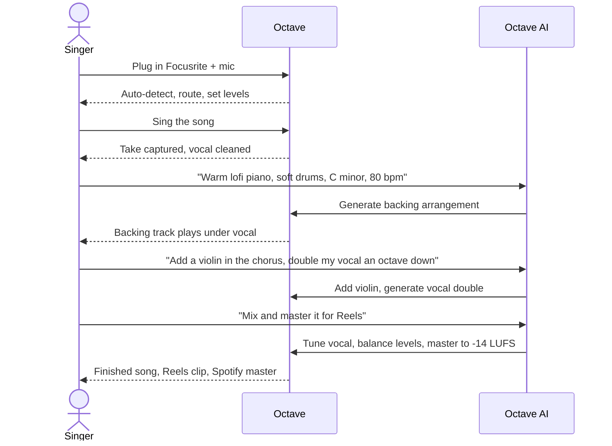
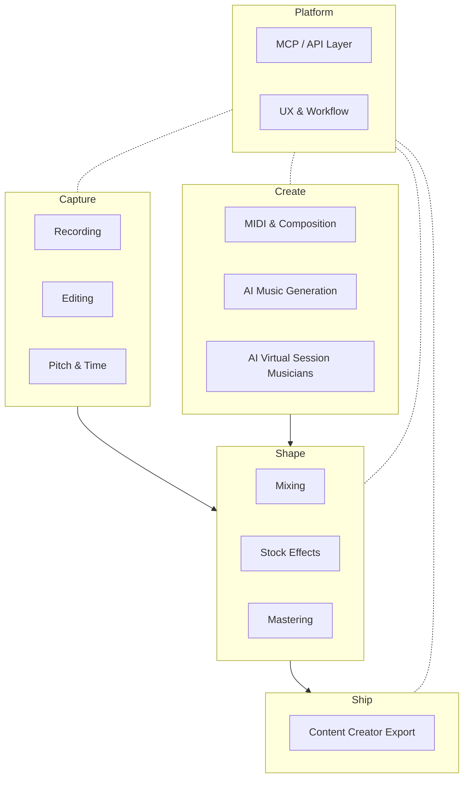
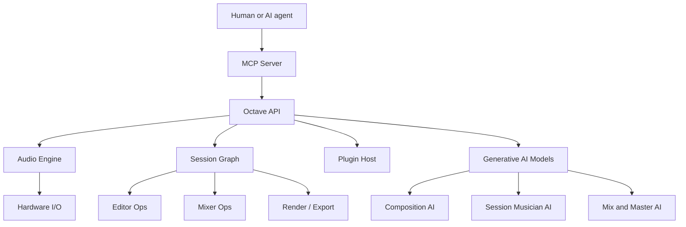
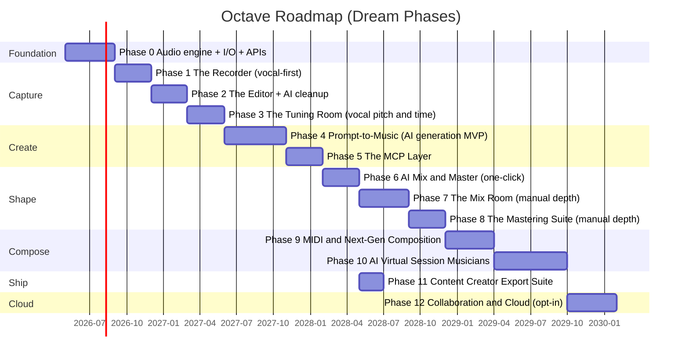

# Octave — Vision & Goal Chart

> [!IMPORTANT]
> Octave is a free, open, AI-native music studio. Our audience is **not** the established pro — it is the talented amateur with a real voice, a small mic, and a dream they can't afford to fund. Solo artist in. Full song out. No studio. No band. No bill.

*"Sing the song. Octave plays the orchestra."*

## 1. The Mission

Build the best software in the world for making music — and **give it away**.

We exist for the people who can sing, but can't pay a producer. Who hear an arrangement in their head, but can't hire a band. Who have a song to share on Instagram or TikTok or YouTube, but no studio to record it in. Who have a passion and a dream, but not a paycheck.

Octave's mission: **let one person, with one mic and one laptop, make the song they hear in their head — at a quality you'd hear on the radio — for free.**

> [!NOTE]
> **Octave is free and public.** Forever. This is not a freemium product or a free tier. The full studio — recording, editing, pitch correction, mixing, mastering, AI music generation, AI virtual session musicians — is free for everyone, end to end.

## 2. North Star

A solo singer:

1. Plugs in their cheap mic and Focusrite interface.
2. Sings a song.
3. Tells Octave what backing they want — *"warm lofi piano with soft drums, slow and dreamy, in C minor."*
4. Octave generates the music.
5. Asks Octave to add a violin in the chorus, swap drums for a finger snap, double the vocal an octave below.
6. Asks Octave to mix and master it for Instagram Reels.
7. Exports a Reels-ready clip and a Spotify-ready master.

End to end: under 30 minutes. No engineering knowledge required. No paid plugins. No subscriptions. No upload to a cloud they don't trust.

## 3. Who We Serve

> [!TIP]
> Naming the audience is a design tool. Every feature is judged by *"does this help our singer-on-a-laptop?"*

| Persona | Reality | What Octave gives them |
|---|---|---|
| **The bedroom singer** | Has a beautiful voice, a USB mic, and no money | Studio-quality vocals + AI band |
| **The content creator** | Posts to Reels / TikTok / Shorts daily, needs original audio fast | Prompt → finished track in minutes, platform-ready exports |
| **The pianist with no band** | Plays well, dreams of a string quartet behind them | AI session musicians who play along live |
| **The hobby songwriter** | Writes lyrics and melodies on guitar, can't notate or arrange | Hum the parts, AI fills in the rest |
| **The non-engineer** | Doesn't know what compression is, doesn't want to learn | One prompt: *"mix and master this for Spotify"* |
| *(later)* The pro | Can already do all this — wants the AI as a collaborator | Same studio, deeper controls, MCP scripting |

We start with the first five. Pros come later — once Octave is undeniably good, they'll come asking.

## 4. The Singer's Journey — The Killer Flow



This is the flow we are building toward. Everything else exists to serve this loop.

## 5. Competitive Map

We benchmark against two camps: the **pro DAWs** (whose audio quality bar we must match) and the **free / AI tools** (whose accessibility we must beat).

| Camp | Tool | What we steal | Where we beat them |
|---|---|---|---|
| Pro DAW | Pro Tools | Recording workflow, comping | Free, AI-native, no learning curve |
| Pro DAW | Logic Pro | UI polish, stock plugins | Cross-platform, free, generative AI |
| Pro DAW | Ableton Live | Session/clip view, performance | Solo-artist focus, prompt-to-music |
| Pro DAW | FL Studio | Pattern composition, beat-making | AI fills in the parts you can't play |
| Pro DAW | Reaper | Scripting, lightness | Open API + MCP first-class |
| Pitch / tune | Melodyne, Auto-Tune | Polyphonic pitch quality | Built in, free, AI-driven |
| Mastering | iZotope Ozone, LANDR | Loudness, intelligent assistants | Built in, free, conversational |
| Free / casual | GarageBand | Approachable UI | Cross-platform, AI generation, modern stack |
| Free / casual | BandLab, Soundtrap | Browser-based collaboration | Local-first, no account required |
| AI generation | Suno, Udio | Prompt-to-music quality | You bring the vocal, AI builds around YOU |
| AI mastering | LANDR, CloudBounce | One-click mastering | In-app, transparent, tweakable |

> [!NOTE]
> Suno and Udio generate songs *for* you. Octave generates a song *with* you — your voice stays at the center.

## 6. Guiding Principles

```mindmap
root((Octave))
  Free and public
    Open source
    No paywalls ever
    No accounts required
    Local-first
  AI-native
    Prompt to music
    Conversational engineering
    Virtual session musicians
    AI mix and master
  API-first
    UI is a client
    Typed and documented
    MCP-ready from day one
  Pro audio quality
    32-bit float
    Sample-accurate automation
    PDC across the graph
    LUFS and true-peak metering
  Solo artist friendly
    One mic is enough
    No band required
    No engineer required
    Sixty seconds to first take
  Cheap mic compensation
    Smart de-noise
    De-room
    Tone shaping
    Harmonic enhancement
  Non-destructive
    Reversible edits
    Branching history
    Region-based effects
  Hardware respect
    Focusrite day one
    Class-compliant USB
    Linux audio stack first
  Open formats
    WAV FLAC AIFF
    AAC MP3 Opus
    AAF OMF interchange
  Plugin friendly
    VST3 CLAP LV2
    AU on macOS
    AAX long-term
  Cross-platform
    Linux first
    macOS second
    Windows third
```

## 7. The Feature Pillars



### Pillar 1 — Recording

> [!TIP]
> *"Capture every nuance."*

- Multi-track simultaneous recording (limited only by the interface)
- Loop / punch-in / punch-out recording
- Take folders & comping (record 20 takes, build the perfect one)
- Pre-roll / count-in / metronome with subdivisions and accents
- Low-latency monitoring (direct hardware + plugin monitoring)
- Headphone cue mixes
- Tempo / time-signature map detected from a recorded performance
- Plugin Delay Compensation across the entire graph
- Recording pre-buffer — keep the last 10s always, recover "the take before you hit record"
- **Auto-setup for solo singers** — plug in, Octave names the input, sets the gain, arms the track, ready in seconds

### Pillar 2 — Editing

> [!TIP]
> *"Surgical, fast, reversible — and mostly automatic."*

- Sample-accurate waveform editor with zoom-to-sample
- Slip / slide / split / heal / crossfade
- Strip silence / gate-based silencing
- Quantize audio to grid via transient detection
- Beat detection, warping, elastic audio
- Spectral editing — paint out hum, breaths, clicks visually
- Click / pop / mouth-noise removal (one-click for amateurs, manual for pros)
- Phase alignment between tracks
- Unlimited undo with branching history
- **AI cleanup** — *"clean up the breaths and remove the chair squeak at 0:42"*

### Pillar 3 — Pitch & Time

> [!TIP]
> *"Make the voice sound like the singer's best day."*

- Monophonic pitch correction (real-time and offline)
- Polyphonic pitch correction — Melodyne DNA-style
- Manual note-by-note pitch / timing / formant editing
- Vibrato shaping, scoop reduction, attack timing
- Scale-aware tuning (major / minor / modes / microtonal / custom)
- Pitch quantize strength (natural → robotic)
- Time stretching (élastique[^elastique], rubberband, formant-preserving)
- Harmony generation from a melody
- Vocal doubler / thickener
- Speech-to-MIDI — sing a melody → MIDI notes
- **AI natural tuning** — listens to the song's key, tunes the vocal so it never sounds processed unless you want it to

### Pillar 4 — Mixing

> [!TIP]
> *"A console you can talk to. Or ignore entirely."*

- Unlimited tracks, buses, sends
- Pre / post fader sends, sidechain on every plugin
- Channel strip per track (gate, EQ, compressor, saturator)
- VCA / DCA groups
- Surround / Atmos for stretch use cases
- Sample-accurate automation, automation lanes, snapshots
- Three views: Mixer, Arrangement, Session/Clip
- A/B comparison on any plugin or the whole mix
- Reference-track import & loudness-matched comparison
- **AI mix assistant** — *"mix this for vocal-forward Reels"* → balanced, ducked backing, vocal upfront

### Pillar 5 — Stock Effects

> [!TIP]
> *"You shouldn't need to buy anything to make a record."*

| Category | Stock plugins |
|---|---|
| Dynamics | Compressor (FET / Opto / VCA / Vari-Mu), multiband, limiter, gate, expander, transient shaper, de-esser, vocal rider |
| EQ | Parametric (linear / minimum-phase, dynamic), graphic, match EQ, tilt, Pultec-style, console emulations |
| Time-based | Algorithmic reverb (hall, room, plate, spring), convolution reverb, delay (digital, analog, tape, ping-pong, multi-tap), chorus, flanger, phaser, tremolo, vibrato |
| Saturation | Tape, tube, transformer, bit crusher, sample-rate reducer, distortion, fuzz, amp simulation, exciter |
| Spatial | Stereo widener, M/S processor, auto-pan, surround panner, imager, phase scope |
| Cleanup | De-noise, de-reverb, de-room, de-bleed, de-click, de-mouth, de-hum |
| Utility | Tuner, metronome, signal generator, spectrum analyzer, vectorscope, correlation meter, loudness meter |

### Pillar 6 — Mastering

> [!TIP]
> *"From recording to released — in the same project."*

- Mastering chain templates (modern, vintage, broadcast, vinyl, podcast, social)
- Multiband processing
- True peak limiting with oversampling
- Dithering (TPDF, noise-shaping)
- AI-assisted mastering — match a reference, hit a loudness target
- Stem mastering, mid/side mastering
- Codec preview — hear MP3 / AAC / Opus before committing

| Platform | Loudness target |
|---|---:|
| Instagram Reels / Stories | -14 LUFS |
| TikTok | -14 LUFS |
| YouTube / Shorts | -14 LUFS |
| Spotify | -14 LUFS |
| Apple Music | -16 LUFS |
| Tidal | -14 LUFS |
| Broadcast (EBU R128) | -23 LUFS |
| CD / DDP | -9 to -12 LUFS |

### Pillar 7 — MIDI & Next-Gen Composition

> [!IMPORTANT]
> MIDI is *elevated* in Octave. We aim past Logic, Cubase, and FL Studio. Composition surface is where the user-AI collaboration lives.

**Foundations (table-stakes for any DAW):**

- Piano roll, step sequencer, drum grid, score view
- MPE support, polyphonic aftertouch
- Stock instruments: sampler, drum machine, synth (subtractive / FM / wavetable), piano, strings, brass, woodwinds
- Arpeggiator, chord generator, scale lock
- MIDI effects: humanize, quantize, transpose, velocity shaping
- Hardware MIDI (USB + DIN-5)

**Beyond the table-stakes (where we go further):**

- **Hum-to-MIDI** — sing or hum a melody, get a playable MIDI part
- **Voice-to-instrument** — sing a phrase, route it through a violin, a synth, a flute
- **Natural-language note entry** — *"add a syncopated bassline on the I and V chords for 8 bars"*
- **Style transfer on MIDI** — take a melody, *"make it sound like a Hans Zimmer string arrangement"*
- **Timeline-aware AI** — the AI hears what's already in the song and writes parts that fit
- **Constraint-based generation** — key, BPM, time signature, mood, genre, instrumentation, length, energy curve
- **Re-roll and variation** — like a part but want options? Generate 5 alternatives
- **Stem-aware generation** — AI listens to your vocal and writes around it, never on top of it
- **Lyrics-driven composition** — paste lyrics, get a melodic and harmonic suggestion that fits the meter
- **Visual composition surfaces** — chord wheels, scale-aware grids, generative cells, beat probability matrices
- **Adaptive follow** — virtual instruments that follow your tempo / key / dynamics in real time

### Pillar 8 — AI Music Generation (Prompt → Music)

> [!IMPORTANT]
> The killer feature for our audience.

- **Prompt-to-backing-track** — *"warm lofi piano, soft drums, slow and dreamy, C minor"* → full multi-track arrangement
- **Vocal-first generation** — record vocal first, AI builds the band around the actual performance (key, tempo, vibe inferred)
- **Genre, mood, era, and reference styling** — *"Phoebe Bridgers verse, Bon Iver chorus"*
- **Editable output** — every AI-generated part is real MIDI on real tracks; you can edit any note
- **Section-by-section prompting** — different prompts for verse, chorus, bridge
- **Energy curve control** — sketch a waveform of "build / drop / cooldown" and the AI follows it
- **Re-roll any part** — don't like the bass? Regenerate just the bass
- **Constraint locking** — *"keep the drums, regenerate everything else"*
- **Lyric-informed generation** — paste lyrics; arrangement reflects the emotional arc
- **Length awareness** — *"30-second Reels version"* vs *"3:30 single"*

### Pillar 9 — AI Virtual Session Musicians

> [!IMPORTANT]
> The long-term dream. The pianist gets a violinist. The singer gets a band. The bedroom artist gets a full orchestra — and they can *talk* to it.

- **Persistent musician agents** — each has a name, an instrument, a style, a personality
- **Conversational direction** — *"play the bridge softer, more lyrical"*, *"add a fill in bar 12"*, *"less busy in the verse"*
- **Live performance mode** — virtual musicians follow your tempo, key, and dynamics in real time as you play or sing
- **Hire / customize** — pick a jazz upright bassist or a metal slap bassist; they remember preferences
- **Style discussion** — *"I'm thinking something like a Bach counterpoint over my chords"* → musician proposes a part, you refine
- **Inter-musician chat** — your AI violinist can talk to your AI cellist about what they're each playing, and adapt
- **Stage direction** — describe a feel; the ensemble interprets
- **Ensemble mode** — solo pianist + AI string quartet; solo guitarist + AI rhythm section; solo singer + AI band
- **Long-term memory** — the musicians learn your style across songs

### Pillar 10 — MCP / API Layer

> [!IMPORTANT]
> Every UI feature ships with its API. The MCP server exposes that API to any AI agent. This is how Octave stays **future-proof** — a new model gets dropped, and Octave gets smarter overnight.



- MCP server exposing every API — record, edit, mix, master, generate, render
- **Conversational engineering** — *"clean the breaths in verse 2 and add a tape delay on the lead vocal"* → done
- **Voice control during tracking** — hands-free transport, punch-in, take management
- **Scriptable everything** — build your own assistant on top of Octave
- **Bring-your-own-model** — swap the AI provider; the API surface stays the same
- **Public, documented, versioned** — third-party tools can integrate

### Pillar 11 — Content Creator Export

> [!TIP]
> *"From record button to ready-to-post in one click."*

- **One-tap platform exports** — Reels (15s, 30s, 60s, 90s), TikTok (15s, 60s, 3min), Shorts (60s), Stories (15s)
- **Loudness pre-targeted per platform** — never get auto-attenuated
- **Stems for collaboration** — vocals only, instrumental only, individual instrument stems
- **Karaoke / instrumental version** — vocal removed, ready for cover artists
- **BPM-locked clips** — clean loop points for transitions and overlays
- **Embedded metadata** — title, artist, BPM, key, ISRC if needed
- **Direct-publish links** *(stretch)* — Spotify for Artists, DistroKid, SoundCloud, YouTube
- **Auto-generated waveform / lyric video** *(stretch)* — vertical video with bouncing waveform for Reels
- **Project archive** — share the whole session with another Octave user (audio + plugins + AI parts)

### Pillar 12 — UX & Workflow

- Two modes: **Simple Mode** (one prompt, one record button, one export) and **Studio Mode** (everything visible)
- Three views in Studio Mode: Arrangement, Mixer, Session/Clip
- Customizable layout, dockable panels
- Dark mode default, light mode, high-contrast
- Touch / tablet support
- Hardware control surfaces (Mackie HUI, Avid S1, generic MIDI)
- Macros / scripting (also exposed via API)
- Command palette — everything one keystroke away
- **Onboarding for non-engineers** — *"sing into the mic"* is the first instruction, not *"set your buffer size"*

## 8. Hardware Priorities

| Vendor / Standard | Priority | Notes |
|---|---|---|
| Focusrite Scarlett / Clarett / Red | Day-one | User's interface |
| Class-compliant USB audio | Day-one | Covers most cheap interfaces |
| Built-in laptop mic / USB mic | Day-one | The reality for most amateurs |
| ALSA / JACK / PipeWire (Linux) | Day-one | Primary platform |
| Core Audio (macOS) | Phase 2+ | Second platform |
| ASIO (Windows) | Phase 3+ | Third platform |
| Universal Audio, RME, MOTU, PreSonus | Phase 2+ | Pro-tier interfaces |
| MIDI controllers (USB / DIN-5) | Phase 1 | For composition |

> [!NOTE]
> Mic quality is irrelevant. Octave makes a low-cost mic sound as good as it can sound — smart de-noise, de-room, tone shaping, harmonic enhancement, AI restoration, all built in.

## 9. Quality Bar — Non-Negotiable

> [!WARNING]
> Free does not mean cheap. The audio bar is the same as Pro Tools.

- 32-bit float (or 64-bit double) internal processing
- Up to 384 kHz sample rate
- Sample-accurate everything (automation, MIDI, edits)
- Zero glitches / dropouts at a properly-sized buffer
- Plugin Delay Compensation across the whole graph, automatic
- Lossless export — no truncation, no implicit dithering surprises
- Pass independent audio quality tests: THD[^thd], IMD[^imd], dynamic range, latency

The acceptance equation for round-trip latency on a Focusrite at 48 kHz, 64-sample buffer:

$$
L_\text{rt} = \frac{2 \cdot N_\text{buf}}{f_s} + L_\text{io} + L_\text{pdc} \le 10\,\text{ms}
$$

## 10. Roadmap

> [!NOTE]
> Reordered around the singer's killer flow. Vocal in → AI backing → AI mix-master → export is the **MVP**. Pro-grade manual mixing comes after.



## 11. Strategic Quadrant

```quadrantchart
title Music software positioning — Audience reach vs AI-native
x-axis Pros only --> Made for everyone
y-axis Traditional --> AI-native
quadrant-1 Future leaders for everyone
quadrant-2 AI tools for power users
quadrant-3 Legacy pro tools
quadrant-4 Friendly but conventional
Pro Tools: [0.2, 0.15]
Logic Pro: [0.55, 0.2]
Ableton Live: [0.45, 0.25]
Cubase: [0.3, 0.2]
FL Studio: [0.55, 0.25]
Reaper: [0.25, 0.35]
GarageBand: [0.85, 0.2]
BandLab: [0.85, 0.3]
Soundtrap: [0.8, 0.3]
Suno: [0.85, 0.85]
Udio: [0.85, 0.85]
LANDR: [0.7, 0.7]
Octave: [0.92, 0.95]
```

## 12. Stretch Dreams

- Live performance mode (busk with your AI band)
- Video timeline for scoring and music videos
- Auto-generated vertical lyric / waveform video for Reels
- Modular routing (à la Bitwig "The Grid")
- Built-in royalty-free sample library + AI sample search
- Notation / score view for trained composers
- Podcast mode — auto-leveling, transcript-based editing, chapter markers
- Streaming-platform direct publish (Spotify for Artists, DistroKid)
- **Octave Marketplace** — community-shared AI musicians, prompt presets, mastering chains, all free

## 13. Success Metrics

> [!TIP]
> Every checkbox is something a *user* — not a developer — has to be able to do.

- [ ] A bedroom singer with a $30 mic records and ships a Reels-ready song to Instagram in under 30 minutes.
- [ ] A pianist plays alone, asks for a string quartet, and performs live with virtual musicians who follow their dynamics.
- [ ] A solo songwriter hums a melody, prompts a full arrangement, and exports a Spotify-ready master without touching a fader.
- [ ] An AI agent, given a vocal take and a one-line description, produces a finished, mastered song through MCP — zero UI interaction.
- [ ] Audio quality is indistinguishable from Pro Tools / Logic in blind tests.
- [ ] First-time user records their first vocal in under 60 seconds from cold start.
- [ ] Octave runs entirely offline, with no account, no cloud requirement, no fee.
- [ ] The whole codebase is public and the binary is free, on every supported platform.

## 14. What Octave Is *Not*

> [!WARNING]
> Saying no is part of the vision.

- **Not for pros first.** We build for the bedroom singer. Pros are welcome — but they are not the design center.
- **Not paid.** Ever. No freemium. No premium tier. No locked features.
- **Not a closed garden.** Open source, open formats, open APIs, open plugin standards.
- **Not SaaS-only.** Runs fully offline. Cloud is opt-in. Your voice does not leave your machine unless you say so.
- **Not a Suno clone.** Suno generates a song *for* you. Octave generates *with* you — your voice, your performance, stays at the center.
- **Not a toy.** The audio bar is the same as a paid pro DAW.

## Glossary

**API**: Application Programming Interface — the typed, documented surface every Octave operation must expose.

**MCP**: Model Context Protocol — the standard Octave speaks so AI agents can drive every API.

**DAW**: Digital Audio Workstation — Octave's product category.

**PDC**: Plugin Delay Compensation — automatic alignment of tracks after plugins introduce latency.

**LUFS**: Loudness Units relative to Full Scale — the modern broadcast / streaming loudness standard.

**Comping**: Compositing the best moments from multiple takes into one performance.

**Sidechain**: Routing one signal to control a plugin processing another.

**Stem**: A submix of related tracks (drums, vocals, bass) exported as one file.

**M/S**: Mid/Side processing — encoding stereo into mono+sides for independent treatment.

**MPE**: MIDI Polyphonic Expression — per-note pitch, pressure, and timbre control.

**Hum-to-MIDI**: Voice-driven MIDI input — sing or hum a melody and get a playable MIDI part.

**Virtual session musician**: An AI agent embodying a player on an instrument, with style, memory, and conversational direction.

**Prompt-to-music**: Generating a musical part or arrangement from a natural-language description.

**Reels-ready**: An audio export pre-targeted for Instagram Reels — duration, codec, loudness, sample rate.

---

> *"Sing the song. Octave plays the orchestra. Free for all. That's the dream."*
>
> *— And I will be the first user.*

[^elastique]: zplane élastique, a high-quality time-stretch / pitch-shift algorithm widely used in commercial DAWs.
[^thd]: Total Harmonic Distortion — measure of unwanted harmonic content introduced by a signal path.
[^imd]: Intermodulation Distortion — non-harmonic distortion produced when multiple frequencies interact through a non-linear system.
