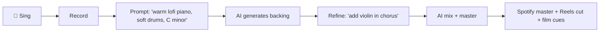

# Octave

> *Sing the song. Octave plays the orchestra.*

**Octave is a free, open, AI-native music studio.** It is being designed for the singers, content creators, bedroom artists, indie filmmakers, and home album-makers who can't afford a real one. Plug in a cheap mic, sing your song, prompt for a backing arrangement, let the AI mix and master it — and ship anything from a 15-second Reels hook to a 4-minute single to a 12-minute short-film score, all from the same project.

> [!IMPORTANT]
> Octave is currently in **Phase 0 — pre-foundation**. There is no code yet, only the vision. The full plan lives in [`PLAN.md`](./PLAN.md).

## Who it's for

Not the established pro. Octave is being built for:

- The bedroom singer with a $30 mic and a real voice
- The Instagram / TikTok / Shorts creator who needs original audio fast
- The home album-maker who wants to ship a real EP to Spotify
- The indie filmmaker scoring a short film without a composer's budget
- The podcaster who needs an intro / outro / bed in the show's voice
- The pianist who dreams of a string quartet behind them
- The songwriter who hums melodies but can't notate or arrange
- The non-engineer who can sing but doesn't know what compression is

> [!IMPORTANT]
> **Octave is not a "short-form" tool.** From a 15-second Reels hook to a 4-minute single to a 12-minute short-film score — Octave produces studio-quality output for *any* listening context. Same engine, same quality bar, every time.

Pros are welcome — but they are not the design center. *Yet.*

## What it will do

End to end, under 30 minutes. No studio. No band. No bill.

## The mission in one line

> **Let one person, with one mic and one laptop, make the song they hear in their head — at a quality you'd hear on the radio — for free.**

## Vision documents

- [**PLAN.md**](./PLAN.md) — the full vision, goals, feature pillars, roadmap, and success metrics
- *(more docs to come as the project takes shape)*

## Status

| Phase | Description | Status |
|---|---|---|
| 0 | Foundation — audio engine, hardware I/O, APIs | 🟡 Pre-foundation, designing |
| 1 | The Recorder (vocal-first) | ⏳ Planned |
| 2 | The Editor + AI cleanup | ⏳ Planned |
| 3 | The Tuning Room | ⏳ Planned |
| 4 | Prompt-to-Music (AI generation MVP) | ⏳ Planned |
| 5 | The MCP Layer | ⏳ Planned |
| 6 | AI Mix and Master (one-click) | ⏳ Planned |
| 7+ | Manual depth, MIDI, Virtual Session Musicians | ⏳ Planned |

See [`PLAN.md`](./PLAN.md) for the full roadmap.

## Principles

- **Free and public, forever.** No freemium. No paywalls. No locked features.
- **AI-native.** Generative music, AI virtual session musicians, AI mix and master are core — not bolt-ons.
- **API-first.** Every UI feature ships with a typed API. The UI is just the first client.
- **Pro audio quality.** 32-bit float internal, sample-accurate automation, plugin delay compensation. Free does not mean cheap.
- **Local-first.** Runs offline. No required account. No required cloud. Your voice doesn't leave your machine unless you say so.
- **Hardware respect.** Focusrite day-one. Linux first, then macOS, then Windows.

## Contributing

The project is in vision phase. Code contribution starts at Phase 0 (foundation). For now, the most valuable contribution is **feedback on the vision** — open an issue with thoughts, missing features, or audience perspectives.

## License

To be decided. Intent: a permissive open-source license consistent with *"free for all, forever."*

---

> *Free for all. That's the dream. — And I will be the first user.*
