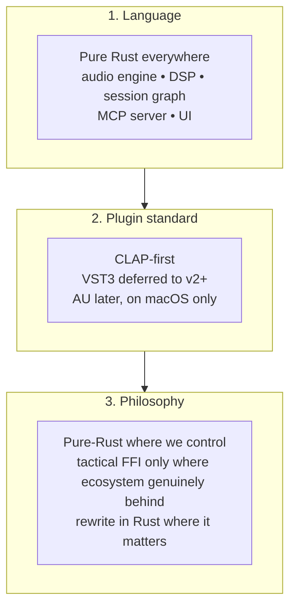

# ADR 0001 — Tech stack: Rust everywhere, CLAP-first plugin standard

> *Free for all. That's the dream. — And I will be the first user.*

> [!IMPORTANT]
> This is a **locked-with-open-questions** ADR. The high-order commitments (language, plugin format, philosophy) are decided. The five Open Questions at the bottom remain to be resolved in follow-up discussions; each one will close out as a child ADR (`0002-*`, `0003-*`, …) or as an amendment here.

## 1. Context

Octave is being built from scratch as a free, AI-native music studio for non-professional singers, bedroom artists, content creators, indie filmmakers, podcasters, and home album-makers. It must hit a **professional audio quality bar** (32-bit float internal, sample-accurate automation, plugin delay compensation, LUFS metering, <10 ms round-trip latency on a Focusrite) while running on cheap mics and modest laptops, and while being **API-first** so an MCP layer can drive every feature.

The first foundational choice — before any module is planned, before any code is written — is **what do we write all this in?** Audio engines have hard real-time constraints; a single allocation or lock on the audio thread causes audible glitches. The choice of language, of plugin standard, and of "pure Rust vs FFI" defines every downstream module's complexity, portability, and ceiling.

This ADR records that choice.

## 2. Decision

### 2.1 The three locked commitments

| # | Commitment | Scope | Rationale (one-line) |
|---|---|---|---|
| 1 | **Backend, DSP, engine, MCP server, UI** are all Rust | Entire codebase | Real-time safety, memory safety, single-language stack, no GC, world-class concurrency primitives |
| 2 | **CLAP-first** plugin format (`clack` host, `clap-sys` ABI). **VST3 deferred** to v2+. AU on macOS only | Plugin hosting + plugin authoring | CLAP is MIT-licensed, modern, Rust-friendly, designed for sample-accurate automation, and aligns with our audience (no legacy plugin libraries) |
| 3 | **Pure Rust where we control the stack.** **Tactical FFI** only where Rust ecosystem is genuinely behind (e.g. ONNX Runtime for AI inference). **Rewrite in Rust** where the missing piece blocks us | All modules | Treat ecosystem gaps as opportunities, not blockers; AI-age means we can rebuild what's missing, only better |

### 2.2 What this means concretely

- **Audio thread**: Pure Rust. No allocs, no locks, no syscalls inside the audio callback. `assert_no_alloc` enforces this in debug builds.
- **DSP**: Pure Rust. SIMD via `std::simd` or `wide`/`pulp`; FFT via `realfft`/`rustfft`; resampling via `rubato`.
- **Plugin host boundary**: CLAP via `clack`. The C-ABI crossing is the *only* sanctioned non-Rust boundary in v1. Plugin GUIs render on whatever toolkit the plugin uses; we host the window.
- **AI inference**: ONNX Runtime via `ort` crate is the *one* heavy FFI dependency we plan for. Long-term we evaluate `candle` (pure-Rust ML inference by HuggingFace) as a replacement when models we care about ship in `candle` format.
- **MCP server**: Pure Rust. Likely `rmcp` or a custom thin server over the typed core API.
- **UI**: Rust-native (decision deferred — see Open Question §6.1).

### 2.3 What this explicitly is NOT

- **Not a polyglot stack.** No Python for "the AI parts," no C++ for "the DSP parts," no Electron for "the UI parts." One language, one toolchain, one mental model.
- **Not a JUCE port.** We are not wrapping the C++ DAW canon. We sit beside it.
- **Not VST3-host-first.** Users coming from Pro Tools / Logic / Ableton with a 200-plugin VST3 library will not be able to load those in v1. This is a deliberate audience choice — see §3.

## 3. Consequences

### 3.1 What this enables

- **Memory safety + real-time safety in one language.** Rust's ownership model + `assert_no_alloc` + lock-free crates (`rtrb`, `ringbuf`) let us prove the audio thread is glitch-free at compile time, not at debugging time.
- **One toolchain, one IDE, one debugger, one profiler.** `cargo`, `rust-analyzer`, `cargo flamegraph`. No CMake, no `setup.py`, no `package.json` in the audio path.
- **Plugin authors get our quality bar for free.** CLAP is sample-accurate by design; no per-block automation hack like VST2/3 inherited.
- **Cross-platform from day one** without `#ifdef` hell. `cpal` abstracts ALSA / Core Audio / WASAPI / ASIO. Linux first, then macOS, then Windows.
- **AI-friendly.** Rust's type system makes the API surface trivially MCP-exposable — every `pub fn` with serde-friendly inputs becomes a tool.

### 3.2 What this costs

- **Plugin pool is smaller on day one.** CLAP-shipping plugins are a strict subset of VST3-shipping plugins (though the gap is narrowing fast — u-he, Surge, Bitwig, Vital, Valhalla, FabFilter all ship CLAP as of 2026). VST3-only plugins won't load in v1.
- **Some libraries don't yet exist in Rust at the quality we need.** Notably: Melodyne-class polyphonic pitch correction, world-class convolution reverb, mastering-grade limiters, and parts of the AI inference stack. We accept the cost of writing them.
- **Hiring pool is narrower than C++.** Rust audio engineers are rarer than C++ audio engineers. Mitigation: the project is volunteer / OSS, and Rust's learning curve is the project's filter, not a recruiter's.
- **GUI in Rust is still maturing.** None of the Rust UI frameworks have a 20-year track record. We accept this; see Open Question §6.1.

### 3.3 What's ruled out

| Ruled-out option | Reason |
|---|---|
| C++ everywhere | Memory-unsafe; harder to enforce no-alloc on audio thread; cross-platform pain; we'd be a JUCE wrapper |
| Zig everywhere | Pre-1.0; small ecosystem; no proven real-time discipline; we'd be fighting the toolchain |
| Polyglot (Rust core + Python AI + TS UI) | Three runtimes, three packagers, three FFI surfaces, harder to ship a single binary, harder to reason about latency |
| VST3-first | Larger plugin pool but our audience doesn't have plugin libraries, and VST3's GPL/proprietary licensing dance + Steinberg's IP control conflict with "free and public, forever" |
| Browser/Electron UI | Audio threading model is wrong; latency and process-boundary cost on every interaction |

## 4. Ecosystem map

> [!NOTE]
> This map is the **honest current state** as of 2026-05. Each row is a bet. Green rows ("ships now") we lean on. Yellow rows ("we write or harden") are the work we're signing up for.

### 4.1 Where Rust ships now (we use these)

| Capability | Crate(s) | Status | Notes |
|---|---|---|---|
| Cross-platform audio I/O | `cpal` | ✅ Ships now | ALSA / CoreAudio / WASAPI / ASIO behind one API |
| Audio decode | `symphonia`, `hound`, `claxon` | ✅ Ships now | WAV / FLAC / MP3 / Ogg / Opus / AAC |
| FFT | `rustfft`, `realfft` | ✅ Ships now | Mature, SIMD-accelerated |
| Resampling | `rubato` | ✅ Ships now | High-quality, sample-accurate |
| Lock-free queues | `rtrb`, `ringbuf`, `crossbeam` | ✅ Ships now | The backbone of RT-safe inter-thread comms |
| RT-safety enforcement | `assert_no_alloc` | ✅ Ships now | Compile-time + debug-runtime no-alloc on audio thread |
| MIDI | `midly` (file) + `midir` (live) | ✅ Ships now | Plus our own next-gen layer on top |
| CLAP host | `clack` | ✅ Ships now | Pure-Rust CLAP host (Prokopyl) |
| CLAP plugin authoring | `nih-plug` (optional) | ✅ Ships now | If we ship our own plugins as standalone CLAPs |
| Serialization for project files | `serde` + `bincode` / `rmp-serde` | ✅ Ships now | Self-describing project format |
| MCP server | `rmcp` (or thin custom) | ✅ Ships now | Anthropic-aligned crate; we may fork |

### 4.2 Where the bet is harder (we write or harden)

| Capability | Today's reality | Our plan |
|---|---|---|
| Polyphonic pitch correction (Melodyne-class) | No comparable Rust crate | Write our own. Likely YIN / pYIN multi-pitch + spectral resynthesis. Major DSP project. |
| High-quality time-stretching (Élastique-class) | Some Rust crates, none Pro-Tools-grade | Hybrid phase-vocoder + transient-aware. Module plan will cite papers. |
| Convolution reverb (zero-latency) | `fundsp` and others have basic reverb; not zero-latency convolution at our quality bar | Partitioned-block FFT convolution, pure Rust. Standard published algorithm. |
| Mastering-grade limiter / multiband | A few crates, no clear winner | Write our own; this is a known, well-documented DSP problem. |
| LUFS / true-peak metering | EBU R128 implementations exist but inconsistent | Write our own following the published EBU spec exactly. |
| Plugin-GUI hosting cross-platform | No Rust crate handles X11/Wayland/Cocoa/Win32 plugin window embedding uniformly | Wrap each platform's native windowing; thin platform shim. |
| AI inference for music generation | `candle` is promising but model coverage limited | Use ONNX Runtime via `ort` short-term; revisit `candle` per-model. |
| AI mix/master models | Brand-new field, no public Rust pipeline | Train and ship our own; ONNX export → `ort` runtime |

### 4.3 The one accepted FFI dependency

**ONNX Runtime via `ort`.** This is the only heavy non-Rust dependency we plan for in v1. Reason: shipping arbitrary AI models in pure Rust today would mean writing custom inference for every model architecture — that's the wrong battle. The C++/CUDA boundary stays out of the audio thread (inference happens off-thread, results stream into the audio path via a lock-free queue).

We revisit this annually: the day `candle` covers our model zoo, we drop the FFI.

## 5. Performance & quality bar (unchanged from PLAN.md)

| Metric | Target | Why this language choice helps |
|---|---|---|
| Round-trip latency on Focusrite Scarlett @ 48 kHz / 64 samples | $$\le 10\,\mathrm{ms}$$ | Rust no-GC + lock-free + `assert_no_alloc` |
| Audio thread budget per buffer (48 kHz / 64 samples) | $$\le 1.33\,\mathrm{ms}$$ | Predictable performance, no GC pauses |
| Internal sample format | 32-bit float | First-class numeric types |
| Sample-accurate automation | Required | CLAP supports this natively (VST3 awkwardly) |
| Cross-platform | Linux-first → macOS → Windows | `cpal` + `winit`/native shims |

The latency budget is:

$$t_{\text{total}} = t_{\text{input}} + t_{\text{processing}} + t_{\text{output}} \le 10\,\mathrm{ms}$$

where $t_{\text{processing}} \le 1.33\,\mathrm{ms}$ at 48 kHz / 64 samples. Rust's lack of a garbage collector is the single biggest reason we can hit this without heroics.

## 6. Open Questions

> [!WARNING]
> These five questions are **not yet answered**. Each will be resolved in a follow-up ADR (`0002-*`, `0003-*`, …) or as an amendment to this one. **Do not start any module that depends on these answers until they are closed.**

### 6.1 UI framework

Which Rust UI stack do we build on?

| Option | Pro | Con |
|---|---|---|
| `egui` | Simple, immediate-mode, fast to iterate, ships natively | Immediate-mode redraws can cost more than retained-mode for static screens; less polished aesthetic out of the box |
| `iced` | Elm-style, retained-mode, nicer aesthetic | Smaller ecosystem; harder to embed custom GPU surfaces |
| `slint` | Designer-friendly DSL, retained-mode, polished | Mixed-licensing past; less proven for pro audio |
| Custom on `wgpu` | Full control, can match Pro Tools polish | Months of foundational work before first feature |

**Lean (not decided):** `egui` for chrome (menus, dialogs, side panels) + custom `wgpu` for DAW surfaces (waveforms, automation lanes, mixer faders, piano roll). This mirrors what most pro DAWs do.

**Closes as:** ADR 0002 — UI framework.

### 6.2 Local vs cloud AI for prompt-to-music

Generative-music models are large. Local-first is a project principle. Where does this tension resolve?

- **Pure local** — Honors the principle but caps quality at what fits on the user's GPU.
- **Cloud-by-default** — Best quality but breaks "your voice doesn't leave your machine."
- **Tiered** — Local for previews and small models; cloud opt-in for top quality, with the user explicitly pressing a button.

**Lean (not decided):** Tiered, with the local tier capable enough to be the default, and the cloud tier opt-in *with the user's explicit consent every time*.

**Closes as:** ADR 0003 — AI inference topology.

### 6.3 VST3 escape-hatch policy

Under what conditions do we flip "VST3 deferred" → "ship VST3 hosting now"?

Possible triggers:
- A critical mass of users requests VST3-only plugins they can't replace
- A specific plugin category (e.g. orchestral libraries) is dominated by VST3-only
- Steinberg relaxes its licensing (unlikely)

**Lean (not decided):** Hold the line through Phase 7 (Manual Mix Room). Re-evaluate when shipping Phase 7.

**Closes as:** A periodic review note, not a separate ADR. Tracked in this ADR's `superseded_by` field if/when the policy flips.

### 6.4 Workspace shape ✅ closed

**Closed 2026-05-09 by [ADR 0004 — Workspace shape: modular Cargo workspace](./0004-workspace-shape.md).**

**Decision:** Modular Cargo workspace under `crates/`, one crate per approved module plan, naming convention `octave-<role>`, edition 2024 / resolver `"3"` / MSRV 1.85. Module crates do not depend on each other; shared types and pure-DSP go in shared crates; the `octave` umbrella composes everything.

### 6.5 Linux audio stack priority

User is on Linux. Three audio stacks coexist: ALSA (kernel), JACK (pro low-latency), PipeWire (modern unified). `cpal` abstracts above all three but the user-facing experience differs.

| Option | Pro | Con |
|---|---|---|
| **PipeWire-first** | The modern default on most distros (Fedora, Ubuntu 22.04+, Arch); JACK-compatible API; pulse-compatible | Newer, some pro users still on plain JACK |
| **JACK-first** | Pro audio standard; lowest latency historically | Many distros no longer ship it by default; needs manual setup |
| **ALSA-direct** | Bypass everything; lowest possible latency on bare hardware | No mixing with other apps; hostile to non-pro users |

**Lean (strong):** PipeWire-first (uses JACK API), with JACK as a tested fallback path, and ALSA as the floor `cpal` falls back to. We test on all three.

**Closes as:** Part of the `record-audio` module plan rather than a separate ADR — this is a runtime / configuration question.

## 7. Acceptance criteria for closing this ADR

This ADR is considered **fully closed** when:

- [x] Language locked: Rust everywhere
- [x] Plugin format locked: CLAP-first, VST3 deferred
- [x] Philosophy locked: pure-Rust where we control, tactical FFI accepted, rewrite where it matters
- [ ] §6.1 UI framework decided (ADR 0002)
- [ ] §6.2 AI inference topology decided (ADR 0003)
- [x] §6.4 Workspace shape decided ([ADR 0004](./0004-workspace-shape.md), 2026-05-09)
- [ ] §6.3 and §6.5 policies recorded (in-place amendment or module plan)
- [x] First module (`record-audio`) plan approved (2026-05-04), validating the full stack walk

## 8. Implementation note

Per `.claude/skills/module-plan/SKILL.md`, **no code is written until at least one module plan is approved.** This ADR unblocks the *first module-plan invocation*, not implementation. The first planned module is expected to be `record-audio` — Phase 1 of the roadmap, and the module that grounds the entire stack from Focusrite hardware up through the API surface.

## 9. References

[^cpal]: cpal — Cross-Platform Audio Library, the de-facto Rust audio I/O abstraction. <https://github.com/RustAudio/cpal>
[^clack]: clack — Pure-Rust CLAP host implementation by Prokopyl. <https://github.com/prokopyl/clack>
[^clap]: CLAP — Clever Audio Plugin standard, MIT-licensed, by u-he and Bitwig (2022). <https://cleveraudio.org>
[^nihplug]: nih-plug — Rust framework for authoring CLAP / VST3 plugins. <https://github.com/robbert-vdh/nih-plug>
[^assert-no-alloc]: assert_no_alloc — runtime check that an audio callback performs no heap allocation. <https://github.com/Windfisch/rust-assert-no-alloc>
[^rtrb]: rtrb — real-time-safe single-producer-single-consumer ring buffer. <https://github.com/mgeier/rtrb>
[^candle]: candle — Hugging Face's pure-Rust ML inference framework. <https://github.com/huggingface/candle>
[^ort]: ort — Rust binding for ONNX Runtime. <https://github.com/pykeio/ort>
[^ebu-r128]: EBU R 128 — Loudness normalisation and permitted maximum level of audio signals. <https://tech.ebu.ch/publications/r128>

## 10. Glossary

| Term | Meaning |
|---|---|
| **ABI** | Application Binary Interface. The contract between compiled code and a host. CLAP's C-ABI is what makes it cross-language. |
| **CLAP** | Clever Audio Plugin — a modern, MIT-licensed plugin standard created by u-he and Bitwig in 2022. Sample-accurate, thread-aware, Rust-friendly. |
| **FFI** | Foreign Function Interface. Calling code written in one language from another. The cost is loss of safety guarantees across the boundary. |
| **Lock-free** | A concurrency discipline where threads never block each other. Required on the audio thread. |
| **MCP** | Model Context Protocol. The protocol that lets AI agents drive Octave's API surface. |
| **PDC** | Plugin Delay Compensation. The DAW automatically aligns tracks so plugins that introduce latency don't push their tracks behind the others. |
| **Pure Rust** | A crate or path with zero non-Rust dependencies (no C, C++, or other-language code). |
| **Real-time (RT)** | Code that must complete within a hard deadline (one buffer, $\sim 1.33\,\mathrm{ms}$). No allocs, no locks, no syscalls. |
| **VST3** | Steinberg's plugin standard. Larger plugin pool than CLAP, more legal/licensing complexity. |

---

> *We didn't pick the easy stack. We picked the right one. — Sandeep, 2026-05-03*
