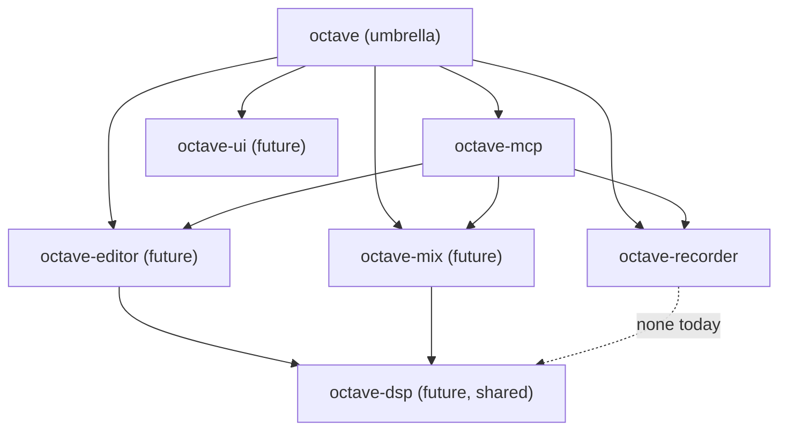

# ADR 0004 — Workspace shape: modular Cargo workspace

> *One plan, one crate. The plan is the spec.*

> [!IMPORTANT]
> This ADR closes Open Question §6.4 of [ADR 0001](./0001-tech-stack.md). It unblocks scaffolding the first crate (`octave-recorder`) and sets the layout convention for every future module.

## 1. Context

[ADR 0001](./0001-tech-stack.md) §6.4 left workspace shape open: single binary crate vs modular Cargo workspace. With the first module plan (`record-audio`, status: `approved` 2026-05-04) ready to scaffold, the workspace shape is now blocking and must be decided.

The repository already enforces a 1-to-1 relationship between approved module plans (`docs/modules/<name>.md`) and the implementation work that follows from them — see `.claude/skills/module-plan/SKILL.md`. Cargo's workspace model is a natural fit for that pattern.

## 2. Decision

Octave is a **modular Cargo workspace**. Each approved module plan in `docs/modules/` corresponds to exactly one library crate under `crates/`. The plan defines the API surface, performance bar, failure modes, and acceptance criteria; the crate implements them.

### 2.1 Layout

```text
octave/
├── Cargo.toml                  # workspace root (no package, only [workspace])
├── rust-toolchain.toml         # pinned stable; edition 2024
├── crates/
│   ├── octave-recorder/        # ↔ docs/modules/record-audio.md
│   ├── octave-editor/          # ↔ docs/modules/editor.md (future)
│   ├── octave-tuning/          # ↔ docs/modules/tuning-room.md (future)
│   ├── octave-mix/             # ↔ docs/modules/mixing.md (future)
│   ├── octave-mcp/             # ↔ docs/modules/mcp-layer.md (future)
│   └── octave/                 # umbrella library + binary; composes the rest
├── docs/
│   ├── decisions/              # ADRs (this file lives here)
│   └── modules/                # module plans (the specs)
└── PLAN.md
```

### 2.2 Crate naming convention

| Plan slug | Crate name | Crate kind |
|---|---|---|
| `record-audio` | `octave-recorder` | `cdylib` + `rlib` |
| `editor` | `octave-editor` | `rlib` |
| `tuning-room` | `octave-tuning` | `rlib` |
| `mcp-layer` | `octave-mcp` | `rlib` + binary |
| (umbrella) | `octave` | `rlib` + `bin` |

Crate names use the **`octave-<role>`** form rather than the verbatim plan slug, because crate names should be terse and noun-shaped (the recorder *is* a recorder; the plan slug describes the action).

### 2.3 Dependency direction



**Rules:**

- Module crates (`octave-recorder`, `octave-editor`, …) must not depend on each other. Cross-module collaboration goes through the umbrella or through a shared crate (`octave-dsp`, `octave-types`).
- Shared crates contain only data types, traits, and pure-DSP utilities — no I/O, no threads, no allocations on the RT path.
- The `octave-mcp` crate depends on every module crate it exposes (it's the JSON-schema lift).
- The umbrella `octave` crate is the public API and binary entry point. It re-exports module crates.

### 2.4 Workspace-level configuration

- **Edition**: `2024` (Rust 1.85+).
- **Resolver**: `"3"` (the workspace resolver introduced for edition 2024).
- **MSRV**: `1.85` — set in `rust-toolchain.toml`.
- **Lint policy**: workspace-level `[workspace.lints.rust]` and `[workspace.lints.clippy]` so every crate inherits the same severity for `unsafe_code`, `missing_docs`, `unused`, and the audio-relevant clippy lints (`clippy::float_cmp`, `clippy::lossy_float_literal`, `clippy::cast_possible_truncation`, `clippy::pedantic` curated subset).
- **Common deps as workspace deps**: `cpal`, `rtrb`, `assert_no_alloc`, `serde`, `uuid`, `thiserror`, `tracing` are declared once in `[workspace.dependencies]` and consumed via `cpal.workspace = true` in member crates. This guarantees a single version graph.
- **Profile overrides**: `release` keeps `lto = "fat"` and `codegen-units = 1` for the audio path; `dev` enables `debug-assertions` (which arms `assert_no_alloc`).

### 2.5 Rust toolchain pin

`rust-toolchain.toml`:

```toml
[toolchain]
channel = "stable"
components = ["rustfmt", "clippy"]
profile  = "default"
```

Stable, not nightly. We accept the cost of waiting for nightly features to land in stable (no portable SIMD intrinsics for now → use `wide` or `pulp`).

## 3. Consequences

### 3.1 Wins

- **Enforced module boundaries.** A `record-audio` change can't accidentally reach into `editor` because the dependency edge doesn't exist.
- **Parallel builds.** Cargo builds independent crates in parallel.
- **Per-module test isolation.** `cargo test -p octave-recorder` runs only that crate's tests.
- **Reusable.** Third parties (or future Octave users) can depend on `octave-recorder` alone — *"give me a Rust audio recorder, no DAW required."*
- **CI matrix friendly.** Per-crate jobs get smaller, faster cycles.

### 3.2 Costs

- **Slightly more ceremony.** Each new module plan now also writes a `Cargo.toml` and a `src/lib.rs` skeleton.
- **Shared types live somewhere.** `octave-types` (or whatever we end up calling it) becomes a place where leaks accumulate — needs vigilance.
- **Versioning discipline.** Module crates that get published to crates.io eventually need semver coordination. Not v1's problem; record now.

### 3.3 What this rules out

- A single-crate "godhead" `octave` that owns everything. We may have shared crates, but no single mega-crate.
- Re-exposing private internals across crates (we use `pub(crate)` rigorously).
- Cross-module imports without going through a shared crate or the umbrella.

## 4. First-crate scaffolding (immediate next step)

The first crate to be created under this ADR is `crates/octave-recorder/`, implementing the API surface in §9 of [`docs/modules/record-audio.md`](../modules/record-audio.md). Initial scaffold:

- `Cargo.toml` declaring `octave-recorder` v0.1.0 with the dependencies `cpal`, `rtrb`, `assert_no_alloc`, `thiserror`, `tracing`, `uuid`, `serde`.
- `src/lib.rs` with the public type signatures from §9 stubbed (`unimplemented!()` bodies, full rustdoc).
- `src/error.rs` with the `OpenError`, `ArmError`, `RecordError`, `StopError`, `CancelError` variants from §9.3.
- `src/state.rs` with the `RecorderState` enum from §9.1 and the state-machine transitions matching §11.3.

No RT-thread code is written in the same turn as ADR-or-plan approval (skill rule). The scaffold establishes the public surface; the implementation arrives in subsequent turns.

## 5. Acceptance criteria

This ADR is closed when:

- [x] Workspace shape decided: modular Cargo workspace under `crates/`.
- [x] Naming convention recorded: `octave-<role>`.
- [x] Dependency-direction rule recorded: module crates do not depend on each other.
- [x] Edition / resolver / MSRV recorded: `2024` / `"3"` / `1.85`.
- [ ] Root `Cargo.toml`, `rust-toolchain.toml`, and `crates/octave-recorder/` scaffold exist on disk and `cargo check` passes (deferred to next turn — requires Rust toolchain installation).
- [x] [ADR 0001](./0001-tech-stack.md) §6.4 marked closed and linked here.

## 6. References

[^cargo-workspaces]: The Cargo Book — Workspaces. <https://doc.rust-lang.org/cargo/reference/workspaces.html>
[^edition-2024]: Rust Edition 2024. <https://doc.rust-lang.org/edition-guide/rust-2024/index.html>
[^adr-0001]: [ADR 0001 — Tech stack: Rust + CLAP](./0001-tech-stack.md).
[^record-audio]: [Module plan — Record Audio](../modules/record-audio.md).

## 7. Glossary

| Term | Meaning |
|---|---|
| **Cargo workspace** | A set of related Rust crates that share a single `Cargo.lock` and `target/` directory. |
| **Member crate** | One crate inside a workspace. |
| **MSRV** | Minimum Supported Rust Version — the oldest stable Rust the workspace promises to compile on. |
| **Resolver** | Cargo's algorithm for picking dependency versions across the workspace; `"3"` is the default for edition 2024. |
| **Umbrella crate** | A re-export crate that gives end-users one import to pull the public surface. |

---

> *One plan, one crate. The plan is the spec, the crate is the proof. — 2026-05-09*
