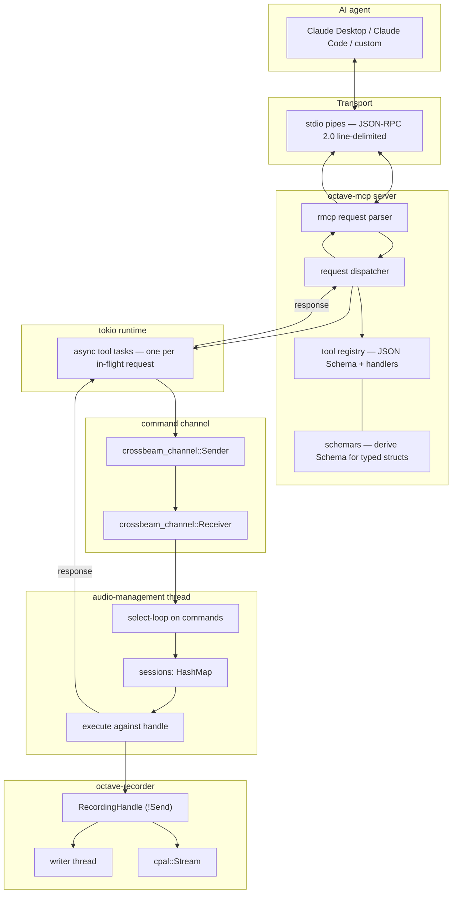
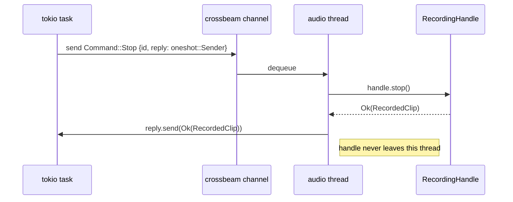
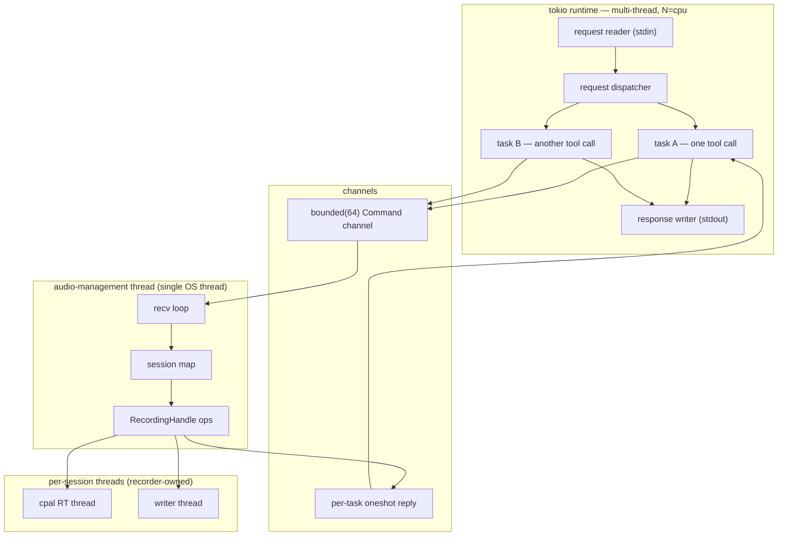

# Module: MCP Layer

> *If a feature isn't an MCP tool, it isn't a feature.*

## 1. Mission

The MCP layer turns Octave's typed Rust APIs into [Model Context Protocol][^mcp] tools that any MCP-speaking AI agent — Claude Desktop, Claude Code, a custom agent — can call. It is the load-bearing piece of Octave's *AI-native, API-first* non-negotiable[^plan-non-negotiables]: without it, every other module ships as "a feature you click" rather than "a tool an AI can wield." With it, the killer flow becomes legitimately conversational — *"Claude, record me singing for ten seconds and call it `take.wav`"* succeeds today, in v0.1, before pitch correction or AI generation exist.

It is **not** the audio engine, the project graph, the editor, the UI, or the tools themselves — it's the *protocol surface* and the *dispatch* that lets external agents drive whatever modules exist. v0.1 lifts the seven `recording_*` tools defined in [`record-audio`](./record-audio.md) §10 and ships them through a stdio MCP server. Future modules ship their own tool sets through the same registration mechanism.

The audience served is the same singer-on-a-laptop[^plan-audience] that record-audio serves — but mediated by an agent. The user types *"record me, ten seconds, into a new project"* and never opens a UI, never picks a sample rate, never thinks about devices. The MCP layer is what makes that legible.

## 2. Boundaries

> [!IMPORTANT]
> A protocol layer that doesn't know what it isn't gradually becomes the kitchen sink. These bounds are deliberately tight.

| In scope (v0.1) | Out of scope (v0.1) |
|---|---|
| MCP server speaking JSON-RPC 2.0 over stdio | HTTP / SSE / streamable-HTTP transports |
| Tool dispatch and registration mechanism | MCP `resources` and `prompts` (we use tools only) |
| JSON-schema generation for typed Rust types via `schemars` | Hand-written schemas |
| Session manager: `Uuid` → `RecordingHandle` map | Persistent sessions across server restarts |
| Audio-management thread that owns all `!Send` handles | Multi-tenant isolation between agents |
| Command channel from MCP request handlers → audio thread | Direct `Arc<Mutex<RecordingHandle>>` (would block tokio runtime) |
| The seven recording tools, end-to-end | Tools for any non-recorder module (each module ships its own when it lands) |
| `octave-mcp` binary launched by an agent over stdio | Authentication (local subprocess is trusted by the agent that launched it) |
| Graceful shutdown on stdio EOF | Hot reload of tool definitions |
| Structured error mapping our error enums → MCP error responses | Agent-facing prose tutorials in tool descriptions |

The first two out-of-scope items are deliberate: HTTP/SSE arrives when Octave needs to be driven *remotely* (collaboration, cloud agents). Authentication arrives with HTTP/SSE because stdio's parent process *is* the trust boundary.

## 3. Stack walk



### 3.1 Hardware layer

**N/A** — the MCP layer is protocol plumbing. The hardware live underneath the recorder.

### 3.2 Driver / kernel layer

**N/A** — but worth naming the OS abstractions involved:

- **`stdin` / `stdout`** — standard pipes the parent process inherits. On Linux these are pseudo-tty-or-pipe FDs the kernel manages. We never call `read(2)` directly; tokio's `AsyncRead` over `tokio::io::stdin()` does.
- **`tokio` runtime** — multi-threaded, work-stealing. We pick the multi-thread flavor so a slow tool call doesn't block other requests.

### 3.3 OS / platform abstraction

`tokio` for async I/O, `crossbeam_channel` for the sync command channel between async tasks and the audio thread. Both are cross-platform. No conditional compilation in this module.

### 3.4 Engine layer

The **audio-management thread** is the heart of this module. It owns:

- `sessions: HashMap<Uuid, RecordingHandle>` — every active recording handle.
- A `crossbeam_channel::Receiver<Command>` — incoming commands from MCP request tasks.

It runs a simple loop:

```text
loop {
  match receiver.recv() {
    Ok(cmd) => execute_against_session(cmd, &mut sessions),
    Err(Disconnected) => break,  // server shutting down
  }
}
on shutdown:
  for (_, handle) in sessions.drain() {
    let _ = handle.cancel(); handle.close();
  }
```

This is the **actor pattern**[^actor]. The handle never crosses thread boundaries; commands do. This is forced on us by `cpal::Stream` being `!Send` — see §5.1 for the mechanics and §6 for the latency budget.

### 3.5 DSP / algorithm layer

**N/A** — no audio computation in this module. All DSP lives in the recorder.

### 3.6 Session / app layer

A **session** is a logical recording. It maps 1:1 to a `RecordingHandle` and lives only as long as the recording does (or, more precisely, until `recording_cancel` or `recording_stop` runs and the handle is closed).

| Field | Type | Source |
|---|---|---|
| `id` | `Uuid` (v4) | generated on `recording_start` |
| `handle` | `octave_recorder::RecordingHandle` | from `octave_recorder::open` |
| `started_at` | `SystemTime` | captured at `recording_start` |
| `output_path` | `PathBuf` | from the start args |
| `sample_rate`, `channels` | `u32`, `u16` | from the start args |

Sessions die with the server process. v0.1 makes no attempt to reconnect to a previous server's sessions.

### 3.7 API layer

The internal Rust API of `octave-mcp` is small:

```rust
pub fn run() -> Result<(), ServerError>;          // blocks until stdin EOF
pub fn run_with_runtime(rt: tokio::runtime::Handle) -> Result<(), ServerError>;
```

Everything else lives behind the MCP wire protocol.

### 3.8 MCP layer

The seven tools listed in §10. Each is registered with `rmcp`'s tool builder, advertises a JSON Schema generated from its argument and return types, and dispatches into one `Command` enum variant.

### 3.9 UI layer

**N/A** — `octave-mcp` is headless. The agent's surface (Claude Desktop's chat, Claude Code's terminal) is what the user sees. We can influence that surface only through (a) tool descriptions, (b) returned content, and (c) error structures. We treat all three as part of the API.

## 4. Data model & formats

### 4.1 Wire format

JSON-RPC 2.0 over line-delimited JSON on stdio. Standard MCP[^mcp]. Each line is one JSON object (request, response, or notification). Examples:

```jsonc
// agent → server
{"jsonrpc":"2.0","id":1,"method":"tools/list"}

// server → agent
{"jsonrpc":"2.0","id":1,"result":{"tools":[...]}}

// agent → server
{"jsonrpc":"2.0","id":2,"method":"tools/call",
 "params":{"name":"recording_start","arguments":{...}}}

// server → agent
{"jsonrpc":"2.0","id":2,"result":{"content":[{"type":"text","text":"..."}],"isError":false}}
```

### 4.2 Tool argument and return types

All tool arguments and returns are derived from typed Rust structs that already exist in `octave-recorder`'s public API (see [`record-audio`](./record-audio.md) §9.1) or are defined in this crate as thin wrappers. Every type derives `serde::{Serialize, Deserialize}` *and* `schemars::JsonSchema`.

| Tool | Argument type | Return type |
|---|---|---|
| `recording_list_devices` | `()` | `ListDevicesResult { devices: Vec<DeviceInfo> }` |
| `recording_describe_device` | `DescribeDeviceArgs { device_id: String }` | `Capabilities` |
| `recording_start` | `StartArgs { device_id, sample_rate, buffer_size, channels, output_path }` | `StartResult { session_id: Uuid, started_at: DateTime<Utc> }` |
| `recording_stop` | `SessionArgs { session_id: Uuid }` | `RecordedClip` |
| `recording_cancel` | `SessionArgs { session_id: Uuid }` | `CancelResult { path: PathBuf, deleted: bool }` |
| `recording_get_levels` | `SessionArgs { session_id: Uuid }` | `LevelsResult { peak_dbfs: Vec<f32>, rms_dbfs: Vec<f32> }` |
| `recording_get_status` | `SessionArgs { session_id: Uuid }` | `StatusResult { state, xrun_count, dropped_samples, elapsed_seconds }` |

### 4.3 JSON Schema generation

`schemars` derives the JSON Schema of each input and output type at compile time. The advertised schema in `tools/list` is the single source of truth — agent type-checks happen there before a request lands. We do *not* hand-write schemas for any tool.

> [!NOTE]
> `schemars` and `serde` agree on field names by default. Where the recorder's API uses Rust idioms that don't translate (e.g., `BufferSize::Fixed(u32)` enum-with-data), we expose a flatter wrapper in this crate (`{kind: "fixed", value: 64}` or similar) so the agent's schema is human-readable.

### 4.4 Error response format

Tool errors return `result: { content: [{type: "text", text: "<reason>"}], isError: true }` per the MCP spec. Internally:

```rust
enum ToolError {
    SessionNotFound { session_id: Uuid },
    Recorder(RecorderErrorKind),    // wraps OpenError, ArmError, etc.
    InvalidArgument(String),
    AudioThreadGone,
}
```

The text payload is human-readable and references the originating Rust enum variant by name so an agent can discriminate (e.g., `"OpenError::DeviceNotFound: device_id 'ALSA:nonexistent' not found"`).

### 4.5 Persisted representation in the project

The MCP layer holds **no persistent state** in v0.1. Sessions are in-memory; logs go to `stderr` (since `stdout` is the protocol channel). When persistent project state arrives later, this module reads but does not own it.

## 5. Algorithms & math

> [!NOTE]
> This is a plumbing layer — the only "algorithm" worth describing is the actor pattern that bridges the async runtime to the `!Send` recorder handles. The rest is JSON.

### 5.1 The `!Send` boundary — actor pattern

`cpal::Stream` is `!Send` on every backend (each platform's audio HAL parks state in thread-local storage). This propagates: `RecordingHandle` is `!Send`. But `tokio`'s multi-thread runtime moves tasks between worker threads; an `async fn` cannot hold a `!Send` value across an `.await` point without breaking task migration.

So we cannot do this:

```rust
async fn recording_stop(session_id: Uuid) -> Result<RecordedClip, ToolError> {
    let mut handle = SESSIONS.get_mut(&session_id);  // !Send
    handle.stop().await                              // ❌ won't compile
}
```

We use the **actor pattern**: one OS thread *owns* the handles; async tasks send commands and `.await` responses. The handles never cross threads.



The `Command` enum mirrors the recorder's API:

```rust
enum Command {
    Open    { spec: RecordingSpec, reply: oneshot::Sender<Result<Uuid, OpenError>> },
    Arm     { id: Uuid, reply: oneshot::Sender<Result<(), ArmError>> },
    Record  { id: Uuid, path: PathBuf, reply: oneshot::Sender<Result<(), RecordError>> },
    Stop    { id: Uuid, reply: oneshot::Sender<Result<RecordedClip, StopError>> },
    Cancel  { id: Uuid, reply: oneshot::Sender<Result<PathBuf, CancelError>> },
    Levels  { id: Uuid, reply: oneshot::Sender<Result<LevelsResult, ToolError>> },
    Status  { id: Uuid, reply: oneshot::Sender<Result<StatusResult, ToolError>> },
    Shutdown,
}
```

`recording_start` collapses **Open + Arm + Record** into one command for ergonomics — agents shouldn't have to reason about the recorder's three-step state machine. Internally the audio thread runs them in sequence; failure at any step rolls the partial state back (`open` and `arm` succeed → `record` fails → close the stream → return).

### 5.2 Backpressure and command-queue sizing

The command channel is `crossbeam_channel::bounded(64)`. Sends from async tasks never block tokio because (a) 64 is far more than concurrent in-flight tool calls in any realistic agent session, and (b) on the rare full case we use `try_send` and return `ToolError::AudioThreadGone` immediately.

Latency budget: **command round-trip ≤ 5 ms** in steady state (audio thread is mostly idle between buffer-period work). See §6.

### 5.3 Session ID generation

`Uuid::new_v4()`. Random, opaque, no semantic content. The agent sees session IDs only as strings; never parse them, never embed them in paths.

### 5.4 Tool call → response timeline

For a representative tool (`recording_get_levels`):

$$
t_{\text{tool}} = t_{\text{parse}} + t_{\text{schema-validate}} + t_{\text{channel-send}} + t_{\text{wait-audio}} + t_{\text{atomic-loads}} + t_{\text{channel-reply}} + t_{\text{serialize}}
$$

Each term:

| Term | Budget | Notes |
|---:|---:|---|
| $t_{\text{parse}}$ | ≤ 200 µs | `serde_json` over a small JSON message |
| $t_{\text{schema-validate}}$ | ≤ 100 µs | `schemars`-generated schema, structural |
| $t_{\text{channel-send}}$ | ≤ 1 µs | `crossbeam_channel::send` |
| $t_{\text{wait-audio}}$ | ≤ 500 µs | thread wakeup + dispatch |
| $t_{\text{atomic-loads}}$ | ≤ 5 µs | per-channel atomic read |
| $t_{\text{channel-reply}}$ | ≤ 1 µs | `oneshot::Sender::send` |
| $t_{\text{serialize}}$ | ≤ 200 µs | `serde_json` write |
| **total** | **≤ ~1 ms** | poll-friendly for level meters |

For destructive tools (`recording_start`, `recording_stop`), the audio side dominates ($t_{\text{wait-audio}}$ extends to whatever the recorder's `open + arm` or `stop` takes — see record-audio §6.2). Total can hit ~200 ms on cold-start, ~100 ms on stop/finalize.

### 5.5 Alternatives considered

| Alternative | Why rejected |
|---|---|
| `Arc<Mutex<RecordingHandle>>` shared with tokio tasks | `!Send` types cannot live behind `Arc<Mutex<>>` either; the underlying `cpal::Stream` would be moved across threads on lock acquisition |
| `tokio::task::LocalSet` to pin tasks to the audio thread | Defeats the multi-thread runtime. Adds complexity for no gain over the explicit channel |
| One channel per session | More ceremony; same performance as a single bounded channel since the audio thread's work is short |
| Hand-rolled JSON-RPC over stdio | We'd reinvent the wheel and lose `tools/list` schema discovery; rmcp is mature and idiomatic |
| `MaybeUninit<JsonValue>` schemas | Premature optimization; `schemars` derives are essentially free |

## 6. Performance & budgets

> [!WARNING]
> Numbers, not adjectives. Each row below is verified at acceptance.

### 6.1 Steady-state budgets

| Metric | Budget | Measured at |
|---:|---:|---|
| Tool-call round-trip (read-only: levels, status) | ≤ 1 ms p99 | 1000 calls, no contention |
| Tool-call round-trip (start) | ≤ 200 ms | cold cpal stream build on Linux PipeWire |
| Tool-call round-trip (stop) | ≤ 100 ms | for clips under 1 GB |
| `tools/list` response | ≤ 5 ms | cached schema; one-shot at handshake |
| Idle CPU | ≤ 0.1 % of one core | tokio + audio thread parked |
| Memory at idle | ≤ 10 MB RSS | server with no sessions |
| Memory per active session | ≤ 1 MB | beyond what the recorder allocates |
| Cold start (process exec → ready) | ≤ 200 ms | from `octave-mcp` invocation |

### 6.2 Concurrent sessions

v0.1 caps concurrent sessions at **8**. Hardware limits real concurrency anyway (one input device per session), but more importantly: every active session pins the audio thread momentarily on each command. 8 is enough for most realistic uses (multitrack? overdub? practice loops?) and small enough to keep the actor's worst-case wakeup latency low.

### 6.3 Throughput targets

The MCP layer is request-driven, not throughput-driven. We size for **100 tool calls per second** as a comfortable ceiling — far above any agent's polling loop.

## 7. Concurrency & threading model



### 7.1 Threads at a glance

| Thread | Priority | Allocates? | Locks? | Syscalls? | Owns |
|---|---|:-:|:-:|:-:|---|
| tokio worker (× N) | normal | ✅ | ✅ | ✅ | request/response state, async tasks |
| audio-management | normal | ✅ | ✅ | ✅ | session map, RecordingHandles |
| cpal RT (per stream) | RT | ❌ | ❌ | ❌ | audio callback only — owned by recorder |
| writer (per recording) | normal | ✅ | ✅ | ✅ | WAV file — owned by recorder |

### 7.2 Synchronisation primitives

- **`crossbeam_channel::bounded(64)`** — async tasks → audio thread. Sync, lock-free under the hood.
- **`tokio::sync::oneshot`** — audio thread → originating task. One per request.
- **`HashMap<Uuid, RecordingHandle>`** — session map, owned by audio thread, never shared.
- **`AtomicBool`** for shutdown signaling (read by audio thread on each iteration).

No `Arc<Mutex<RecordingHandle>>`. No `Arc<RwLock<>>`. Sharing-by-channel only.

### 7.3 The async/sync boundary

The audio thread is **synchronous**. It uses `recv()` (blocking) on the command channel, executes one command, sends the reply via the synchronous half of `tokio::sync::oneshot::Sender::send` (which is non-blocking — it's a single atomic store), then loops.

This is fine because the recorder's API is itself synchronous. We don't `await` inside the audio thread; we run, return, signal completion.

### 7.4 Cancellation / shutdown

- **Stdin EOF** → tokio reader task exits → drops the dispatcher's input → tokio runtime drains in-flight tasks → drops the command-channel sender → audio thread sees `Disconnected`, drains the session map, closes each handle, exits.
- **SIGTERM / SIGINT** → tokio's signal handler triggers the same shutdown path.
- **In-flight tool call during shutdown** → its oneshot is dropped → the awaiting task gets `Err(Canceled)` → maps to a server-error response. Best effort; we don't guarantee delivery during shutdown.

### 7.5 Ordering guarantees

Commands are processed in the order they arrive on the channel (FIFO). Per-session ordering is preserved because all commands for a session land on the same channel.

> [!NOTE]
> The note text above contains no semicolons — doc-to-dashboard converts those to commas in sequence-diagram notes.

## 8. Failure modes & recovery

| Failure | Cause | Detection | User-visible behavior | Recovery |
|---|---|---|---|---|
| Tool args malformed | Agent sent JSON not matching schema | `serde` deserialize fails | Tool error: `InvalidArgument` with field name | Agent retries |
| Session not found | Agent passes stale UUID | Map lookup misses | Tool error: `SessionNotFound` | Agent re-creates a session |
| Recorder open failure | Device unplugged, format unsupported | `OpenError` from recorder | Tool error wraps `OpenError`'s text | Agent picks another device |
| Stop on idle session | Agent calls stop without start | Recorder returns `StopError::NotRecording` | Tool error wraps the variant name | Agent's bug; surfaced for debugging |
| Audio thread panicked | Recorder bug (shouldn't happen) | Channel send works but recv times out | Tool error: `AudioThreadGone`; server unhealthy | v0.1: server exits, agent must restart |
| Stdin closed mid-request | Agent crashed | `tokio::io::stdin().read_line` returns 0 | Server initiates shutdown | None — sessions cancelled, files truncated |
| Stdout broken pipe | Agent closed early | `write_all` returns `BrokenPipe` | Same as stdin EOF | Same as stdin EOF |
| Concurrent session limit (8) hit | Agent leaked sessions or is greedy | Dispatcher checks before sending Open | Tool error: `TooManySessions` | Agent calls stop/cancel on others first |
| `tools/list` requested mid-shutdown | Race during exit | Dispatcher sees shutdown flag | Returns server-error; client retries are honest no-ops | None — server is dying |
| Schema mismatch between server and client expectations | We bumped a type | `tools/list` advertises new schema; old client validation fails on server | Client sees explicit fields | Bump server version; client adapts |
| Output-path race (two tools write same path) | Agent gives same path twice | Recorder's `WavWriter::create` succeeds because `File::create` truncates | Second recording overwrites first silently | Agent's bug; document in tool description: "destructive when path exists" |

## 9. API surface

> [!IMPORTANT]
> The public Rust API of this crate is small. The *real* API surface — the seven MCP tools — lives in §10. Both are stability commitments.

### 9.1 Crate-level Rust API

```rust
/// Run the MCP server. Blocks until stdin EOF or fatal error.
pub fn run() -> Result<(), ServerError>;

/// Same as [`run`], but reuses an existing tokio runtime.
pub fn run_with_runtime(handle: tokio::runtime::Handle) -> Result<(), ServerError>;

#[derive(Debug, thiserror::Error)]
pub enum ServerError {
    #[error("io error: {0}")]
    Io(#[from] std::io::Error),
    #[error("rmcp error: {0}")]
    Rmcp(String),
    #[error("audio-management thread spawn failed: {0}")]
    AudioThreadSpawn(String),
}
```

### 9.2 Internal types (not pub)

```rust
struct Session { /* per §3.6 */ }
enum  Command  { /* per §5.1 */ }
struct AudioActor { /* owns the session map, runs the loop */ }
struct ToolRegistry { /* dispatched-to by rmcp */ }
```

### 9.3 Binary

`crates/octave-mcp/src/bin/octave-mcp.rs`:

```rust
fn main() -> std::process::ExitCode {
    if let Err(e) = octave_mcp::run() {
        eprintln!("octave-mcp: {e}");
        return std::process::ExitCode::from(1);
    }
    std::process::ExitCode::SUCCESS
}
```

Logs go to `stderr` (because `stdout` is the protocol channel). `tracing_subscriber` configured to write structured JSON or plain text based on `RUST_LOG` and `OCTAVE_LOG_FORMAT` env vars.

## 10. MCP exposure

The seven tools, sourced from [`record-audio`](./record-audio.md) §10 and refined here. Every tool:

1. Carries a JSON Schema generated by `schemars` from the typed argument struct.
2. Has a one-paragraph human-readable `description` aimed at the agent's prompt context.
3. Maps to exactly one `Command` variant.
4. Returns a typed result or a `ToolError`.

### 10.1 Tool table

| MCP tool | Args | Returns | Side effect | Description (truncated) |
|---|---|---|---|---|
| `recording_list_devices` | `{}` | `{ devices: DeviceInfo[] }` | none | "Enumerate every input device the host can see across all backends." |
| `recording_describe_device` | `{ device_id }` | `Capabilities` | none | "Return supported sample rates, channel counts, and buffer sizes for one device." |
| `recording_start` | `{ device_id, sample_rate, buffer_size, channels, output_path }` | `{ session_id, started_at }` | **creates a file at `output_path`; overwrites if it exists** | "Open the device, start the audio callback, begin writing 32-bit float WAV to `output_path`. Returns a session_id for subsequent stop/cancel/status calls." |
| `recording_stop` | `{ session_id }` | `RecordedClip` | finalizes the file | "Stop a recording cleanly. Drains the buffer, finalizes the WAV header, fsyncs, returns the clip metadata." |
| `recording_cancel` | `{ session_id }` | `{ path, deleted }` | **deletes the partial file** | "Stop a recording and delete the partial file. Use this when the recording is unwanted." |
| `recording_get_levels` | `{ session_id }` | `{ peak_dbfs[], rms_dbfs[] }` | none | "Read the current per-channel peak and RMS levels in dBFS. Safe to poll at meter rates (e.g., 30 Hz)." |
| `recording_get_status` | `{ session_id }` | `{ state, xrun_count, dropped_samples, elapsed_seconds }` | none | "Return the recorder's current state machine status, plus underrun and drop counts." |

### 10.2 Destructive flagging

`recording_start` and `recording_cancel` are flagged **destructive** in the rmcp tool annotation system. Agents that respect the annotation (Claude Desktop / Claude Code do) prompt the user before invoking.

### 10.3 Error result shape

All tool errors return:

```jsonc
{
  "isError": true,
  "content": [
    {"type": "text", "text": "OpenError::DeviceNotFound: device_id 'ALSA:nonexistent' not found"}
  ]
}
```

The leading `EnumName::Variant:` prefix is intentional — it lets the agent string-match for retry logic without us specifying a brittle "error code" enum on the wire. The MCP spec is loose about machine-readable error codes; we use the text payload as the contract for now.

### 10.4 Schema registration timing

Tool schemas are generated **at server startup** (one `schemars::schema_for!()` call per type). Cached in a `OnceLock<ToolRegistry>`. `tools/list` reads from the cache.

## 11. UI surface

**N/A — server is headless.** The agent's UI surface is what the user perceives. Three knobs we control there:

1. **Tool descriptions** (§10.1) — agent reads these when deciding whether/how to call a tool.
2. **Returned data** — agents render structured results back to the user (Claude Desktop shows tool call cards; Claude Code prints structured output).
3. **Error text** — `EnumName::Variant: detail` prefix lets the agent surface meaningful problems back to the user.

When a real Octave UI lands (Phase 7+), it will *also* be a consumer of the same Rust API the MCP layer wraps. The two surfaces never compete; they both run through the typed core.

## 12. Test strategy

### 12.1 Unit

- **Schema generation**: `schemars` derives produce stable JSON Schema for each tool's argument and return type. Snapshot-test against fixtures so any breaking change to the schema is a visible diff.
- **Command serialization**: `Command` round-trips through serde where applicable.
- **Session map invariants**: insert / remove / size limits.
- **Error mapping**: every `OpenError`, `ArmError`, `RecordError`, `StopError`, `CancelError` variant maps to a stable string prefix.

### 12.2 Integration — in-process

Spawn the actor + dispatcher in-process; bypass stdio. Drive with synthetic JSON-RPC requests.

- `tools/list` returns all 7 tools with valid schemas.
- `recording_list_devices` returns a `Vec<DeviceInfo>`.
- `recording_describe_device` for a non-existent ID returns the right error.
- `recording_start` → `recording_stop` happy path with a mocked recorder (or a real one, gated by env var).

### 12.3 Integration — subprocess

Spawn the `octave-mcp` binary with `tokio::process::Command`. Communicate over the child's stdin/stdout. Verify the full handshake (`initialize`, `notifications/initialized`, `tools/list`, `tools/call` × 7).

- Fuzz the request stream with malformed JSON, missing fields, wrong types — server returns errors but doesn't crash.
- Send `tools/call` for an unknown tool — server returns a clean error.

### 12.4 End-to-end with a real agent

Configure Claude Desktop's `mcpServers` config to launch `octave-mcp`. Manually verify:

- Claude lists the seven tools when prompted.
- *"List my input devices"* → the agent calls `recording_list_devices` and renders results.
- *"Record me singing for 3 seconds at 48 kHz, save to /tmp/test.wav"* → start + sleep + stop via the agent's tool calls; resulting WAV is byte-identical to one produced by `cargo run --example record-demo -- /tmp/test.wav 3` modulo timestamps and uuids.

### 12.5 Performance benchmarks

- `criterion` benchmark: 1000 `tools/call recording_get_status` round-trips. p99 ≤ 1 ms.
- Cold start: spawn `octave-mcp`, send `initialize`, measure response. ≤ 200 ms.

### 12.6 Manual smoke tests

A `Makefile` target or shell script that:
1. Builds the binary.
2. Pipes a canned JSON-RPC sequence through it.
3. Diffs the output against a recorded golden response.

Lightweight; runs in CI; a developer can also `cargo run` and pipe by hand.

## 13. Open questions

> [!NOTE]
> Each question's resolution lands as either an in-place edit to this plan or an issue tracked in the project file. None of these block v0.1 if I document the chosen default.

1. **rmcp version pinning.** The Rust SDK is at 0.x (rapid evolution); 1.0 will reshape the macro surface. Lean: pin a specific minor + revisit at every minor bump. Worth a quick check at code time for whether the latest 0.x has `tools/list` schema integration through a derive macro.
2. **Schema for `BufferSize::Default | Fixed(u32)`.** Rust enum-with-data serializes as `{"Fixed": 64}` by default — readable but unidiomatic JSON. Alternative: flatten to `{"kind": "default"}` / `{"kind": "fixed", "samples": 64}`. Lean: flatten via `#[serde(tag = "kind", rename_all = "snake_case")]`.
3. **Session GC.** What if the agent never calls stop or cancel? Lean: 1-hour idle timeout (no levels/status calls) → cancel and free. v0.1 ships without this; v0.2 adds the timer.
4. **Concurrent session cap.** §6.2 says 8. Confirm against realistic agent flows; could reasonably be higher.
5. **`recording_start` rolling back partial state on failure.** §5.1 says we close the stream if `record` fails after `open + arm` succeeded. The recorder doesn't expose `unarm` or `disarm`; we'd `close` and lose the stream. Document the semantics: *"start is atomic — succeeds fully or rolls back fully."*
6. **Streaming levels.** MCP recently added support for tool-result streaming (server-sent events within a tool call). `recording_get_levels` could push instead of poll. Defer; too new to depend on, and polling is fine at 30 Hz.
7. **Resource cleanup on cancel + delete failure.** **Resolved:** `CancelResult` now ships as `{ path: PathBuf, deleted: bool }`. The agent gets back the path it asked for + a recheck of whether the file is gone. The recorder also logs the underlying I/O error when delete fails (record-audio §13.12), so operators see "why" in the engine's tracing output. §4.2 / §10.1 published shapes updated.
8. **Authentication for HTTP/SSE.** Out of v0.1 scope, but worth recording: lean OAuth 2.0 device flow when remote transport lands, falling back to `Authorization: Bearer <pre-shared-key>` for headless setups.
9. **Logging discipline.** All logs go to `stderr`. Lean: `RUST_LOG=info`-controlled `tracing_subscriber` with JSON output when `OCTAVE_LOG_FORMAT=json`, plain text otherwise. The agent's parent process sees `stderr`; in Claude Desktop it's surfaced via the dev tools.
10. **Tool description copy.** §10.1 has truncated descriptions. The full text needs to be agent-tested — agents are sensitive to subtle phrasings (e.g., the difference between *"writes to disk"* and *"creates a file"* changes whether they prompt the user). I'll iterate on these post-v0.1 as I see real agent transcripts.

## 14. Acceptance criteria

A reviewer signs off and `status: approved` is set only when all of the following hold:

- [ ] `octave-mcp` binary builds, launches, completes the MCP `initialize` handshake.
- [ ] `tools/list` advertises all 7 tools with valid `schemars`-derived JSON schemas.
- [ ] `recording_list_devices` and `recording_describe_device` work without an active session.
- [ ] `recording_start` → `recording_get_levels` (during recording) → `recording_stop` end-to-end produces a playable WAV identical to `record-demo`'s output (modulo timestamps / uuids).
- [ ] `recording_cancel` on an active session deletes the partial file and frees the session.
- [ ] `recording_get_status` returns `RecorderState` with `xrun_count` and `dropped_samples`.
- [ ] Subprocess integration test passes in CI (no real audio device required for the schema/dispatch parts).
- [ ] Manual e2e: Claude Desktop launches `octave-mcp` via its config, asks Claude to record 3 seconds, file appears and plays.
- [ ] Tool errors carry `EnumName::Variant:` prefixes, agent-discriminable.
- [ ] Bench: `recording_get_status` p99 ≤ 1 ms over 1000 calls.
- [ ] Cold-start: ≤ 200 ms from `octave-mcp` exec to first response.
- [ ] All public APIs have rustdoc; the binary's `--help` documents env vars.
- [ ] Coverage ≥ 85 % for non-stdio code paths (the stdio glue is hard to unit-test cleanly; integration tests cover it).

## 15. References

[^mcp]: Model Context Protocol specification. <https://spec.modelcontextprotocol.io/>
[^rmcp]: `rmcp` — Rust SDK for MCP, the official-ish implementation. Pin a specific 0.x at code time. <https://github.com/modelcontextprotocol/rust-sdk>
[^schemars]: `schemars` — JSON Schema generation for serde-derived types. <https://github.com/GREsau/schemars>
[^crossbeam-channel]: `crossbeam_channel` — high-performance multi-producer multi-consumer channels. <https://github.com/crossbeam-rs/crossbeam>
[^tokio]: `tokio` — async runtime for Rust. <https://tokio.rs/>
[^actor]: The Actor Pattern — Hewitt et al, *A Universal Modular Actor Formalism for Artificial Intelligence*, IJCAI 1973.
[^plan-non-negotiables]: PLAN.md §6 — three architectural non-negotiables (API-first, AI-native, pro audio quality). [`PLAN.md`](../../PLAN.md).
[^plan-audience]: PLAN.md §3 — the talented amateur as design center. [`PLAN.md`](../../PLAN.md).
[^record-audio]: [Module plan — Record Audio](./record-audio.md). The module whose API this layer first exposes.
[^adr-0001]: [ADR 0001 — Tech stack: Rust + CLAP](../decisions/0001-tech-stack.md).
[^adr-0004]: [ADR 0004 — Workspace shape: modular Cargo workspace](../decisions/0004-workspace-shape.md).

## 16. Glossary

| Term | Meaning |
|---|---|
| **Actor pattern** | A concurrency model where state is encapsulated in a single thread (or task) and accessed only via messages. Used here to bridge tokio's async multi-thread runtime to the recorder's `!Send` handles. |
| **JSON-RPC 2.0** | The wire protocol MCP rides on. Line-delimited JSON objects with `method`, `params`, `id`, `result`, `error` fields. |
| **MCP** | Model Context Protocol — Anthropic-introduced standard for AI agents to call typed tools, read resources, and use prompts. |
| **rmcp** | The Rust SDK for MCP. Provides the server skeleton, request parsing, and tool registration macros. |
| **schemars** | A Rust crate that derives JSON Schema from `serde` types at compile time. |
| **Session** | One in-flight recording, identified by a UUID, owning one `RecordingHandle`. |
| **stdio transport** | The MCP standard for local subprocess servers — agent launches the server as a child process and speaks JSON-RPC over its stdin/stdout. |
| **Tool** | An MCP-exposed callable; the unit of agent-driven action in v0.1. |

---

> *The protocol is the product. — 2026-05-09*
