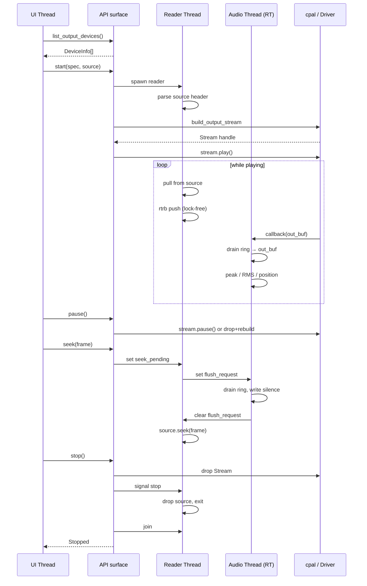
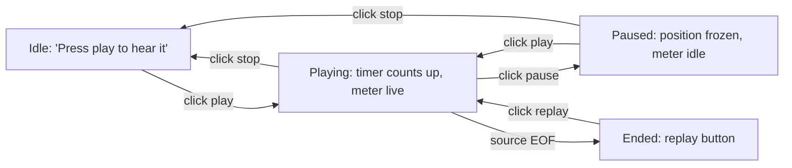
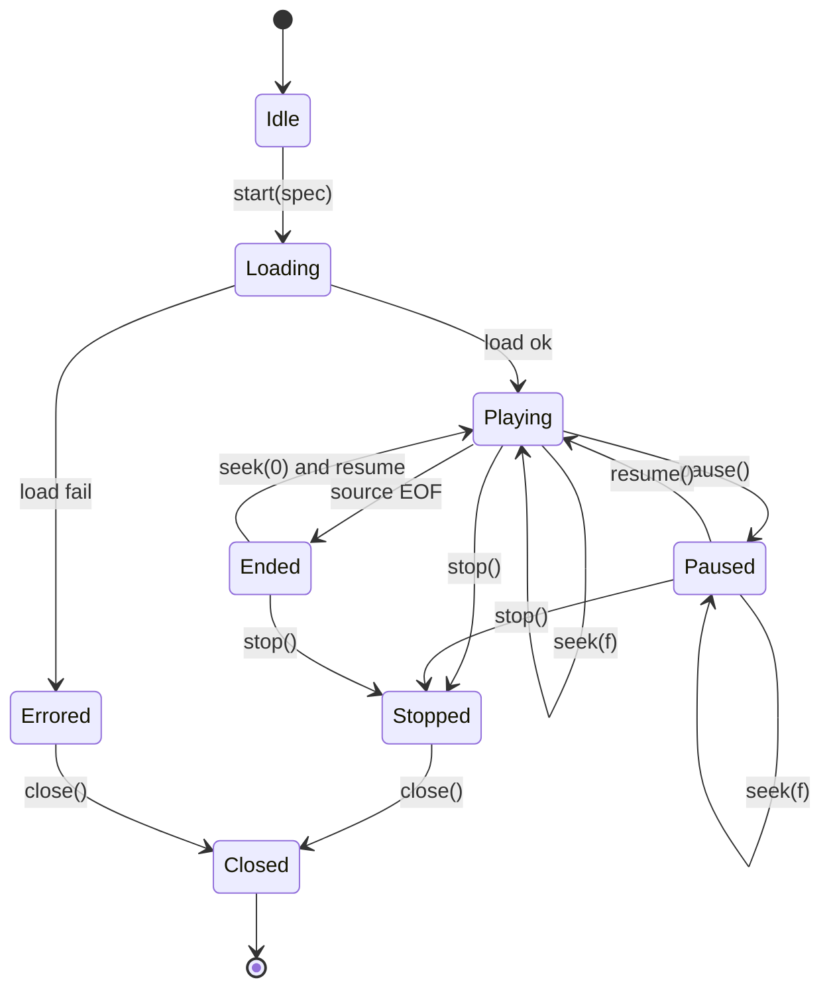

# Module: Play Audio

> *Pressing play is the first time the singer hears the take that's about to leave the studio. If we miss a sample, we lose their trust.*

## 1. Mission

`playback-audio` is the symmetric counterpart of [`record-audio`](./record-audio.md): it takes frames from a known-good source — a 32-bit float WAV file landed by the recorder, or an in-memory buffer fed by an upstream module (eventually the mix engine) — and pushes them through `cpal` into the user's chosen output device, sample-accurate and dropout-free. It is the smallest possible vertical slice from a sample source up to a speaker, and it earns its right to exist by completing the smallest real DAW loop: **record → play it back**.

It is **not** the editor, the mixer, the monitor router, or the FX chain. It owns one output device, plays one source at a time, and exposes only the transport controls a singer needs to verify what they just sang: **play, pause, resume, stop, seek**. Every other knob (loop, varispeed, scrub, multi-track mixing, software input monitoring) belongs to a downstream module. Serves the bedroom singer who pressed record, sang the take, and now wants to hear it[^plan-audience].

## 2. Boundaries

> [!IMPORTANT]
> A module that doesn't know what it isn't will leak. Playback's bounds are tight on purpose — symmetry with [`record-audio`'s](./record-audio.md) v1 scope means each side stays small enough to *prove* correct.

| In scope (v1) | Out of scope (v1) |
|---|---|
| Open one output device per session | Multi-device simultaneous output |
| Single source per session, switchable on `start` | Multi-source mixing (belongs to the mix engine) |
| Source from a 32-bit float WAV file (RIFF or RF64) | Lossy decoded sources (MP3, AAC, Opus, FLAC) |
| Source from an in-memory `Arc<[f32]>` buffer | Streaming source from a callback / iterator (Phase 2) |
| 32-bit float internal end-to-end | On-the-fly bit-depth conversion / dithering |
| File sample-rate must equal device sample-rate | On-the-fly resampling (separate `resample` module) |
| Up to the device's max channel count | Channel-count downmix / upmix (separate `channel-mapper` module) |
| Cross-platform via `cpal` (Linux ALSA / PipeWire / JACK; macOS Core Audio; Windows WASAPI / ASIO) | Direct platform API access bypassing `cpal` |
| Output device discovery, capability query, sample-rate / buffer config | Bus / aux routing, FX chain on output |
| Lock-free reader-thread → RT-thread handoff via `rtrb` | Crossfade / overlap on seek, scrub, loop |
| Live peak + RMS level meter (per channel, output side) | LUFS / true-peak / spectrum metering |
| Transport: `start`, `pause`, `resume`, `stop`, `seek` | `loop`, `speed`, `pitch-preserving varispeed`, `reverse` |
| Position reporting in frames, seconds | Sub-sample-accurate positioning (already accurate to one frame) |
| xrun (under-run) detection and counting | xrun *prevention* via predictive buffer sizing |
| Single playback session at a time, across the whole engine | N concurrent sessions sharing one device (needs internal mixer) |
| Software output device → speakers / headphones | Software input monitoring (input → output passthrough) |
| Typed Rust API + MCP tool surface | UI beyond a single-button Simple Mode + meter + transport bar |

The first three "out of scope" rows — multi-source mixing, lossy formats, on-the-fly resampling — each become their own module. Playback refuses them so its surface stays small. A separate `mix-engine` module will *use* `playback-audio` as one of its outputs, not the other way around.

## 3. Stack walk

```mermaid
flowchart TB
  subgraph SRC["Source"]
    FILE[📄 32-bit float WAV<br/>RIFF or RF64]
    BUF[💾 In-memory Arc&lt;&#91;f32&#93;&gt; buffer]
  end
  subgraph WRK["Octave Engine — Reader side"]
    READ["Reader thread<br/>(normal priority)"]
    HDR["WAV header parser<br/>(RIFF / RF64)"]
    DEC["Frame decoder<br/>(interleaved f32, no conversion)"]
    READ --> HDR --> DEC
  end
  subgraph ENG["Octave Engine — RT side"]
    RING["rtrb SPSC ring buffer"]
    CB["Audio callback thread<br/>(RT, no alloc, no lock)"]
    METER["Peak / RMS computation"]
    POS["Position counter (atomic)"]
    RING --> CB --> METER
    CB --> POS
  end
  subgraph OS["OS abstraction"]
    CPAL["cpal — unified Rust audio I/O"]
  end
  subgraph DRV["Driver / Kernel"]
    LIN["Linux: ALSA → PipeWire / JACK"]
    MAC["macOS: Core Audio HAL"]
    WIN["Windows: WASAPI / ASIO"]
  end
  subgraph HW["Hardware"]
    DAC[Preamp + DAC]
    OUT[🔊 Speakers / 🎧 Headphones]
    DAC --> OUT
  end
  subgraph API["Public surface"]
    TYP["Typed Rust API"]
    MCP["MCP tool surface"]
    UI["UI: Simple + Studio Mode"]
  end

  FILE --> READ
  BUF --> READ
  DEC --> RING
  CB --> CPAL
  CPAL --> LIN
  CPAL --> MAC
  CPAL --> WIN
  LIN --> DAC
  MAC --> DAC
  WIN --> DAC
  POS --> TYP
  TYP --> MCP
  TYP --> UI
```



The flow is the **mirror** of [`record-audio`](./record-audio.md): in recording, the cpal callback is the producer and a worker thread is the consumer (writing to disk); in playback, the worker thread is the producer (reading from a source) and the cpal callback is the consumer (feeding samples to the DAC). The same `rtrb` SPSC ring sits between them; the same RT discipline applies.

### 3.1 Hardware layer

The reference target is the same **Focusrite Scarlett 2i2 (3rd / 4th gen)**[^scarlett] used by `record-audio`: 2 outputs, 24-bit DAC at up to 192 kHz, ~2.74 ms round-trip at 64-sample buffer / 96 kHz. The DAC is the symmetric chip to the ADC; the same USB Audio Class 2.0 pipe carries IN and OUT.

| Hardware class | Example | What it gives | What it limits |
|---|---|---|---|
| Pro USB-Audio interface | Focusrite Scarlett, MOTU M2 | Low latency, balanced TRS out, headphone amp | Manual gain knob, no software volume |
| Cheap USB DAC / dongle | Apple USB-C dongle, FiiO E10 | One-cable simplicity, 24-bit / 96 kHz typical | No balanced out, modest headphone amp |
| Built-in laptop output | MacBook, ThinkPad | Always available, no cable | Loud OS mixer in the path, sometimes 16-bit |
| HDMI / DisplayPort audio | Connected monitor, TV | Convenient | Variable latency, sample-rate negotiation surprises |

Playback must work against all four through `cpal`'s `default_output_device()` selection.

### 3.2 Driver / kernel layer

Identical kernel stack to [`record-audio` §3.2](./record-audio.md#32-driver--kernel-layer) — `cpal` exposes `build_output_stream` symmetric to `build_input_stream`. The kernel call that enters the OS is `snd_pcm_writei` (ALSA), `AudioOutputUnitStart` + render callback (Core Audio), `IAudioRenderClient::GetBuffer` + `ReleaseBuffer` (WASAPI), `ASIOOutputReady` (ASIO). All deliver buffers in fixed periods; underflow shows up as a `cpal::StreamError::OutputUnderflow` or backend-specific xrun.

> [!NOTE]
> A subtle asymmetry: PipeWire's ALSA bridge sometimes claims `can_pause = false` for output streams, which causes `cpal::Stream::pause()` to silently no-op (cpal swallows the error in its ALSA `pause` impl[^cpal-pause-bug]). Playback's `pause` must therefore drop the stream rather than just calling `pause()` if it observes that subsequent reads keep being requested after a pause. This is documented in [§5.7](#57-pause-resume-and-the-cpal-pause-trap).

### 3.3 OS / platform abstraction — `cpal`

Same crate as recording[^cpal]; we use the output APIs (`Device::default_output_device()`, `Device::supported_output_configs()`, `Device::build_output_stream(...)`). Stream config (sample-rate, buffer-size, channels, sample-format) mirrors recording.

**Accepted sample formats: F32, I32, I16.** Preference order at stream-build time: F32 (no conversion needed) > I32 (full-precision integer) > I16. Internally the engine is f32 throughout — the audio thread converts to the device's native format inline (see [§3.4](#34-engine-layer--rt-side)). This matters on Linux: every physical `hw:CARD=` device exposes I32 or I16 natively (USB-Audio is I32-only, HD-Audio is I16+I32). The F32-only filter we shipped before this would reject every direct-hardware device, leaving only the PipeWire / `default` plug devices as the practical playable surface.

#### 3.3.1 Device-handle caching — `DeviceCatalog`

> [!IMPORTANT]
> Linux-specific defect this defends against: `cpal`'s ALSA backend enumerates devices by calling `snd_pcm_open(name, …, SND_PCM_NONBLOCK)` on every PCM hint and **silently drops** any device whose open returns `EBUSY`. PipeWire (and PulseAudio) routinely hold physical `hw:CARD=X,DEV=Y` PCMs exclusively while the user has a desktop audio session. So a `list_output_devices` call that catches the device free, followed by a `start` call moments later that catches it busy, fails with `DeviceNotFound` even though the user just clicked a row that was visibly there.

To make every device that ever appeared in a listing reusable for `start`, both calls go through a stateful `DeviceCatalog`:

- `DeviceCatalog::list_output_devices()` enumerates **and** caches the `cpal::Device` handles it returns. Holding the `cpal::Device` keeps the underlying ALSA `snd_pcm_t` open (cpal stores it as `Arc<Mutex<DeviceHandles>>`), so PipeWire cannot make us forget how to find it.
- `DeviceCatalog::start(spec)` looks the requested `device_id` up in the cache **first**. On hit we use the cached `cpal::Device` directly; on miss we fall back to enumeration (so an agent that supplies a remembered id without listing first still works, at the original race risk).
- Each `list_output_devices` call replaces the cache entirely. Devices that disappeared get evicted and their handles drop, freeing the underlying ALSA references.

Side-effect: since we hold the PCM open, the device is exclusively ours from the moment the catalog lists it until the catalog is dropped (or replaced by another `list_output_devices` call that doesn't include it). For a DAW this is the correct semantic — Bitwig / Reaper / Pro Tools all grab the audio interface exclusively.

**Re-list flushes the cache before probing.** A naïve "build new cache, swap in" would keep the old `cpal::Device` handles alive *during* the new enumeration — and those old handles would then block cpal's `snd_pcm_open` probe of the same hw: PCMs, silently dropping them from the listing. So `list_output_devices` clears the cache up front, before the first probe. Active `PlaybackHandle`s carry their own Arc-shared clone of `cpal::Device`, so this clear doesn't disturb them — the underlying ALSA PCM stays open as long as any live handle still references it (the cache being one possible reference among many).

**Multi-pass enumeration.** A single `host.output_devices()` pass can miss a hw: PCM that PipeWire holds at the exact probe moment. The catalog runs `ENUMERATION_PASSES = 3` passes with `ENUMERATION_PASS_GAP = 100 ms` between them, unioning by id and keeping the first-seen `cpal::Device` for each unique device. 3 × 100 ms = 300 ms list latency, below the 400 ms ISO-acceptable threshold for "instant" feedback on a button click.

**Unified across input and output.** The `DeviceCatalog` lives in the shared `octave-audio-devices` crate; both the player's `start()` and the recorder's `open()` look up devices through the same instance. Before unification, the player and recorder each had their own catalog, and cpal's `DeviceHandles::open` (which opens **both** PCM directions during enumeration) made the two catalogs deadlock each other — the player's cached Focusrite Device held both PCMs, so the recorder's input probe of the same physical device returned EBUSY (and vice versa). With one shared cache, one `cpal::Device` per physical device, both engines clone the same handle and consume different sides of `DeviceHandles` via `build_output_stream` / `build_input_stream`. The catalog's `list_output_devices()` and `list_input_devices()` both refresh the cache (output enumeration first, then input enumeration to catch input-only devices); for each cached device, `supported_{input,output}_configs()` is queried directly on the same `cpal::Device` so a device discovered via output enumeration carries its input metadata too without needing a second probe.

Cross-platform: `cpal::Device` is `Send + Sync` on every backend Octave targets (ALSA via `Arc<Mutex<…>>`; CoreAudio is POD; WASAPI declares it explicitly). The catalog is therefore safe to share across threads behind its internal `Mutex<HashMap<DeviceId, cpal::Device>>`.

### 3.4 Engine layer — RT side

The cpal output callback is wrapped in `assert_no_alloc::assert_no_alloc(...)`[^assert-no-alloc] (debug builds only — release strips). Per buffer the callback:

1. Reads `samples.len()` interleaved f32 from the SPSC ring (`rtrb` consumer).
2. Computes per-channel peak (max abs) and mean-square (sum-of-squares / N) — stack locals only.
3. Atomic-stores last-buffer peak, last-buffer mean-square, running peak (max over the take so far) — same scheme as recording's input meter.
4. Writes the consumed samples into the cpal-supplied output buffer.
5. Bumps an atomic frame-position counter by `frames_in_buffer`.
6. On under-run (ring empty when callback fires), writes silence into the requested slots and bumps `xrun_count`.

The audio callback **never allocates, never locks, never blocks**. Same enforcement as the recording side.

**Format conversion in the I32 / I16 paths.** When the chosen stream config is not F32, the cpal callback receives `&mut [T]` for `T ∈ {i32, i16}`. The closure owns a pre-allocated `Vec<f32>` scratch (sized at stream-build time, capped at `MAX_SCRATCH_FRAMES = 16384` frames per channel — well above any realistic RT buffer). Per callback: slice `&mut scratch[..out.len()]`, run [`process_output_buffer`](#34-engine-layer--rt-side) into the slice, then convert sample-by-sample into `out`:

$$
\text{i32}(s) = (\text{clamp}(s, -1, 1) \cdot 2^{31}) \text{ as i32}
$$
$$
\text{i16}(s) = (\text{clamp}(s, -1, 1) \cdot 2^{15}) \text{ as i16}
$$

Rust's float-to-int `as` cast saturates at the integer range, so the clamp prevents overflow without any branchy "if greater than max" code. No allocation, no syscall, no lock — RT-safe.

If cpal ever hands a buffer larger than the scratch (would mean we under-sized at build time), the callback silences `out` and returns. Better than allocating in the RT path; the under-sizing would surface as audible silence, then a follow-up audit raises the const.

### 3.5 Engine layer — Reader side

The reader thread runs at normal OS priority. It owns:

- The `PlaybackSource` trait object (file or buffer impl — see [§5.1](#51-the-playbacksource-trait)).
- The `rtrb::Producer<f32>` end of the ring.
- Local state: current frame position, EOF flag, seek-pending flag.

In a tight loop the reader:

1. Checks shutdown / cancel flags. If set, drops resources and exits.
2. Checks seek-pending flag. If set, flushes the ring (drains all consumer-readable samples — see [§5.6](#56-seek-and-the-ring-flush-protocol)), repositions the source via `source.seek(target_frame)`, clears the flag.
3. Reads up to `READ_BLOCK` (4096) frames into a stack buffer.
4. Pushes the frames into the ring with `producer.write_chunk_uninit`. If full, parks on a short sleep (`PARK_DURATION = 1 ms`) and retries — the audio callback drains the ring, so the ring will become writable.
5. On source EOF (`source.pull()` returns 0), sets a local `eof_seen` flag. Continues looping (in case of seek-back) but no longer calls `source.pull()`.
6. Loops back to step 1.

The reader is allowed to allocate, lock, and block — it never touches the audio thread. Backpressure (RT thread can't drain fast enough) is impossible by construction in playback because the RT thread is the *consumer* and runs at strict period boundaries; the ring fills up to capacity and the reader naturally throttles.

### 3.6 DSP / algorithm layer

No DSP in v1. Frames flow through unmodified. Peak / RMS / position counters are bookkeeping, not signal processing. See [§5](#5-algorithms--math) for details.

### 3.7 Session / app layer

Playback is **single-session** at the engine level. The MCP actor (see [`mcp-layer`](./mcp-layer.md)) holds at most one `PlaybackHandle`. Attempting to start a second session while one is active returns `AlreadyPlaying { current_session: Uuid }` and the agent must `stop` first.

The active session is referenced by an opaque `session_id` (UUID); the typed Rust handle is `!Send` (cpal's `Stream` is `!Send` on every backend) and lives on the actor's dedicated OS thread.

### 3.8 API layer

See [§9](#9-api-surface). Strict separation between handle methods on `PlaybackHandle` (`pause`, `resume`, `stop`, `seek`, `position_frames`, `peak_dbfs`, `rms_dbfs`, `state`, `xrun_count`, `close`) and catalog methods on `DeviceCatalog` (`list_output_devices`, `output_device_capabilities`, `start`) — see [§3.3.1](#331-device-handle-caching--devicecatalog).

### 3.9 MCP layer

See [§10](#10-mcp-exposure). Eight tools: `playback_list_output_devices`, `playback_describe_device`, `playback_start`, `playback_pause`, `playback_resume`, `playback_stop`, `playback_seek`, `playback_get_status`, `playback_get_levels`. The MCP server (separate module: [`mcp-layer`](./mcp-layer.md)) lifts these typed Rust signatures into JSON-schema tools.

### 3.10 UI layer

Two surfaces:

- **Simple Mode** — one big play / pause button, a progress bar, a stop button, two horizontal peak meters. That's it.
- **Studio Mode** — adds device picker, position scrubber with sample-accurate readout, per-channel meter pair (peak + RMS), xrun counter, "Loop region" / "Speed" controls greyed out with a "Phase 2" tooltip.

## 4. Data model & formats

### 4.1 Source formats supported

| Source | Sample format | Sample rates | Channel layouts | Notes |
|---|---|---|---|---|
| 32-bit float WAV (RIFF) | `IEEE_FLOAT` (`0x0003`) | 44.1k, 48k, 88.2k, 96k, 176.4k, 192k | mono, stereo, multi (≤ device max) | Recorder's native output |
| 32-bit float WAV (RF64) | `IEEE_FLOAT` (`0x0003`) in `WAVE_FORMAT_EXTENSIBLE` (RF64) | as above | as above | Recorder's auto-promotion target past 3.5 GB |
| In-memory `Arc<[f32]>` buffer | `f32` interleaved | declared at `start()` | declared at `start()` | Used by the future mix engine; v1 client is the test harness |

> [!IMPORTANT]
> v1 plays only files written by `record-audio`. Other 32-bit float WAVs from third-party tools (Audacity, Reaper, ffmpeg) are accepted *if* their header conforms to the same byte layout (see [§4.4](#44-on-disk-format-shared-with-record-audio)); we do not run a full WAV-format conformance suite at parse time. Malformed input fails fast with `SourceUnreadable { reason }`.

### 4.2 Sample rates

Identical to the recorder's supported set. The file's declared sample rate **must equal** the device's open sample rate. Mismatch fails at `start()` with `RateMismatch { source_rate, device_rate }` — playback does not resample in v1.

### 4.3 Channel layouts

The source's channel count **must equal** the device's open channel count. Mismatch fails with `ChannelMismatch { source_channels, device_channels }`. v1 has no upmix / downmix — that is an explicit out-of-scope. A future `channel-mapper` module will live between source and ring.

### 4.4 On-disk format (shared with `record-audio`)

Per [`record-audio §4.5`](./record-audio.md#45-on-disk-format--32-bit-float-wav):

- RIFF chunk: `"RIFF" <size> "WAVE"`.
- `fmt ` chunk: `WAVE_FORMAT_IEEE_FLOAT` (or `WAVE_FORMAT_EXTENSIBLE` with the `KSDATAFORMAT_SUBTYPE_IEEE_FLOAT` GUID).
- `data` chunk: interleaved 32-bit float samples, frame-aligned.
- For files past 3.5 GB: `RF64` magic + `ds64` chunk with 64-bit `riff_size`, `data_size`, `sample_count`.

The reader parses the `fmt ` chunk to extract sample rate, channel count, and bit depth, validates against `IEEE_FLOAT` + 32 bits, finds the `data` chunk offset, and frame-seeks within it.

### 4.5 Position model

Position is reported as a frame index from the start of the source. Frame 0 is the first frame; frame `N-1` is the last; frame `N` means EOF (one-past-the-end is the natural representation for "all frames played"). Position in seconds is derived as `frame_index / sample_rate`.

The atomic position counter is updated by the RT thread after every callback; readers see it with `Ordering::Acquire`. There is one position per session.

> [!NOTE]
> Position lags the audio device's actual output by the buffer + driver latency (typically 1-3 ms on a class-compliant interface at 64-sample buffer). The UI compensates by computing display-position as `position_frames + cpal_output_latency_frames`. The internal counter remains canonical for seek / scrub.

### 4.6 Persisted representation in the project

Playback is **stateless** with respect to the project file. A "play this clip" action is recorded by the project module as a transient command, not as durable state. The project file knows about clips (their on-disk paths and metadata); transport state lives only in memory.

## 5. Algorithms & math

### 5.1 The `PlaybackSource` trait

The reader thread is source-agnostic. It works through:

```rust
pub trait PlaybackSource: Send {
    /// Pull up to `dst.len() / channels` frames into `dst` (interleaved).
    /// Returns the number of *frames* actually written.
    /// Returning 0 means EOF.
    fn pull(&mut self, dst: &mut [f32]) -> usize;

    /// Reposition to the given frame index.
    /// Returns `Err` if the source can't seek (e.g., a streaming source).
    fn seek(&mut self, frame: u64) -> Result<(), SeekError>;

    /// Total frame count if known; `None` if unbounded (streaming source).
    fn duration_frames(&self) -> Option<u64>;

    /// Sample rate the source produces at.
    fn sample_rate(&self) -> u32;

    /// Channel count the source produces.
    fn channels(&self) -> u16;
}
```

Two impls in v1:

- **`FileSource`** — owns a `BufReader<File>`, parsed `fmt`/`data` offsets, current byte position. `pull` reads `dst.len() * 4` bytes and `to_le_f32`-decodes them. `seek` repositions the file via `seek(SeekFrom::Start(data_offset + frame * channels * 4))`. `duration_frames` returns `Some(data_chunk_bytes / (channels * 4))`. RF64 detection in the header parser sets the data offset and length from the `ds64` chunk; the `pull` loop is identical.
- **`BufferSource`** — owns `Arc<[f32]>`, declared `sample_rate`, declared `channels`, current frame index. `pull` copies a slice. `seek` updates the index. `duration_frames` returns `Some(buffer_len / channels)`.

The trait deliberately exposes no concept of "playing" or "transport" — it is a pure source. Transport lives in the handle.

### 5.2 WAV parser (RIFF + RF64)

Hand-written, minimal, validated against the recorder's output[^wav-spec][^rf64-spec]. Walk the chunks from byte 0:

1. Read 4-byte `RIFF` or `RF64` magic. Reject anything else.
2. Read 4-byte chunk size (or `0xFFFFFFFF` sentinel for RF64).
3. Read 4-byte `WAVE` form type.
4. For each sub-chunk: read 4-byte tag, 4-byte size, dispatch.
   - `ds64` (only if RF64): read 64-bit `riff_size`, `data_size`, `sample_count`.
   - `fmt `: parse `format_tag`, `channels`, `samples_per_sec`, `avg_bytes_per_sec`, `block_align`, `bits_per_sample`. For `WAVE_FORMAT_EXTENSIBLE`, also read the GUID.
   - `data`: record the byte offset and length. Stop chunk-walking; we have everything.
   - Anything else: skip past `size` bytes.

We tolerate (skip) unknown chunks before `data`. We require `IEEE_FLOAT` (or EXTENSIBLE with the `KSDATAFORMAT_SUBTYPE_IEEE_FLOAT` GUID) + 32 bits per sample. Any other format → `SourceUnreadable { reason: "format not 32-bit float" }`.

The parser does **not** use `hound`[^hound] or `symphonia`[^symphonia] in v1; we own the byte layout we wrote in `record-audio` and want zero surprise on the read side. Test harness compares against `hound` for round-trip parity (see [§12.1](#121-unit)).

### 5.3 Peak detection (per channel, per buffer)

Identical to recording's [§5.1](./record-audio.md#51-peak-detection-per-channel-per-buffer):

$$
\text{peak}_c \;=\; \max_{i \in \text{frames of buffer}} \;\bigl| \text{sample}_{c,\,i} \bigr|
$$

where $c \in [0, \text{channels})$. Stack-local; one atomic store per channel after the loop.

### 5.4 RMS over a buffer

Mean-square over the current buffer:

$$
\text{ms}_c \;=\; \frac{1}{N} \sum_{i=0}^{N-1} \text{sample}_{c,\,i}^{\,2}
$$

UI computes $\text{rms}_c = \sqrt{\text{ms}_c}$ off the audio thread, then $\text{dBFS} = 20 \log_{10}(\text{rms}_c)$. Same scheme as recording.

### 5.5 SPSC ring (rtrb)

Same primitive as recording: `rtrb::RingBuffer<f32>`[^rtrb], wait-free, no allocations after construction. Capacity is sized in interleaved samples:

$$
\text{capacity} \;=\; \text{sample\_rate} \times \text{channels} \times \frac{\text{headroom\_ms}}{1000}
$$

with default `headroom_ms = 1000` (1 s of audio). Always a whole multiple of `channels` so reads / writes stay frame-aligned.

> [!NOTE]
> Ring direction is **flipped** vs recording. Producer = reader thread, consumer = audio callback. The `rtrb` API is symmetric — the only thing that changes is who calls `write_chunk` and who calls `read_chunk`.

### 5.6 Seek and the ring flush protocol

Naive seek is dangerous: the ring contains samples from *before* the seek target, and the audio callback would play them after the seek "succeeds." The flush protocol:

1. UI / API calls `handle.seek(target_frame)`.
2. The handle stores `target_frame` in an `AtomicU64` and sets `seek_pending` to `true` (atomic).
3. The reader thread, on its next iteration, observes `seek_pending`, drains the ring's *producer side* by calling `producer.write_chunk_uninit(producer.slots()).map(|c| c.commit_all())` — but a producer can't drain its own consumer. So instead the reader signals the audio callback to flip an `AtomicBool flush_request`, then waits.
4. The audio callback, on its next invocation, observes `flush_request`, calls `consumer.read_chunk(consumer.slots()).map(|c| c.commit_all())` to drop everything currently in the ring, writes silence into the cpal output buffer for that one period, sets `position_frames = target_frame`, clears `flush_request`.
5. The reader sees `flush_request` cleared, calls `source.seek(target_frame)`, clears `seek_pending`, resumes its read loop.

The user-visible effect: a one-period silence at the seek point (~1.3 ms at 64 samples / 48 kHz), then audio resumes from `target_frame`. Acceptable for v1; a future enhancement could overlap-add a 5 ms crossfade for click-free seek.

> [!IMPORTANT]
> Seek is a coordinated handshake between two threads using two atomics. Both atomics are bool; both use Acquire / Release ordering. There is no SeqCst because the handshake is two strictly ordered hops (UI → reader → callback → reader). See [§7.2](#72-synchronisation-primitives) for the full primitive list.

### 5.7 Pause, resume, and the cpal pause trap

`cpal::Stream::pause()` is the documented way to halt the audio callback. **However**, on Linux ALSA, `cpal`'s implementation calls `snd_pcm_pause(handle, 1)` and silently swallows any error with `.ok()`[^cpal-pause-bug]. Devices that report `can_pause = false` (which includes some PipeWire-bridged ALSA devices) silently no-op the pause: the audio callback keeps running and the ring keeps draining.

Pause strategy in v1:

1. Try `stream.pause()`. If `can_pause` is true, this works and the callback halts.
2. If after `PAUSE_VERIFY_PERIODS = 4` periods the audio callback has fired anyway (we detect this by reading the position counter delta), we **drop the stream** and reopen it on `resume()`. Costs one stream-rebuild on resume (sub-100 ms on every backend we target) but guarantees pause semantics across all backends.

> [!NOTE]
> The recorder's `stop()` already pauses the input stream before joining the writer ([record-audio §7.4](./record-audio.md#74-cancellation--shutdown-semantics)) — same trap applies. We learned this empirically while debugging the recorder; the workaround there was acceptable because `stop` immediately drops the stream anyway. For playback, where pause must be reversible, the verify-and-rebuild fallback is necessary.

### 5.8 Position counter and EOF detection

Position is an `AtomicU64` initialized to `0` on `start()`. After every callback, the audio thread does `position.fetch_add(frames_in_buffer, Ordering::Release)`.

EOF is detected by the reader: when `source.pull()` returns 0, it sets an `AtomicBool eof_seen`. The audio callback reads this on every iteration; once `eof_seen` is true *and* `consumer.slots() == 0`, the callback writes silence and emits a one-shot `AtomicBool playback_complete = true`. The actor polls `playback_complete` and transitions state from `Playing` to `Ended`.

> [!IMPORTANT]
> `Ended` is distinct from `Stopped`. `Ended` means "source ran out — the file finished." `Stopped` means "user asked us to stop." Both transitions release the device (drop the stream) on `close()`; the difference is purely informational, surfaced in `get_status` so the agent can act differently ("auto-loop next clip" vs "user pressed stop").

### 5.9 Buffer-size and sample-rate validation

At `start()`:

- Source's `sample_rate()` must be in the device's `Capabilities.supported_sample_rates`. If not → `RateUnsupportedByDevice { source_rate, supported }`.
- Source's `channels()` must be in `Capabilities.channels`. If not → `ChannelsUnsupportedByDevice { source_channels, supported }`.
- Buffer-size policy follows recording: `BufferSize::Default` lets cpal pick; `BufferSize::Fixed(n)` requires `min_buffer_size ≤ n ≤ max_buffer_size`.

### 5.10 Latency budget (informational, computed and surfaced)

Output latency (samples → speakers) at 48 kHz / 64-sample buffer:

$$
\text{latency}_{\text{out}} \;\approx\; \underbrace{\text{ring\_residency}}_{\le\,1\,\text{period}} + \underbrace{\text{cpal\_buffer}}_{1\,\text{period}} + \underbrace{\text{driver+DAC}}_{\sim 1.4\,\text{ms on Scarlett}}
$$

So roughly $1.3 + 1.3 + 1.4 = 4.0$ ms total output latency. Combined with [`record-audio`'s](./record-audio.md#56-latency-budget-informational-computed-and-surfaced) ~3 ms input latency, end-to-end record-monitor (if we ever do software monitoring, which we don't in v1) would be ~7 ms — within the < 10 ms target.

### 5.11 Numerical considerations

- Samples flow through unmodified — no arithmetic that could introduce NaN / Inf / denormals beyond what was in the source.
- Peak / RMS computations are identical to recording: floored at `1e-9` linear (`-180 dBFS`) before `log10` to avoid `-Inf` UI artefacts.
- Position counter is `u64` — never overflows in practical sessions ($2^{64}$ frames at 192 kHz = 3 million years).

### 5.12 Alternatives considered

| Alternative | Why rejected |
|---|---|
| `symphonia` for source decoding | v1 plays only files we wrote. Adding a general-purpose decoder doubles the dependency surface and delays the first verified loop. Defer until lossy / FLAC support is in scope. |
| `cpal` resampling on stream open | cpal does not actually resample; the OS does. Behavior varies per backend (PipeWire silently resamples; WASAPI exclusive mode rejects mismatched rates). We require an exact match and let the caller / future `resample` module handle conversion. |
| Internal mixer for N concurrent sessions | Single session keeps the code path tight. The day we need N voices, we'll add a `mix-engine` module that owns `playback-audio` as one of N sources, not the other way around. |
| Streaming source (callback / iterator) for v1 | Trait already supports `Option<u64>` duration for unbounded sources, so the door is open. But v1 ships with two concrete impls (file, buffer) so the test surface stays bounded. |
| Ring sized for 100 ms instead of 1 s | A smaller ring means more frequent reader wakeups and tighter under-run margin. 1 s gives a comfortable cushion against disk latency spikes (which we observed during recorder soak tests on PipeWire). |

## 6. Performance & budgets

> [!WARNING]
> "Smooth playback" is not a number. Every claim here is concrete.

### 6.1 Audio-thread (RT) budgets

| Metric | Budget | Measured at |
|---|---:|---|
| Worst-case callback duration | ≤ 100 µs | 48 kHz, 64-sample buffer, 2 ch |
| Worst-case callback duration | ≤ 200 µs | 96 kHz, 64-sample buffer, 8 ch |
| Allocation count on RT path | 0 | per buffer, enforced by `assert_no_alloc` |
| Lock acquisitions on RT path | 0 | per buffer |
| Syscalls on RT path | 0 | per buffer (only `clock_gettime` for cpal-internal timestamps) |
| Under-runs at 64-sample buffer | 0 | 1-hour soak, idle laptop |
| Under-runs at 64-sample buffer | < 1 / hour | 1-hour soak, 25 % background CPU |

### 6.2 Reader-thread budgets

| Metric | Budget | Measured at |
|---|---:|---|
| Reader CPU steady-state | < 1 % of one core | 48 kHz, 2 ch, NVMe SSD |
| Reader wakeup interval | ~ 40 ms | 4096-frame block / 48 kHz / 2 ch |
| Source pull → ring write | ≤ 1 ms p99 | NVMe SSD, file source |
| Source pull → ring write | ≤ 5 ms p99 | spinning HDD shared with other I/O |
| Seek latency (UI call → audio resume) | ≤ 50 ms | including the one-period silence |
| Start latency (UI call → first sample out) | ≤ 100 ms | including stream build |

### 6.3 Memory budgets

| Metric | Budget | Notes |
|---|---:|---|
| Per-session ring | 96 kB at 48 kHz / 2 ch | 1 s × 48000 × 2 × 4 |
| Per-session ring | 6.1 MB at 192 kHz / 8 ch | upper bound, single session |
| Reader-thread stack | 64 kB | default OS thread stack |
| Source buffer (file) | 4 kB BufReader + 32 kB pull-block | small |
| Source buffer (in-memory) | sized by caller | `Arc<[f32]>` shared, no copy |

### 6.4 Throughput limits

Same as recording §6.4, mirrored:

| Channels | Sample rate | Bytes / s out |
|--:|---|---:|
| 2 | 48 kHz | 384 kB/s |
| 2 | 192 kHz | 1.5 MB/s |
| 8 | 48 kHz | 1.5 MB/s |
| 8 | 192 kHz | 6 MB/s |

Trivially satisfied by any modern SSD; HDDs at the high end may xrun if shared with other I/O — the user gets a "consider faster storage" toast, same as recording.

## 7. Concurrency & threading model



> [!NOTE]
> The note text above contains no semicolons — doc-to-dashboard converts those to commas in sequence-diagram notes.

### 7.1 Threads

| Thread | Priority | Allocates? | Locks? | Syscalls? |
|---|---|:-:|:-:|:-:|
| **Audio (cpal callback)** | RT (SCHED_FIFO / time-constraint / MMCSS Pro Audio) | ❌ | ❌ | ❌ (only `clock_gettime` for timestamps) |
| **Reader** | Normal | ✅ | ✅ | ✅ (`read`, `seek`) |
| **Actor (audio-management)** | Normal | ✅ | ✅ | ✅ |
| **UI** | Normal | ✅ | ✅ | ✅ |
| **cpal error callback** | Worker (cpal-managed) | ✅ | ✅ | ✅ |

### 7.2 Synchronisation primitives

- **`rtrb::RingBuffer<f32>`** — reader thread → audio thread frames. SPSC, wait-free, no allocations after construction. **Direction is reversed vs recording** (reader is producer, RT is consumer).
- **`AtomicU32` per channel × 2** — peak (bit-cast f32), mean-square (bit-cast f32). RT writes, UI reads.
- **`AtomicU32` xrun_count** — RT writes, UI reads. Counts under-runs (callback fired with empty ring).
- **`AtomicU64` position_frames** — RT writes (after every callback), UI / API reads.
- **`AtomicU64` seek_target_frame** + **`AtomicBool` seek_pending** — UI writes, reader reads. Seek handshake.
- **`AtomicBool` flush_request** — reader writes, RT reads + clears. Seek-flush handshake.
- **`AtomicBool` eof_seen** — reader writes, RT reads.
- **`AtomicBool` playback_complete** — RT writes, actor reads. EOF transition.
- **`AtomicU8` playback_state** — actor writes, all threads read.

### 7.3 The RT/non-RT boundary, enforced

Identical enforcement to recording:

- All types reachable from the audio callback are `#[derive]`-checked to be alloc-free.
- `assert_no_alloc!{}` wraps the audio callback in debug builds.
- CI runs the test suite with debug + soak with `--release` + a malloc-interpose lib that aborts the process on alloc from the RT thread.

### 7.4 Cancellation / shutdown semantics

- **Graceful stop**: UI calls `stop()`. State → `Stopping`. Audio thread receives a `stop_request` flag, plays out the current period, transitions to `Stopped`. Stream is dropped; reader sees device-gone and exits cleanly. Total stop time ≤ one buffer period (~1.3 ms at 48 / 64).
- **Pause**: see [§5.7](#57-pause-resume-and-the-cpal-pause-trap). Either `stream.pause()` or stream-drop, depending on backend behavior verified at first pause.
- **Process crash**: nothing to finalize. Any in-flight position is lost; the source on disk is unaffected.
- **Source EOF mid-stream**: handled by the `eof_seen` + `playback_complete` flags ([§5.8](#58-position-counter-and-eof-detection)).

## 8. Failure modes & recovery

| Failure | Cause | Detection | User-visible behavior | Auto recovery | Manual recovery |
|---|---|---|---|---|---|
| Source file not found | User-supplied path doesn't exist | `File::open` returns `ENOENT` | `start()` fails with `SourceUnreadable { reason: "not found" }` | None | User picks valid path |
| Source file unreadable | Bad WAV header / wrong format / truncated | Parser rejects | `start()` fails with `SourceUnreadable { reason }` | None | Re-encode source as 32-bit float WAV |
| Sample-rate mismatch | File rate ≠ device rate | Pre-flight check before stream build | `start()` fails with `RateMismatch { source, device }` | None | UI offers to open device at file rate |
| Channel-count mismatch | File channels ≠ device channels | Pre-flight check | `start()` fails with `ChannelMismatch { source, device }` | None | UI offers to open device with matching channels |
| Output device unplugged | USB removed mid-play | cpal error callback `DeviceNotAvailable` | Playback stops at last good sample, toast: "Output disconnected" | None (v1) | User reconnects, re-starts |
| Stale cached device handle | User unplugs device after `list_output_devices` but before `start` | `cpal::build_output_stream` returns `BackendError` | `start` fails with `BuildStreamFailed`; catalog still holds a dead `cpal::Device` until next `list_output_devices` call | None (v1) | User re-lists, picks a still-present device |
| Listing missed a busy device | PipeWire held a `hw:` PCM exclusively at the exact moment `list_output_devices` ran | Device absent from the returned `Vec` | UI shows fewer devices than `/proc/asound/cards`; user can re-list to retry. Once it appears, see §3.3.1 — `start` will succeed via the cache | None | User re-lists, or picks `default` / `pipewire` (always present) |
| xrun (output under-run) | RT thread didn't service buffer in time | Ring empty when callback fires | `xrun_count` increments, audible glitch (one period of silence), toast on every 10th xrun | None | Suggest larger buffer / lower CPU load |
| Reader thread panics | Bug, OOM, file-system error | Reader thread join detects panic | Playback stops, state → `Errored`, error text surfaced | None | Bug report; user re-starts |
| Disk read slow → ring drains | Spinning HDD, network FS, OS pause | xrun_count climbs; ring residency monitored | Same as xrun above; documented threshold for "consider faster storage" toast | None | Move source to faster storage |
| Seek past end of file | UI passes `frame ≥ duration_frames` | Reader's `source.seek` returns `SeekOutOfBounds` | `seek()` returns `OutOfBounds { requested, max }` | None | UI clamps to `duration_frames - 1` |
| Pause silently no-ops | cpal swallowed the error | Position counter still advances after `pause()` | Auto-fallback: drop stream + reopen on `resume()` (~50 ms hiccup) | Auto | None — handled by [§5.7](#57-pause-resume-and-the-cpal-pause-trap) |
| Sample-rate change underneath | OS / user switched device default rate mid-stream | cpal `StreamError::Backend` | Playback stops, state → `Errored` | None | User re-starts |
| Buffer source dropped while playing | Caller releases the `Arc<[f32]>` | `Arc` strong count check at session start | We hold our own `Arc` clone; caller drop is harmless. Source survives until session ends. | Auto | N/A |
| All-silence output | Source contains all zeros | Meter shows -∞ dBFS for ≥ 5 s | Toast: "Source is silent" (informational, not an error) | None | User checks they picked the right clip |
| NaN / Inf in source samples | Corrupted file | Sample inspection in callback | Sample replaced with 0, logged; no callback panic | Auto | None — log filed |

## 9. API surface

> [!IMPORTANT]
> Every signature below is a stability commitment. Stable items become MCP tools without further translation. Internal items stay rust-only.

### 9.1 Types

```rust
pub struct DeviceId(pub String);   // platform-stable identifier — same type as record-audio

#[derive(Debug, Clone)]
pub struct OutputDeviceInfo {
    pub id: DeviceId,
    pub name: String,
    pub backend: Backend,           // ALSA | PIPEWIRE | JACK | COREAUDIO | WASAPI | ASIO
    pub is_default_output: bool,
    pub max_output_channels: u16,
}

#[derive(Debug, Clone)]
pub struct OutputCapabilities {
    pub min_sample_rate: u32,
    pub max_sample_rate: u32,
    pub supported_sample_rates: Vec<u32>,
    pub min_buffer_size: u32,
    pub max_buffer_size: u32,
    pub channels: Vec<u16>,
    pub default_sample_rate: u32,
    pub default_buffer_size: u32,
}

#[derive(Debug, Clone)]
pub enum PlaybackSourceSpec {
    File { path: PathBuf },
    Buffer {
        samples: Arc<[f32]>,
        sample_rate: u32,
        channels: u16,
    },
}

#[derive(Debug, Clone)]
pub struct PlaybackSpec {
    pub device_id: DeviceId,
    pub source: PlaybackSourceSpec,
    pub buffer_size: BufferSize,    // shared with record-audio
}

#[derive(Debug, Clone, Copy, PartialEq, Eq)]
pub enum PlaybackState {
    Idle,
    Loading,
    Playing,
    Paused,
    // Seeking removed in v0.1: the seek-flush handshake completes
    // within ~1.3 ms (one period at 48 kHz / 64 buffer) — by the
    // time any caller polls get_status the state has already
    // returned to Playing or Paused. If a future seek path runs
    // long (network sources, on-the-fly resampling), reintroduce.
    Stopped,
    Ended,         // source EOF, distinct from Stopped
    Errored,
    Closed,
}

pub struct PlaybackHandle { /* opaque, !Send */ }

/// Owns the cached `cpal::Device` handles from the most recent
/// `list_output_devices()` call so `start()` doesn't have to
/// re-enumerate (and lose to the PipeWire ALSA exclusive-grab race).
/// One per long-lived component — see §3.3.1.
pub struct DeviceCatalog { /* opaque, Send + Sync */ }

#[derive(Debug, Clone)]
pub struct PlaybackStatus {
    pub state: PlaybackState,
    pub position_frames: u64,
    pub position_seconds: f64,
    pub duration_frames: Option<u64>,    // None for unbounded sources
    pub duration_seconds: Option<f64>,
    pub sample_rate: u32,
    pub channels: u16,
    pub xrun_count: u32,
}

#[derive(Debug, Clone)]
pub struct PlaybackLevels {
    pub peak_dbfs: Vec<f32>,    // one per channel
    pub rms_dbfs: Vec<f32>,     // one per channel
}
```

### 9.2 Operations

`list_output_devices`, `output_device_capabilities`, and `start` are methods on `DeviceCatalog` (see §3.3.1) — the catalog owns the `cpal::Device` cache that makes `start` survive PipeWire's ALSA exclusive-grab race. Callers that want the cached path keep one catalog per long-lived component (one per Tauri actor, one per MCP actor). `Default` builds an empty catalog; first `list_output_devices` populates it.

| Operation | Signature | Pre | Post | Errors | Stability |
|---|---|---|---|---|---|
| `DeviceCatalog::new` | `fn new() -> Self` | — | Empty catalog | — | stable |
| `DeviceCatalog::list_output_devices` | `fn list_output_devices(&self) -> Vec<OutputDeviceInfo>` | — | All enumerable output devices; cache replaced with their `cpal::Device` handles | — | stable |
| `DeviceCatalog::output_device_capabilities` | `fn output_device_capabilities(&self, id: &DeviceId) -> Result<OutputCapabilities, DeviceError>` | — | Supported configs (cache hit if listed; enumeration fallback otherwise) | `DeviceNotFound`, `BackendError` | stable |
| `DeviceCatalog::start` | `fn start(&self, spec: PlaybackSpec) -> Result<PlaybackHandle, StartError>` | spec valid against capabilities; no other session active | Handle in `Playing` state, audio flowing. Uses cached `cpal::Device` when available — see §3.3.1 | `DeviceNotFound`, `BackendError`, `SourceUnreadable`, `RateUnsupportedByDevice`, `ChannelsUnsupportedByDevice`, `BufferSizeOutOfRange`, `NoMatchingStreamConfig`, `BuildStreamFailed`, `PlayStreamFailed`, `AlreadyPlaying` | stable |
| `pause` | `fn pause(&mut self) -> Result<(), TransportError>` | state == `Playing` | state == `Paused`, audio thread halted | `NotPlaying { current }` | stable |
| `resume` | `fn resume(&mut self) -> Result<(), TransportError>` | state == `Paused` | state == `Playing`, audio resumes from current position | `NotPaused { current }`, `BackendFailed` (rebuild path) | stable |
| `stop` | `fn stop(&mut self) -> Result<PlaybackStatus, StopError>` | state ∈ {`Playing`, `Paused`, `Ended`} | state == `Stopped`, stream dropped | `NotActive { current }` | stable |
| `seek` | `fn seek(&mut self, frame: u64) -> Result<(), SeekError>` | state ∈ {`Playing`, `Paused`} | position == `frame`, callback resumes from new position | `NotSeekable { current }`, `OutOfBounds { requested, max }` | stable |
| `position_frames` | `fn position_frames(&self) -> u64` | state ≥ `Playing` | Current frame index | — | stable |
| `peak_dbfs` | `fn peak_dbfs(&self, channel: u16) -> f32` | state ≥ `Playing` | dBFS of last buffer | — | stable |
| `peak_take_dbfs` | `fn peak_take_dbfs(&self, channel: u16) -> f32` | state ≥ `Playing` | dBFS of running peak since session start (or last `seek`) | — | stable |
| `rms_dbfs` | `fn rms_dbfs(&self, channel: u16) -> f32` | state ≥ `Playing` | dBFS of last buffer's RMS | — | stable |
| `session_id` | `fn session_id(&self) -> Uuid` | — | UUID issued by `start`; matches the value in `AlreadyPlaying { current_session }` | — | stable |
| `xrun_count` | `fn xrun_count(&self) -> u32` | — | Cumulative under-runs since `start` | — | stable |
| `state` | `fn state(&self) -> PlaybackState` | — | Current state | — | stable |
| `status` | `fn status(&self) -> PlaybackStatus` | — | Combined state + position + duration + xruns | — | stable |
| `close` | `fn close(self)` | — | All resources released, handle consumed | — | stable |

### 9.3 Error variants

```rust
pub enum StartError {
    DeviceNotFound(DeviceId),
    BackendError(String),
    SourceUnreadable(String),
    /// File / buffer source declared a sample rate the device's
    /// `supported_sample_rates` list doesn't contain.
    RateUnsupportedByDevice { requested: u32, supported: Vec<u32> },
    /// File / buffer source declared a channel count the device
    /// doesn't support.
    ChannelsUnsupportedByDevice { requested: u16, supported: Vec<u16> },
    /// Caller asked for `BufferSize::Fixed(n)` outside the device's
    /// reported [min, max] range.
    BufferSizeOutOfRange { requested: u32, min: u32, max: u32 },
    /// Device's `supported_output_configs` has no f32 entry matching
    /// the source's (sample_rate, channels). Distinct from the per-
    /// dimension *Unsupported* variants above (those reject before
    /// we walk the config list).
    NoMatchingStreamConfig { sample_rate: u32, channels: u16 },
    /// `cpal::Device::build_output_stream` failed.
    BuildStreamFailed(String),
    /// `cpal::Stream::play` failed after build.
    PlayStreamFailed(String),
    /// Plan §3.7 / §13.3 single-session enforcement: another
    /// session already owns the global playback slot. The
    /// `current_session` field carries that session's UUID so the
    /// agent can `playback_stop` it before retrying.
    AlreadyPlaying { current_session: Uuid },
}

pub enum TransportError {
    NotPlaying { current: PlaybackState },
    NotPaused { current: PlaybackState },
    /// Returned by `pause`'s verify-and-rebuild fallback (§5.7) and
    /// by `resume`'s rebuild path when the backend can't start the
    /// freshly-built stream.
    BackendFailed(String),
}

pub enum StopError {
    NotActive { current: PlaybackState },
}

pub enum SeekError {
    NotSeekable { current: PlaybackState },
    OutOfBounds { requested: u64, max: u64 },
    // v0.1: source-seek failures (file truncated, I/O error) are
    // surfaced as EOF — the reader sets `eof_seen` and the audio
    // callback transitions state to Ended (see §5.6 / §5.8 / §11.3).
    // `SourceSeekFailed(String)` was on this enum in early drafts
    // but the engine never produces it; revisit if a use case
    // emerges that needs to distinguish "seek failed" from "EOF".
}
```

### 9.4 Example call (Rust)

```rust
use octave_player::{list_output_devices, start, PlaybackSpec, PlaybackSourceSpec, BufferSize};
use std::path::PathBuf;

let devices = list_output_devices();
let default = devices.iter()
    .find(|d| d.is_default_output)
    .expect("no output device");

let mut handle = start(PlaybackSpec {
    device_id: default.id.clone(),
    source: PlaybackSourceSpec::File { path: PathBuf::from("/tmp/take.wav") },
    buffer_size: BufferSize::Default,
})?;

// Wait for it to play out, with the option to pause / seek mid-way.
while handle.state() == PlaybackState::Playing {
    std::thread::sleep(std::time::Duration::from_millis(100));
}

let final_status = handle.stop()?;
println!("Played {:.2} s, {} xruns",
         final_status.position_seconds, final_status.xrun_count);
handle.close();
```

## 10. MCP exposure

Every stable API operation maps to one MCP tool. The MCP server lifts these typed Rust signatures into JSON-schema tools, exactly as it does for `recording_*`.

| MCP tool | Maps to API | Args (typed) | Returns | Side effect | Notes |
|---|---|---|---|---|---|
| `playback_list_output_devices` | `list_output_devices` | `{}` | `OutputDeviceInfo[]` | none | safe |
| `playback_describe_device` | `output_device_capabilities` | `{ device_id: string }` | `OutputCapabilities` | none | safe |
| `playback_start` | `start` | `{ device_id, source: {kind: "file" \| "buffer", ...}, buffer_size }` | `{ session_id, started_at_unix_seconds, duration_seconds: f64?, sample_rate: u32, channels: u16 }` | opens device, may read file | safe; `Buffer` source via base64-encoded f32 array, capped to 100 MB. `sample_rate` + `channels` are echoed back so the agent can interpret subsequent `position_frames` without a second round-trip. |
| `playback_pause` | `pause` | `{ session_id: string }` | `{ state: "Paused", position_seconds, position_frames }` | halts audio thread | safe; both seconds and frames returned so the agent doesn't need a follow-up `playback_get_status` to do a frame-accurate UI update. |
| `playback_resume` | `resume` | `{ session_id: string }` | `{ state: "Playing", position_seconds, position_frames }` | resumes audio | safe; same shape as `playback_pause`. |
| `playback_stop` | `stop` | `{ session_id: string }` | `PlaybackStatus` | drops stream | safe |
| `playback_seek` | `seek` | `{ session_id: string, position_seconds: f64 }` (frames also accepted as `position_frames: u64`) | `{ position_seconds, position_frames }` | flushes ring | safe |
| `playback_get_status` | `status` | `{ session_id: string }` | `PlaybackStatus` | none | safe; pollable |
| `playback_get_levels` | `peak_dbfs` + `rms_dbfs` per channel | `{ session_id: string }` | `{ peak_dbfs: number[], rms_dbfs: number[] }` | none | safe; pollable at meter rates (~30 Hz) |

The MCP server tags none of these as destructive — playback writes nothing to disk, and `stop` is recoverable (the source is unchanged). The `Buffer` source variant is explicitly capped at 100 MB inline JSON to prevent accidental memory blow-ups when an agent passes a huge sample array; for larger buffers, agents should write a temp file and use `File`.

> [!NOTE]
> The 100 MB cap is enforced at the MCP layer, not the Rust API. The Rust trait happily accepts arbitrarily large `Arc<[f32]>` from in-process callers (which is the future mix-engine use case).

## 11. UI surface

### 11.1 Simple Mode



Layout: clip name (auto from take filename), one big play / pause button, a stop button, a horizontal progress bar (clickable to seek), one peak meter pair. That's it.

### 11.2 Studio Mode

Adds: device picker, sample-rate display (read-only — comes from source), buffer-size dropdown, per-channel peak + RMS meters, scrubber with sample-accurate position readout, xrun counter, "Loop region" / "Speed" controls greyed out with a "Phase 2" tooltip.

### 11.3 Player state machine

`seek` does not transition to a separate `Seeking` state in v0.1: the
flush handshake completes within ~1.3 ms (one period at 48 kHz / 64
buffer), so any caller polling `get_status` would see Playing → Playing
or Paused → Paused without ever observing the intermediate. Reintroduce
when a seek path becomes long-running (network sources, on-the-fly
resampling).



### 11.4 Keyboard / palette

| Action | Shortcut | Palette command |
|---|---|---|
| Play / pause | `Space` | `playback: toggle` |
| Stop | `Esc` | `playback: stop` |
| Seek to start | `Home` | `playback: rewind` |
| Seek to end | `End` | `playback: skip-to-end` |
| Nudge backward 1 s | `←` | `playback: nudge-back` |
| Nudge forward 1 s | `→` | `playback: nudge-forward` |

### 11.5 Accessibility

- All controls reachable via keyboard.
- Meter has both visual and ARIA live-region announcement at `<-3 dBFS` ("approaching clip" — only relevant for output level too high relative to the device's analog out).
- Position announced to screen readers on every seek and on second boundaries while playing.
- High-contrast theme tested.

## 12. Test strategy

### 12.1 Unit

- WAV header parser: round-trip with the recorder's writer, byte-exact.
- WAV parser: reject malformed inputs (truncated headers, wrong magic, wrong format tag, missing `data` chunk, conflicting `ds64` / `data` sizes).
- WAV parser fuzzed against `hound`[^hound] as oracle (any parse-disagreement is a bug somewhere).
- RF64 parser: hand-construct an RF64 file at the byte level, parse, verify the data offset and length.
- `BufferSource`: pull all frames, seek mid-stream, EOF.
- `FileSource`: same suite over a real on-disk WAV.
- Position counter: advances by exactly `frames_per_callback`, never overflows, monotonically increases except across seek.
- Seek-flush handshake: simulate the two-thread atomics, verify no stale samples leak past the seek point.
- Pause-verify-and-rebuild fallback: simulated `can_pause = false` device, verify resume works.

### 12.2 Integration

- Mock cpal device → playback → captured callback samples → byte-exact match against source.
- Sample-rate sweep: 44.1, 48, 88.2, 96, 176.4, 192 kHz.
- Channel-count sweep: 1, 2, 4, 8.
- Round-trip: record-audio writes a known signal → playback-audio plays it back into a virtual loopback → capture re-recorded → byte-exact verification.
- 1-hour soak at 48 kHz / 64-sample buffer / 2 channels: zero under-runs, zero panics.
- Real-hardware loopback: signal generator → file → playback through Scarlett analog out → analog in → recorded → measured against the source file. THD+N within 0.5 dB of the device's spec.

### 12.3 Audio-quality

- Bit-exact in / out (any source byte equals the corresponding byte landed in the output buffer, save device-side conversion).
- THD+N @ 1 kHz: limited by device, not module. Pass: within 0.5 dB of reference player on same hardware.
- IMD: pass: within 0.5 dB of reference.
- Phase: linear ± 1° over 20 Hz to 20 kHz.
- Clipping: a `+1.0` sample plays as `+1.0` exactly (no soft-clipping or limiting in our path).
- Click-free start / pause / resume: spectral analysis at the transitions shows no broadband transient above the noise floor.
- Click-at-seek: the one-period silence at seek is documented and acceptable for v1; spectral analysis confirms no leakage of pre-seek samples after the seek point.

### 12.4 Performance benchmarks

- `cargo bench` — audio-thread cost per buffer, p99 < 100 µs at 48 / 64 stereo.
- `assert_no_alloc` test — audio callback runs 10 000 times in debug, no panic.
- Malloc-interpose CI job — release build instrumented to abort on RT-thread alloc.
- Memory ceiling — 1-hour soak's RSS within ±5 % of cold-start RSS.
- Seek latency soak — 1000 random seeks; p99 ≤ 50 ms wall-clock.
- Regression policy: any benchmark > 10 % slower than the prior commit blocks merge.

### 12.5 Property / fuzz

- WAV parser fuzzed with `cargo-fuzz` against `hound` as oracle.
- Seek-flush handshake fuzzed: random interleavings of pause / resume / seek / start / stop, no observable stale samples.
- Position counter fuzzed against duration: never exceeds duration_frames except in a seek transition.

### 12.6 Manual / human-ear

- Play a recently-recorded vocal take, listen, confirm transparency: identical to source listening through the interface direct.
- Seek mid-vocal, confirm no audible pre-seek leakage.
- Pause / resume mid-vocal, confirm no audible click.
- Compare 60-second playback on the same hardware between playback-audio and Audacity / Reaper. Spectrum-match within measurement noise.
- Pre-roll-after-seek subjective check: does the one-period silence feel acceptable, or do users mention it? (Drives Phase 2 crossfade decision.)

## 13. Open questions — resolutions at approval

> [!NOTE]
> Each open question below was resolved at approval (`status: approved`, `2026-05-09`). The `Decision:` line is the binding outcome; the rationale lines explain why. New open questions surfaced during implementation get appended below as `### 13.X` sections.

1. **Crossfade-on-seek.** **Decision:** v1 ships with the one-period silence (~1.3 ms at 48 kHz / 64-sample buffer). No crossfade. *Rationale:* the recorder-monitoring use case (singer presses play, listens to take, occasionally scrubs) tolerates one period of silence — anything sub-5 ms is below the perceptual click threshold for most listeners. A cosine crossfade is queued for Phase 2 if user feedback proves otherwise.
2. **Pause: rebuild latency budget per backend.** **Decision:** ship the verify-and-rebuild fallback against the Linux PipeWire/ALSA reference (the only backend we can measure today). On macOS (Core Audio) and Windows (WASAPI/ASIO) we accept the budget *as a Phase-2 verification task*; if real measurement breaks the ≤ 100 ms claim on either, surface a one-time warning toast and document. *Rationale:* blocking v1 on hardware we don't currently have access to would prevent shipping. The fallback is correct on every backend; only the latency budget is provisional.
3. **Single-session enforcement at engine vs actor.** **Decision:** keep both layers. Engine returns `AlreadyPlaying`; actor enforces independently. *Rationale:* the duplicate check is cheap and the engine is reachable from non-actor callers (tests, future direct-link consumers); defence-in-depth wins.
4. **Buffer source memory ownership.** **Decision:** the handle clones the `Arc<[f32]>` at `start()`; the source lives until session `close()`. Document in the `BufferSource` rustdoc that holding the `Arc` past `close()` is the caller's choice. *Rationale:* `Arc` semantics are well-understood; surprising callers with a "the buffer might be freed early" footgun is worse than surprising them with "the buffer lives until you stop."
5. **MCP `Buffer` source 100 MB cap.** **Decision:** ship 100 MB as the v1 cap. Document the cap; recommend `File` source for anything larger. *Rationale:* JSON-RPC over stdio with multi-hundred-MB inline f32 arrays is pathological regardless of any specific harness limit; agents wanting big buffers should write a temp file. Revisit only if a real consumer hits the limit.
6. **`Ended` vs `Stopped` semantics in MCP.** **Decision:** keep `Ended` as a distinct internal state, but flatten it in MCP `playback_get_status` to `state: "stopped", reason: "eof"`. *Rationale:* the engine benefits from the explicit transition (different telemetry, different UI affordance — "replay" vs "play again"); MCP consumers benefit from one fewer enum variant to switch on. Best of both.
7. **Position reporting: lag-compensated vs raw.** **Decision:** API returns raw `position_frames`; UI computes its own lag-compensated display value using `cpal_output_latency_frames`. No flag. *Rationale:* raw is the canonical truth used for seek; UI compensation is a presentation concern. Mixing them in the API would invite bugs.
8. **Auto-loop / looping.** **Decision:** explicitly out of scope for v1. Document the workaround: agents poll `playback_get_status`, observe `state=stopped, reason=eof`, then `playback_seek(0)` + `playback_resume()` (or just call `playback_start` again). *Rationale:* the building blocks already exist; a `loop=true` flag would ship dedicated state transitions for marginal value.
9. **RF64 promotion mid-read.** **Decision:** out of scope for v1. The parser reads the header once at `start()`; if the file is later promoted to RF64 while the player is reading it, behavior is undefined. Document that v1 does not support concurrent record-and-play of the same file. *Rationale:* the actual user need ("monitor while recording") is software input monitoring, which is also out of v1. The corner case has no real consumer.
10. **Cross-platform device-naming consistency.** **Decision:** delegate to cpal — surface the human-readable `name` cpal returns, with the platform-stable identifier in the opaque `DeviceId`. Same policy as `record-audio`. *Rationale:* keeps both modules consistent; cpal already handles the cross-platform mapping.
11. **Sample-accurate transport sync.** **Decision:** defer. `position_frames` is `u64` so it can participate in a future transport-clock module without API churn. *Rationale:* multi-track sync is a Phase-2+ concern (the Editor and Mix Engine drive it); single-session v1 doesn't need it.

## 14. Acceptance criteria

A reviewer signs off and `status: approved` is set only when *all* of the following hold:

- [ ] Open Focusrite Scarlett 2i2 output, play stereo @ 48 kHz / 64-sample buffer for **1 hour** with **0 under-runs** at idle CPU.
- [ ] Same on a built-in laptop output via PipeWire (Linux), Core Audio (macOS), WASAPI (Windows).
- [ ] Round-trip latency on Scarlett @ 48 / 64 (record → play loopback) measured ≤ 10 ms.
- [ ] `assert_no_alloc` passes in debug; release CI's malloc-interpose detects 0 RT allocations over a 10-minute soak.
- [ ] Pause / resume cycle works on every backend (PipeWire, Core Audio, WASAPI), including the fallback drop-and-rebuild path.
- [ ] Seek from arbitrary positions to arbitrary positions; 1000 random seeks complete with p99 ≤ 50 ms and no audible pre-seek leakage.
- [ ] Bit-exact playback: a `record-audio` → `playback-audio` → re-record loop produces a file byte-identical to the original (modulo device-side conversion noise).
- [ ] All public APIs have rustdoc with at least one example each.
- [ ] All public APIs have an MCP tool definition + integration test that drives them via JSON-RPC.
- [ ] Test coverage ≥ 90 % for non-platform-specific code (line + branch).
- [ ] All 13 failure modes in [§8](#8-failure-modes--recovery) have an integration test demonstrating the documented behavior.
- [ ] Open questions §13.1, §13.2, §13.6 resolved or explicitly deferred with sign-off.

## 15. References

[^plan-audience]: Octave's audience — see [`PLAN.md`](../../PLAN.md) §3.
[^scarlett]: Focusrite Scarlett 2i2 (3rd / 4th gen) datasheet and round-trip-latency table — <https://focusrite.com/scarlett>.
[^cpal]: `cpal` — Cross-platform audio I/O for Rust. <https://docs.rs/cpal>.
[^cpal-pause-bug]: Observed during `record-audio` debugging: `cpal-0.15.3` ALSA backend's `Stream::pause` calls `snd_pcm_pause(handle, 1)` and discards the result with `.ok()` (see `cpal-0.15.3/src/host/alsa/mod.rs:990`). Devices that report `can_pause = false` silently no-op. Documented here so the playback module's pause path budgets for the verify-and-rebuild fallback.
[^rtrb]: `rtrb` — Real-time-safe single-producer single-consumer ring buffer. <https://docs.rs/rtrb>.
[^assert-no-alloc]: `assert_no_alloc` — Runtime check that an audio callback performs no heap allocation. <https://github.com/Windfisch/rust-assert-no-alloc>.
[^hound]: `hound` — Pure-Rust WAV reader / writer. <https://docs.rs/hound>. Used as parser oracle, not as v1 dependency.
[^symphonia]: `symphonia` — Pure-Rust media-format demuxer / decoder. <https://docs.rs/symphonia>. Considered and rejected for v1 ([§5.12](#512-alternatives-considered)).
[^wav-spec]: Microsoft WAVE / RIFF specification.
[^rf64-spec]: EBU TECH 3306 — RF64: An extended File Format for Audio. <https://tech.ebu.ch/publications/tech3306>.

## 16. Glossary

**DAC**: Digital-to-Analog Converter. The chip that turns sample values into the analog voltage feeding speakers / headphones.

**Ended**: Playback state reached when the source returned EOF and the ring drained. Distinct from Stopped (user-initiated).

**Flush request**: One-shot atomic the reader sets to ask the audio callback to drop the ring contents and write silence for one period — the second hop of the seek handshake.

**Pause-verify**: Strategy of testing whether `cpal::Stream::pause` actually halted the callback, and falling back to dropping the stream if not. Compensates for cpal's silent error-swallowing on ALSA.

**Position**: Frame index from the start of the source. Updated by the RT thread after every callback; read by everyone.

**`PlaybackSource`**: Source-agnostic trait the reader thread pulls from. Two v1 impls: `FileSource`, `BufferSource`.

**RF64**: Extended RIFF format with 64-bit chunk sizes, for files > 4 GiB. EBU TECH 3306. Same magic the recorder writes past 3.5 GB.

**Ring direction**: In recording, audio thread is producer, writer thread is consumer. In playback, reader thread is producer, audio thread is consumer. Same `rtrb` primitive, mirror direction.

**Seek-pending**: Atomic the API sets to ask the reader to perform a seek — the first hop of the seek handshake.

**Source EOF**: `source.pull()` returns 0. Triggers the `eof_seen → playback_complete → state=Ended` chain.

**Transport**: The cluster of operations that move time around — start, pause, resume, stop, seek. Loop and speed are explicitly out of v1.

**xrun (output side)**: Under-run. Audio callback fired, ring was empty, we wrote silence and bumped the counter. Audible as a click or one-period dropout.

---

> *Press play. Hear the take. Trust that the sample on disk is the sample at the speaker. — playback-audio v0.1*
