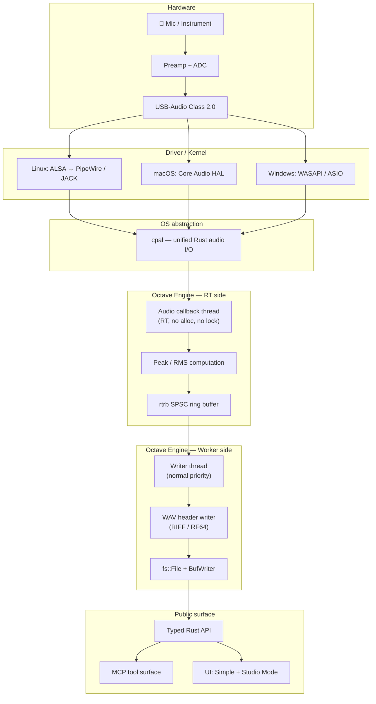
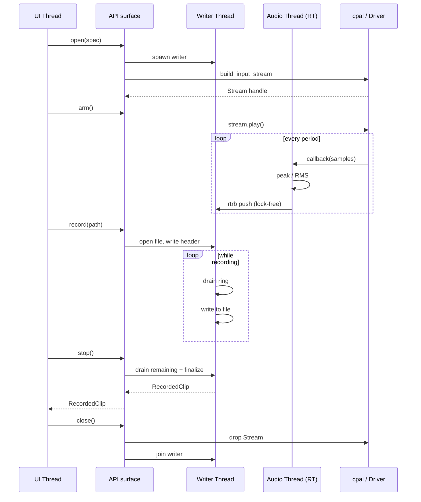
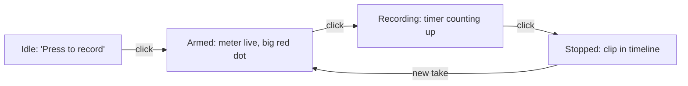

# Module: Record Audio

> *The first sample is sacred. Drop it and the song is gone.*

## 1. Mission

`record-audio` is the module that takes physical sound — a singer in front of a Focusrite Scarlett, a podcaster on a built-in laptop mic, a pianist with a USB condenser — and lands those frames on disk as a lossless, sample-accurate, fully-recoverable file. It is the foundation every other module stands on. If this module fails (drops samples, allocates on the RT thread, locks under load, mis-orders a file header), every downstream module is wrong by construction.

It is **not** the editor, the FX chain, the level pre-amp, or the monitor router. It is the smallest possible vertical slice from the metal up: hardware → driver → cpal → RT thread → lock-free ring → writer thread → file. It serves the bedroom singer and the indie filmmaker[^plan-audience] who pressed the record button and trusted us not to lose what they sang.

## 2. Boundaries

> [!IMPORTANT]
> A module that doesn't know what it isn't will leak. These bounds are deliberately tight — record-audio earns its right to exist by doing one thing exceptionally.

| In scope (v1) | Out of scope (v1) |
|---|---|
| Open one input device per session | Multi-device simultaneous capture |
| Capture all enabled channels of that device | Punch-in / punch-out / takes / comping |
| Up to the interface's max channel count and sample rate | Mid-record sample-rate or buffer-size change |
| 32-bit float internal end-to-end | Bit-depth conversion, dithering |
| Write 32-bit float WAV (auto-promote to RF64 past 3.5 GB) | Lossy formats (MP3, AAC, Opus) |
| Cross-platform via `cpal` (Linux ALSA / PipeWire / JACK; macOS Core Audio; Windows WASAPI / ASIO) | Direct platform API access bypassing `cpal` |
| Device discovery, capability query, sample-rate / buffer config | Bus / aux routing, FX chain on input |
| Lock-free RT-thread → writer-thread handoff via `rtrb` | Network-attached recording, NDI, Dante |
| Live peak + RMS level meter (per channel) | LUFS / true-peak / spectrum metering |
| Start / arm / record / stop / cancel state machine | Auto-reconnect with seamless take continuation |
| Typed Rust API + MCP tool surface | UI beyond a single-button Simple Mode + meter view |
| xrun detection and counting | xrun *prevention* via predictive buffer sizing |
| Hardware-monitoring documentation only | Software monitoring (input → output passthrough) |

The first three "out of scope" items in particular — multi-device, takes, software monitoring — are each their own future module. record-audio refuses them deliberately so its stack stays small enough to *prove* correct.

## 3. Stack walk



### 3.1 Hardware layer

The reference target is the **Focusrite Scarlett 2i2 (3rd / 4th gen)**[^scarlett]: 2 inputs, 2 outputs, USB 2.0 class-compliant, 24-bit ADC at up to 192 kHz, with vendor-published round-trip latency of ~2.74 ms at 64-sample buffer / 96 kHz on a fast machine. Its preamps are 56 dB gain, dynamic range ~111 dB. The interface enumerates as a standard USB Audio Class 2.0 device, which means **zero vendor driver needed on Linux or macOS** and a generic UAC2 driver on modern Windows.

> [!NOTE]
> Class-compliant USB-Audio support is non-negotiable for v1. Vendor drivers are out of scope. If a user has an interface that requires a proprietary driver, it works only to the extent that driver is class-compliant.

Beyond the Scarlett, three real-world hardware classes must work day-one:

| Hardware class | Example | What it gives | What it limits |
|---|---|---|---|
| Pro USB-Audio interface | Focusrite Scarlett, Clarett, MOTU M2 | Low latency, high SNR, low jitter | Phantom power, gain knobs all manual |
| Cheap USB condenser | Generic $30 USB mics | One-cable simplicity | Higher self-noise, fixed gain, sometimes 16-bit only |
| Built-in laptop mic | MacBook, ThinkPad | Always available, no cable | High self-noise, room reflections, often AGC'd by OS |

The recorder treats all three identically through `cpal` — the quality difference is in the input signal, not in our code path.

### 3.2 Driver / kernel layer

| OS | Stack | Lowest-latency path | Notes |
|---|---|---|---|
| Linux | ALSA[^alsa] (kernel) → PipeWire[^pipewire] (default on Fedora / Ubuntu 22.04+) → JACK API (compat layer or native) | PipeWire with quantum 64 / 48 kHz, or JACK with `-p 64` | PipeWire exposes a JACK-compatible API; pro users get JACK semantics for free |
| macOS | Core Audio HAL[^coreaudio] (built-in) | HAL with low buffer size, exclusive aggregate device | First-party kernel API, no installs |
| Windows | WASAPI (default) / ASIO[^asio] (vendor or universal) | ASIO for sub-10 ms; WASAPI exclusive mode otherwise | ASIO requires Steinberg SDK build flag in cpal |

What blocks, what's RT-safe:

- **The audio callback** runs on a high-priority kernel-scheduled thread (Linux: `SCHED_FIFO` set by PipeWire/JACK; macOS: time-constraint thread set by Core Audio; Windows: MMCSS Pro Audio class). It must return inside one buffer period or the next period drops samples. **No allocations, no mutexes, no syscalls** inside it.
- **Device enumeration / open / close** runs on a worker thread (always non-RT). These calls block, do allocations, and may take tens of milliseconds.
- **Driver xrun reporting** comes through the cpal error callback or the `InputCallbackInfo.timestamp` skew — both surface to a non-RT logger, never the audio thread.

### 3.3 OS / platform abstraction — `cpal`

`cpal`[^cpal] is the Rust ecosystem's de-facto cross-platform audio I/O crate. Its core surface, at the abstraction level we use:

```rust
let host = cpal::default_host();
let device: cpal::Device = host.default_input_device()
    .ok_or(OpenError::DeviceNotFound)?;
let supported: cpal::SupportedStreamConfig = device
    .default_input_config()?;
let config: cpal::StreamConfig = supported.into();

let stream: cpal::Stream = device.build_input_stream(
    &config,
    move |samples: &[f32], info: &cpal::InputCallbackInfo| {
        // RT path — runs on the audio thread.
    },
    move |err: cpal::StreamError| {
        // Error path — runs on a worker, not the audio thread.
    },
    None,  // optional timeout for backends that support it
)?;
stream.play()?;
```

We rely on cpal for: device enumeration (`Host::input_devices`), capability query (`Device::supported_input_configs`), stream construction with explicit `BufferSize::Fixed(n)`, and the ASIO build feature on Windows. We do **not** rely on cpal for sample-format conversion, error recovery, or anything beyond "give me f32 frames on the RT thread."

> [!WARNING]
> cpal's API is mostly stable but the `BufferSize` request is a *hint* on some backends (Core Audio, WASAPI shared mode). The plan budgets for the requested buffer size but verifies the actual size from the first callback's slice length.

### 3.4 Engine layer — RT side

The audio callback does exactly four things, in this order:

1. **Validate** the slice length matches `frames × channels` for the active config (assert in debug; cap-and-continue in release).
2. **Update meter atomics**: scan the slice once per channel, computing peak ($\max |x|$) and squared sum ($\sum x^2$); store both into per-channel `AtomicU32` (bit-cast from `f32`, or store the bit pattern of the dBFS value directly).
3. **Push to ring**: `producer.write_chunk_uninit(samples.len())` from `rtrb`[^rtrb], copy with `ptr::copy_nonoverlapping`, commit. `rtrb` is a single-producer single-consumer wait-free SPSC queue with an integer count and a wrap mask — no syscalls, no atomics on the hot path beyond a single fence.
4. **Bump xrun counter atomically** if the cpal `InputCallbackInfo` indicates a discontinuity (gap between expected and actual capture timestamp > one period).

If the ring is full (writer thread blocked / disk slow), the producer **drops** the buffer and increments a `dropped_samples` atomic. We do not block the audio thread under any circumstance. A dropped buffer is a real failure surfaced loudly to the user — not a silent glitch.

### 3.5 Engine layer — worker side

A dedicated **writer thread** owns the file. Its loop:

```text
loop:
  consumer.read_chunk(BLOCK_SIZE) → frames or empty
  if frames: file.write_all(bytes_of(frames))
            running_size += frames.len() * 4
            if running_size > 3.5 GB and not yet promoted: promote_to_rf64()
  else if shutting_down and ring empty: break
  else: park(WRITER_PARK_DURATION)
on shutdown:
  flush + fsync
  patch RIFF / RF64 size fields
  close file
```

The writer is allowed to allocate, lock, and block — it never touches the audio thread. Backpressure (writer too slow) is what fills the ring; we size the ring for ~1 second of audio (see §6) so it tolerates a 1-second disk pause without dropping.

### 3.6 DSP / algorithm layer

Trivial for v1. The only signal computation is peak / RMS for the meter (§5). No filtering, no resampling, no dither, no gain compensation. **The recorder is transparent.**

### 3.7 Session / app layer

A `RecordingSession` owns: the cpal `Stream`, the `rtrb::Producer`, the writer-thread `JoinHandle`, the meter atomics, the xrun counter, and the WAV header state. It exposes the typed API in §9. There is one session per recorder; the broader Octave project graph wraps it (project layer is a separate module).

### 3.8 API layer

See §9. Types are all `Send + Sync` where possible; the `RecordingHandle` is `Send` but not `Sync` (only one owner mutates state).

### 3.9 MCP layer

Every public operation is exposed as an MCP tool with a JSON schema. See §10.

### 3.10 UI layer

- **Simple Mode**: one big record button, auto-selected device (Focusrite if present else default), single peak meter.
- **Studio Mode**: device picker, per-channel arming, sample-rate / buffer-size config, per-channel peak + RMS meters, file-path input, xrun counter readout, "use hardware monitoring" hint with link to interface-specific docs.

State diagram in §11.

## 4. Data model & formats

### 4.1 Sample formats

| Format | Internal | On-disk (v1) |
|---|---|---|
| `f32` (IEEE-754 32-bit float) | ✅ Always | ✅ Always |
| `i16` | Coerced to `f32` on input if device gives it (`x / 32768.0`) | ❌ |
| `i24` (packed or aligned) | Coerced to `f32` (`x / 8388608.0`) | ❌ |
| `i32` | Coerced to `f32` (`x / 2147483648.0`) | ❌ |
| `f64` | Down-cast to `f32` (precision loss documented) | ❌ |

Coercion happens in cpal's adapter layer; we see only `f32` slices on the audio thread. **Internal end-to-end is `f32`.**

### 4.2 Sample rates

Supported (the recorder accepts any rate the device advertises, gated to this list):

`44_100`, `48_000`, `88_200`, `96_000`, `176_400`, `192_000` Hz.

Default is **48 kHz** (the AES standard for production audio, lower CPU than 96 kHz, sufficient for everything Octave outputs).

### 4.3 Channel layouts

The recorder captures all enabled input channels of the device. Channel ordering is **device-native** — i.e., whatever cpal hands us in the interleaved slice. For files with > 2 channels we use `WAVE_FORMAT_EXTENSIBLE` with a channel mask of `0x00000000` ("no spatial assignment") because Octave inputs are typically multi-mic captures, not surround mixes.

### 4.4 Frame layout

In-memory and on-wire (ring buffer): **interleaved** `f32`. For an N-channel session, the ring stores `[ch0_frame0, ch1_frame0, ..., chN-1_frame0, ch0_frame1, ...]`. This matches both cpal's input convention and WAV's on-disk convention — zero deinterleave on the RT path.

Downstream modules that need planar (per-channel buffers) deinterleave themselves; they have non-RT budgets.

### 4.5 On-disk format — 32-bit float WAV

Standard RIFF / WAVE structure:

```text
Offset  Size  Field                        Notes
------  ----  ---------------------------  ----------------------------------
   0      4   "RIFF"                       (or "RF64" if size > 4 GB)
   4      4   chunk_size (u32 LE)          file_size - 8 (or 0xFFFFFFFF for RF64)
   8      4   "WAVE"
  12      4   "JUNK"                       reserved 28-byte JUNK chunk for RF64 promotion
  16      4   28  (u32 LE)                 (becomes "ds64" if promoted)
  20     28   zeros                        (becomes 64-bit size table if promoted)
  48      4   "fmt "                       fmt subchunk
  52      4   subchunk1_size (u32 LE)      40 (for EXTENSIBLE) or 16 (for plain IEEE_FLOAT)
  56      2   format_tag (u16 LE)          0xFFFE (EXTENSIBLE) or 0x0003 (IEEE_FLOAT)
  58      2   num_channels (u16 LE)
  60      4   sample_rate (u32 LE)
  64      4   byte_rate (u32 LE)           = sample_rate * num_channels * 4
  68      2   block_align (u16 LE)         = num_channels * 4
  70      2   bits_per_sample (u16 LE)     = 32
  72      2   cb_size (u16 LE)             22 (EXTENSIBLE only)
  74      2   valid_bits_per_sample (u16)  32 (EXTENSIBLE only)
  76      4   channel_mask (u32 LE)        0 (no spatial assignment)
  80     16   subformat GUID               KSDATAFORMAT_SUBTYPE_IEEE_FLOAT
  96      4   "data"
 100      4   subchunk2_size (u32 LE)      = num_samples * num_channels * 4 (or 0xFFFFFFFF for RF64)
 104     ..   audio data                   interleaved f32 frames
```

`KSDATAFORMAT_SUBTYPE_IEEE_FLOAT` GUID = `00000003-0000-0010-8000-00aa00389b71` (little-endian byte layout).

For ≤ 2 channels we may emit the simpler 16-byte fmt with `format_tag = 0x0003` (IEEE_FLOAT), to maximise reader compatibility. For ≥ 3 channels we always emit EXTENSIBLE.

### 4.6 RF64 auto-promotion (EBU TECH 3306)

Standard RIFF caps file size at 4 GiB (32-bit chunk size field). At 32-bit float / 48 kHz / 2 channels, that's reached at ~3.7 hours; at 8 channels / 96 kHz it's reached at ~28 minutes. The recorder reserves a 28-byte `JUNK` chunk in the header at write-start. When running size approaches 3.5 GB, the writer:

1. Patches `RIFF` → `RF64` (offset 0).
2. Patches `JUNK` → `ds64` (offset 12).
3. Writes 64-bit `riff_size`, `data_size`, `sample_count` into the ds64 body (offset 20–47).
4. Sets the legacy 32-bit `chunk_size` and `data_size` fields to `0xFFFFFFFF`.

Promotion happens **once**, in-place, without a file rewrite. Pre-promotion files remain pure RIFF/WAVE.

### 4.7 Persisted representation in the project

The project file references the recorded clip by relative path: `<project_dir>/audio/captures/<take-uuid>.wav`. The `RecordedClip` returned from `stop()` contains:

```rust
pub struct RecordedClip {
    pub path: PathBuf,
    pub uuid: Uuid,
    pub sample_rate: u32,
    pub channels: u16,
    pub frame_count: u64,
    pub duration_seconds: f64,
    pub started_at: SystemTime,
    pub xrun_count: u32,
    pub dropped_samples: u64,
    pub peak_dbfs: Vec<f32>,   // per channel
}
```

## 5. Algorithms & math

### 5.1 Peak detection (per channel, per buffer)

For a buffer of $N$ frames in channel $c$:

$$
\text{peak}_c = \max_{0 \le i < N} \left| x_c[i] \right|
$$

Stored as the last-known peak in an `AtomicU32` (bit-cast from `f32`). The UI reads it at meter refresh rate (typically 60 Hz). Decay (peak-hold falloff) is applied UI-side, not in the audio thread.

### 5.2 RMS over a sliding window

For an $N$-frame buffer, the per-channel mean-square is:

$$
\text{ms}_c = \frac{1}{N} \sum_{i=0}^{N-1} x_c[i]^2
$$

We store the **mean-square** (not the square root) in the atomic, and let the consumer (UI) take $\sqrt{\cdot}$ on read. This saves one square-root per channel per callback (and `sqrt` is the most expensive op in this module).

### 5.3 dBFS conversion (UI-side, off the audio thread)

$$
\text{dBFS} = 20 \cdot \log_{10}\left( \max(\epsilon, \text{level}) \right)
$$

with $\epsilon = 10^{-9}$ to clamp $-\infty$ to a finite floor (~−180 dBFS).

### 5.4 SPSC ring (rtrb)

`rtrb` implements a wait-free single-producer single-consumer ring with a power-of-two capacity. The producer (audio thread) and consumer (writer thread) each hold a `usize` index plus an atomic `available` counter. Push:

```text
write_chunk_uninit(N):
  let head = self.head.load(Acquire)
  let tail = self.tail.load(Relaxed)
  let free = capacity - (head.wrapping_sub(tail))
  if free < N: return Err(Full)
  let slot = self.buffer.add(head & mask)
  return WriteChunkUninit { slot, n: N }
on commit(N):
  fence(Release)
  self.head.store(head.wrapping_add(N), Release)
```

Capacity must accommodate worst-case writer-thread stall. We size for **1.0 second** of audio at 192 kHz / max channels = `192_000 × max_channels × 4 bytes`. For an 8-channel session that's 6 MB. For 2 channels it's 1.5 MB. Small.

### 5.5 Buffer-size and sample-rate validation

Pre-flight check before opening the stream:

$$
\text{period}_{\text{ms}} = \frac{N_{\text{buffer}}}{f_s} \cdot 1000
$$

Reject configs where $\text{period}_{\text{ms}} < 0.5\,\text{ms}$ (below this point even modern hosts xrun) or > 100 ms (latency too high to be useful for monitoring). Warn for $\text{period}_{\text{ms}} > 21.3\,\text{ms}$ (i.e., > 1024 samples at 48 kHz; realistic only for non-monitored captures).

### 5.6 Latency budget (informational, computed and surfaced)

Round-trip input latency for the user is:

$$
t_{\text{rtl}} = t_{\text{ADC}} + t_{\text{usb}} + t_{\text{buffer}_{\text{in}}} + t_{\text{processing}} + t_{\text{buffer}_{\text{out}}} + t_{\text{DAC}}
$$

For Focusrite Scarlett @ 48 kHz / 64-sample buffer:

- $t_{\text{ADC}} \approx 0.4\,\text{ms}$
- $t_{\text{usb}} \approx 0.4\,\text{ms}$ (one USB micro-frame on USB 2.0)
- $t_{\text{buffer}_{\text{in}}} = 64/48000 \approx 1.33\,\text{ms}$
- $t_{\text{processing}} \le 0.1\,\text{ms}$ (record-audio; downstream may add more)
- $t_{\text{buffer}_{\text{out}}} \approx 1.33\,\text{ms}$
- $t_{\text{DAC}} \approx 0.4\,\text{ms}$
- **Total $\approx 4\,\text{ms}$**, well under the 10 ms project bar.

### 5.7 Numerical considerations

- `f32` provides 24 bits of mantissa, more than enough for 24-bit ADC output.
- Denormals (subnormals): with a transparent record path we don't compute below $10^{-38}$, but we set FTZ + DAZ on the audio thread anyway via platform intrinsics, to defend against future modules that do.
- NaN / Inf: any non-finite sample from the device is treated as silence (replaced with 0.0) and logged. This indicates a device or driver bug, not a recording fault.

### 5.8 Alternatives considered

| Alternative | Why rejected |
|---|---|
| Compute RMS with running-sum sliding window (more "real-time accurate") | Per-buffer RMS at meter refresh rates is plenty for level visualization; sliding-window adds state and complexity for no perceptual gain |
| Use `crossbeam-channel` for the audio→writer handoff | Mutex-based; not RT-safe even in nominally lock-free configurations |
| Use `std::sync::mpsc` | Allocates per send; will not pass `assert_no_alloc` |
| Use raw `Vec<f32>` and pass over `Mutex` | Catastrophic for the audio thread |
| Write with libsndfile via FFI | Bring in C dep for what is ~200 lines of Rust |
| Encode FLAC live | Real-time FLAC encoding is feasible but adds CPU on the writer; v1 prefers raw float for fidelity certainty |
| Per-channel files (Pro Tools style) | Doubles file count, breaks WAV reader expectations, harder to atomically version in the project |

## 6. Performance & budgets

> [!WARNING]
> Every number here is concrete and verified at acceptance. If a measurement misses, the module is not done.

### 6.1 Audio-thread (RT) budgets

Reference scenario: **48 kHz, 64-sample buffer, stereo input**.

| Metric | Budget | Measured at |
|---:|---:|---|
| Period length | 1.333 ms | 64 / 48 000 |
| Worst-case audio-callback duration | ≤ 100 µs (~7.5 % of period) | RDTSC inside callback, p99 over 1 hour soak |
| Allocations on RT path | **0** | `assert_no_alloc` in debug; `MallocNanny` style hook in release CI |
| Mutexes locked on RT path | **0** | static analysis: no `Mutex`, `RwLock`, or `parking_lot::*` reachable |
| Syscalls on RT path | **0** | `strace -f` filter on audio thread tid; assertion fails on any syscall outside `clock_gettime` |
| Dropped buffers per hour at 64-sample buffer | 0 | hour-long soak with steady disk writer |

### 6.2 Writer-thread budgets

Reference scenario: 2-channel 48 kHz / 64-sample buffer, NVMe SSD.

| Metric | Budget |
|---:|---:|
| Disk write throughput required | 384 KB/s |
| Steady-state CPU (writer + meter combined) | ≤ 2 % of one core |
| Cold-start (button press → first sample committed) | ≤ 200 ms |
| File-finalize (stop button → fsync return) | ≤ 100 ms for files ≤ 1 GB |
| File-finalize (stop button → fsync return) | ≤ 1 s for files ≤ 4 GB |

### 6.3 Memory budgets

| Item | Size |
|---|---:|
| Ring buffer (1 s headroom @ 192 kHz × 8 ch × 4 B) | 6 MB worst case |
| Ring buffer (typical 48 kHz × 2 ch × 4 B) | 384 KB |
| Writer scratch buffer | 64 KB |
| WAV header buffer (with RF64 reserve) | 128 B |
| Per-session metadata (caps, IDs, atomics) | < 4 KB |
| **Total per session (typical)** | **< 1 MB** |

### 6.4 Throughput limits

| Channels | Sample rate | Disk throughput required |
|---:|---:|---:|
| 2 | 48 kHz | 384 KB/s |
| 2 | 96 kHz | 768 KB/s |
| 8 | 48 kHz | 1.5 MB/s |
| 8 | 192 kHz | 6 MB/s |
| 18 | 192 kHz | 13.7 MB/s |

All trivially satisfied by any modern SSD; HDDs at the high end may xrun if shared with other I/O.

## 7. Concurrency & threading model



> [!NOTE]
> The note text above contains no semicolons — doc-to-dashboard converts those to commas in sequence-diagram notes.

### 7.1 Threads

| Thread | Priority | Allocates? | Locks? | Syscalls? |
|---|---|:-:|:-:|:-:|
| **Audio (cpal callback)** | RT (SCHED_FIFO / time-constraint / MMCSS Pro Audio) | ❌ | ❌ | ❌ (only `clock_gettime` for timestamps) |
| **Writer** | Normal | ✅ | ✅ | ✅ (`write`, `fsync`, `posix_fadvise`) |
| **UI** | Normal | ✅ | ✅ | ✅ |
| **cpal error callback** | Worker (cpal-managed) | ✅ | ✅ | ✅ |

### 7.2 Synchronisation primitives

- **`rtrb::RingBuffer<f32>`** — audio thread → writer thread frames. SPSC, wait-free, no allocations after construction.
- **`AtomicU32` per channel × 2** — peak (bit-cast f32), mean-square (bit-cast f32). RT writes, UI reads.
- **`AtomicU32` xrun_count, AtomicU64 dropped_samples** — RT writes, UI reads.
- **`AtomicU8` recorder_state** — UI / API writes, audio + writer threads read.
- **`std::sync::mpsc` for command channel** UI → writer (start file, stop file, finalize, abort). Always sent off the audio thread.

### 7.3 The RT/non-RT boundary, enforced

- All types reachable from the audio callback are `#[derive]`-checked to be alloc-free.
- `assert_no_alloc!{}` wraps the audio callback in debug builds; CI runs the test suite with debug + soak with `--release` + a malloc-interpose lib that aborts the process on alloc from the RT thread.
- `cargo deny` rejects accidental dependencies on alloc-heavy crates from the engine RT crate.

### 7.4 Cancellation / shutdown semantics

- **Graceful stop**: UI calls `stop()`. State transitions to `Stopping`. Audio thread keeps pushing for ≤ 50 ms more (drains in-flight period). Writer drains ring fully, finalizes header, fsyncs, returns clip. Total stop time bounded by §6.2.
- **Hard cancel**: UI calls `cancel()`. State → `Cancelling`. Audio thread continues pushing (does not block UI), but the writer immediately closes and **deletes** the partial file. Audio thread continues running for the level meter; only `close()` tears it down.
- **Process crash**: any frames already written to disk are valid. The header's `data_size` is not patched, but a recovery routine (separate tool, not v1 scope) can scan to EOF and rewrite the header.

## 8. Failure modes & recovery

| Failure | Cause | Detection | User-visible behavior | Auto recovery | Manual recovery |
|---|---|---|---|---|---|
| Device unplugged | USB removed mid-record | cpal error callback `DeviceNotAvailable` | Recording finalizes immediately at last good sample, toast: "Device disconnected" | None (v1) | User reconnects, re-arms |
| xrun (input over-run) | RT thread missed a period | `InputCallbackInfo` timestamp gap > 1 period | xrun counter increments, toast on every 10th xrun | None | Suggest larger buffer |
| Ring full → buffer drop | Writer too slow (slow disk, OS pause) | Ring `write_chunk` returns `Full` | `dropped_samples` increments, **loud red banner** "X frames dropped" | None | Suggest faster disk or smaller buffer |
| Format unsupported | User asks for rate the device doesn't advertise | Pre-flight check before `build_input_stream` | Hard fail at `open()`, error variant `FormatUnsupported { requested, supported }` | None | UI shows a chooser of supported formats |
| Disk full | `write` returns `ENOSPC` | Writer thread sees `io::Error` | Recording auto-stops, file finalized at last good frame, toast: "Disk full" | None | User clears space |
| Permission denied (file path) | OS denies open | `File::create` returns `EACCES` | `record()` fails with `PermissionDenied { path }` | None | User chooses different path |
| Sample-rate change underneath | OS / user switched device default rate mid-stream | cpal `StreamError::Backend` | Stream stops, recording finalizes | None | User re-arms |
| Clock drift (USB vs system) | UAC2 isochronous packet boundary | `InputCallbackInfo` timestamps drift > 1 ms over 1 minute | Logged, no user impact in v1 (single-device) | None | None — by design |
| File > 4 GiB approaching | Long recording at high rate | Writer running-size counter | RF64 promotion at 3.5 GB; fully transparent | Auto | None needed |
| Process crash | Panic / OOM kill / power loss | N/A (post-mortem) | Partial WAV with unpatched header | None (v1) | "Repair WAV" tool (out of v1 scope) |
| All-zero input | Cable unplugged at the analog stage | 30 s of consecutive zero peaks | Toast: "No signal detected on channel N" | None | User checks cable |
| NaN / Inf samples from device | Driver bug | Sample inspection in meter loop | Sample replaced with 0, logged; no recording corruption | Auto | None — log filed |
| Stream build fails | Wrong backend, ASIO not present | `build_input_stream` returns `Err` | `open()` fails, error includes backend identification | None | User picks different device |

## 9. API surface

> [!IMPORTANT]
> Every signature below is a stability commitment. Stable items become MCP tools without further translation. Internal items stay rust-only.

### 9.1 Types

```rust
pub struct DeviceId(pub String);   // platform-stable identifier

#[derive(Debug, Clone)]
pub struct DeviceInfo {
    pub id: DeviceId,
    pub name: String,
    pub backend: Backend,           // ALSA | PIPEWIRE | JACK | COREAUDIO | WASAPI | ASIO
    pub is_default_input: bool,
    pub is_class_compliant_usb: bool,
    pub max_input_channels: u16,
}

#[derive(Debug, Clone)]
pub struct Capabilities {
    pub min_sample_rate: u32,
    pub max_sample_rate: u32,
    pub supported_sample_rates: Vec<u32>,   // discrete set when known
    pub min_buffer_size: u32,
    pub max_buffer_size: u32,
    pub channels: Vec<u16>,                  // possible channel counts
    pub default_sample_rate: u32,
    pub default_buffer_size: u32,
}

#[derive(Debug, Clone)]
pub struct RecordingSpec {
    pub device_id: DeviceId,
    pub sample_rate: u32,
    pub buffer_size: BufferSize,
    pub channels: u16,                       // count, not mask: capture channels [0..channels)
}

#[derive(Debug, Clone, Copy)]
pub enum BufferSize { Default, Fixed(u32) }

#[derive(Debug, Clone, Copy, PartialEq, Eq)]
pub enum RecorderState {
    Idle,
    Opening,    // reserved — open() is synchronous in v0.1, never observed
    Armed,
    Recording,
    Stopping,
    Cancelling,
    Closed,     // reserved — close(self) consumes the handle, so this is never observed via state(); kept for forward-compat with a future drop-in-place teardown that splits the operations
    Errored,    // reserved — set by the cpal error callback once the surface for that lands; not yet driven from the engine in v0.1
}

pub struct RecordingHandle { /* opaque, !Send */ }
```

> [!NOTE]
> `RecordingHandle` is `!Send` because `cpal::Stream` is `!Send` on every backend. The handle must be created, used, and dropped on the same OS thread. The MCP layer enforces this via the audio actor (one thread holds the `HashMap<Uuid, RecordingHandle>`); embedders integrating the crate directly must do the same.

```rust

#[derive(Debug, Clone)]
pub struct RecordedClip {
    pub path: PathBuf,
    pub uuid: Uuid,
    pub sample_rate: u32,
    pub channels: u16,
    pub frame_count: u64,
    pub duration_seconds: f64,
    pub started_at: SystemTime,
    pub xrun_count: u32,
    pub dropped_samples: u64,
    pub peak_dbfs: Vec<f32>,
}
```

### 9.2 Operations

| Operation | Signature | Pre | Post | Errors | Stability |
|---|---|---|---|---|---|
| `list_devices` | `fn list_devices() -> Vec<DeviceInfo>` | — | Returns all enumerable input devices | — | stable |
| `device_capabilities` | `fn device_capabilities(id: &DeviceId) -> Result<Capabilities, OpenError>` | — | Returns supported configs for the named device | `DeviceNotFound`, `BackendError` | stable |
| `open` | `fn open(spec: RecordingSpec) -> Result<RecordingHandle, OpenError>` | spec valid against capabilities | Handle in `Idle` state | `DeviceNotFound`, `FormatUnsupported`, `BackendError`, `PermissionDenied` | stable |
| `arm` | `fn arm(&mut self) -> Result<(), ArmError>` | state == `Idle` | state == `Armed`, level meter live | `NotIdle`, `BuildStreamFailed` | stable |
| `record` | `fn record(&mut self, output_path: &Path) -> Result<(), RecordError>` | state == `Armed` | state == `Recording`, file open, header reserved | `NotArmed`, `OutputPathInvalid`, `PermissionDenied`, `DiskFull` | stable |
| `stop` | `fn stop(&mut self) -> Result<RecordedClip, StopError>` | state == `Recording` | state == `Idle` (terminal in v0.1; `close()` is the only legal next move — see note below), file finalized | `NotRecording`, `FinalizeFailed` | stable |
| `cancel` | `fn cancel(&mut self) -> Result<(), CancelError>` | state == `Recording` | state == `Idle` (terminal in v0.1), file deleted | `NotRecording` | stable |
| `peak_dbfs` | `fn peak_dbfs(&self, channel: u16) -> f32` | state >= `Armed` | dBFS of last buffer for that channel | — | stable |
| `rms_dbfs` | `fn rms_dbfs(&self, channel: u16) -> f32` | state >= `Armed` | dBFS of last buffer's RMS | — | stable |
| `xrun_count` | `fn xrun_count(&self) -> u32` | — | Cumulative since `open` | — | stable |
| `dropped_samples` | `fn dropped_samples(&self) -> u64` | — | Cumulative since `open` | — | stable |
| `state` | `fn state(&self) -> RecorderState` | — | Current state | — | stable |
| `close` | `fn close(self)` | — | All resources released, handle consumed | — | stable |

### 9.3 Error variants

```rust
pub enum OpenError {
    DeviceNotFound { id: DeviceId },
    FormatUnsupported { requested: RecordingSpec, supported: Capabilities },
    BackendError(String),
    PermissionDenied,
}

pub enum ArmError {
    NotIdle { current: RecorderState },
    BuildStreamFailed(String),
}

pub enum RecordError {
    NotArmed { current: RecorderState },
    OutputPathInvalid(PathBuf),
    PermissionDenied(PathBuf),
    DiskFull,
}

pub enum StopError {
    NotRecording { current: RecorderState },
    FinalizeFailed(String),
}

pub enum CancelError {
    NotRecording { current: RecorderState },
}
```

> [!IMPORTANT]
> **v0.1: stop / cancel are terminal.** Both transition to `Idle`, not back to `Armed`. The writer thread takes ownership of the SPSC consumer at `record()` time and drops it on finalize; re-arming would need a fresh ring + writer + consumer hand-off back to the handle, which is deferred. After `stop` or `cancel` the only legal next move is `close()` (then `open()` for the next take). The `Stopping → Armed` and `Cancelling → Armed` arrows in §11.3 are the post-v0.1 target — they remain in the diagram so the eventual restructure has somewhere to land.

### 9.4 Example call (Rust)

```rust
use octave_recorder::{list_devices, open, RecordingSpec, BufferSize};

let devices = list_devices();
let scarlett = devices.iter()
    .find(|d| d.name.contains("Scarlett"))
    .expect("no Scarlett connected");

let mut handle = open(RecordingSpec {
    device_id: scarlett.id.clone(),
    sample_rate: 48_000,
    buffer_size: BufferSize::Fixed(64),
    channels: 2,
})?;

handle.arm()?;
// (level meter is live; UI reads peak_dbfs / rms_dbfs)
handle.record(Path::new("audio/captures/take-001.wav"))?;
std::thread::sleep(std::time::Duration::from_secs(30));
let clip = handle.stop()?;
println!("Recorded {:.2} s, peak {:.1} dBFS",
         clip.duration_seconds, clip.peak_dbfs[0]);
handle.close();
```

## 10. MCP exposure

Every stable API operation maps to one MCP tool. The MCP server (separate module) lifts these typed Rust signatures into JSON-schema tools.

| MCP tool | Maps to API | Args (typed) | Returns | Side effect | Notes |
|---|---|---|---|---|---|
| `recording_list_devices` | `list_devices` | `{}` | `DeviceInfo[]` | none | safe |
| `recording_describe_device` | `device_capabilities` | `{ device_id: string }` | `Capabilities` | none | safe |
| `recording_start` | `open` + `arm` + `record` | `{ device_id, sample_rate, buffer_size, channels, output_path }` | `{ session_id: string, started_at: timestamp }` | creates file | **destructive** if path exists; tool requires user confirmation in default policy |
| `recording_stop` | `stop` | `{ session_id: string }` | `RecordedClip` | finalizes file | safe |
| `recording_cancel` | `cancel` | `{ session_id: string }` | `{ deleted_path: string }` | **deletes file** | requires confirmation |
| `recording_get_levels` | `peak_dbfs` + `rms_dbfs` per channel | `{ session_id: string }` | `{ peak_dbfs: number[], rms_dbfs: number[] }` | none | safe; pollable |
| `recording_get_status` | `state` + `xrun_count` + `dropped_samples` | `{ session_id: string }` | `{ state, xrun_count, dropped_samples, elapsed_seconds }` | none | safe |

The MCP server tags `recording_start` and `recording_cancel` as destructive so a hosting agent (e.g., Claude) prompts the user before invoking them. Sessions are referenced by an opaque `session_id` (UUID) so the agent never holds a raw handle.

## 11. UI surface

### 11.1 Simple Mode



Layout: device name (auto-selected), one big record button, one peak meter. That's it.

### 11.2 Studio Mode

Adds: device picker, sample-rate dropdown, buffer-size dropdown, per-channel arming, per-channel peak + RMS meters, file-path input with project-relative default, xrun + dropped-samples counter, "Use hardware monitoring" link.

### 11.3 Recorder state machine

The diagram below is the **target** state machine. The arrows annotated `(post-v0.1)` are not yet driven by the engine — see §9.1 / §9.2 for the v0.1 implemented subset.

```mermaid
stateDiagram-v2
  [*] --> Idle
  Idle --> Armed : arm()
  Armed --> Recording : record(path)
  Recording --> Stopping : stop()
  Stopping --> Idle : finalize ok (v0.1; Armed is the post-v0.1 target)
  Recording --> Cancelling : cancel()
  Cancelling --> Idle : delete ok (v0.1; Armed is the post-v0.1 target)
  Armed --> Idle : disarm() (post-v0.1)
  Idle --> Closed : close()
  Armed --> Closed : close()
  Errored --> Closed : close() (post-v0.1)
  Closed --> [*]
```

### 11.4 Keyboard / palette

| Action | Shortcut | Palette command |
|---|---|---|
| Arm device | `R` (when Idle) | `recording: arm` |
| Start recording | `Space` (when Armed) | `recording: start` |
| Stop recording | `Space` (when Recording) | `recording: stop` |
| Cancel recording | `Esc` (when Recording) | `recording: cancel` |

### 11.5 Accessibility

- All controls reachable via keyboard.
- Meter has both visual and ARIA live-region announcement at `<-3 dBFS` ("approaching clip").
- High-contrast theme tested.
- Recording state announced to screen readers at every transition.

## 12. Test strategy

### 12.1 Unit

- WAV header round-trip (write + read + byte-exact equality).
- WAV → RF64 promotion in-place (size fields correct, file still readable by `symphonia`, `hound`, `ffmpeg`).
- Format coercion (i16 / i24 / i32 / f64 → f32) bit-exact.
- Channel-mask + GUID byte layout for EXTENSIBLE.
- Ring-buffer correctness (random push / pop interleave, no data loss).

### 12.2 Integration

- Mock cpal device sourcing a known signal (sine, white noise, dirac) → record → file → byte-exact verification.
- Sample-rate sweep: 44.1, 48, 88.2, 96, 176.4, 192 kHz.
- Channel-count sweep: 1, 2, 4, 8, 18.
- 1-hour soak at 48 kHz / 64-sample buffer / 2 channels: zero dropped frames, xrun rate < 1 / hour.
- Real-hardware loopback test: signal generator → Scarlett analog out → analog in → recorded file → measured against reference recording from Reaper / Audacity on the same hardware.

### 12.3 Audio-quality

- THD+N @ 1 kHz: limited by device, not module. Pass: within 0.5 dB of reference recorder on same hardware.
- IMD: pass: within 0.5 dB of reference.
- Frequency response: flat ± 0.1 dB from 20 Hz to 20 kHz (limited by device). 
- Phase: linear ± 1° over band.
- Latency (round-trip on Scarlett @ 48 / 64): measured ≤ 10 ms.
- Clipping: digital input at ±1.0 records as ±1.0 exactly (no soft-clipping or limiting in our path).

### 12.4 Performance benchmarks

- `cargo bench` — audio-thread cost per buffer, p99 < 100 µs at 48 / 64 stereo.
- `assert_no_alloc` test — audio callback runs 10 000 times in debug, no panic.
- Malloc-interpose CI job — release build instrumented to abort on RT-thread alloc.
- Memory ceiling — 1-hour soak's RSS within ±5 % of cold-start RSS.
- Regression policy: any benchmark > 10 % slower than the prior commit blocks merge.

### 12.5 Property / fuzz

- WAV header parser fuzzed with `cargo-fuzz` against `symphonia`'s parser as oracle (any disagreement is a bug somewhere).
- RingBuffer fuzzed with random push / pop / drain sequences.

### 12.6 Manual / human-ear

- Record a vocal take, listen, confirm transparency: identical to source listening through the interface direct.
- Record a clap test: peak should be where it was clapped, no sample-misalignment.
- Compare 60-second recordings on the same hardware between record-audio and Audacity / Reaper. Spectrum-match within measurement noise.

## 13. Open questions

> [!NOTE]
> A plan with zero open questions is suspicious — depth produces questions. Each item below is something to resolve before `status: approved`.

1. **RF64 vs Sony Wave64 vs split-file at 4 GB.** RF64 is the EBU standard and strictly preferable for interop. Confirmed — but we should also document that RF64 readers are still imperfect in some legacy DAWs. Mitigation: ship a "split at 3.5 GB into multiple files" option *post-v1* if users hit interop pain.
2. **Per-channel files vs single interleaved file.** v1 ships interleaved. Pro Tools-style per-channel allows easier individual-mic muting at the file system level but doubles file count. Stay interleaved unless user feedback forces a change.
3. **BWF (Broadcast Wave) bext chunk metadata.** Tempting (timestamp, originator, comment) but adds 602 bytes and complicates RF64 promotion. Defer.
4. **Take naming convention.** Currently `take-uuid.wav`. Should the project layer impose `take-001.wav` / `take-002.wav` instead? That's the project module's call, not record-audio's — but the API needs to accept whatever the caller hands it.
5. **Pre-roll capture.** Some users want "capture the 2 seconds before I press record" — would require a continuous background ring on the audio thread. Out of v1. Note for Phase 2.
6. **Cross-platform device naming.** ALSA names are `hw:0,0`-style; PipeWire / Core Audio / WASAPI are human-readable. Standardize the surfaced `name` to the human form, with the raw platform identifier in the opaque `DeviceId`. cpal already does this — verify.
7. **ASIO build.** cpal's ASIO support needs the Steinberg SDK at compile time. Distribution implication: Windows builds require either the SDK or a fallback to WASAPI. Defer to Phase 1 scaffolding decision.
8. **PipeWire-first vs JACK-first on Linux.** Resolved at the ADR level (PipeWire first, JACK fallback, ALSA floor). cpal handles selection automatically. Verify on Fedora 40, Ubuntu 24.04, and Arch.
9. **SIMD on the RT path.** Peak / RMS are tiny; SIMD probably doesn't pay at 64 samples × 2 channels. Profile first; add only if measurable.
10. **Hot-plug device monitoring.** Not in v1. But the OS does fire events (udev on Linux, IOKit on macOS, RAWINPUT on Windows). Future module: `device-watcher`. Until then, users see the recording finalize and a toast.
11. **Sample-accurate timestamping**. cpal's `InputCallbackInfo.timestamp.capture` gives a host time. Should we record this as a side-car JSON for downstream multi-track sync? Probably yes — but defer the file format to a follow-up plan.
12. **Cancellation semantics on file paths that fail to delete.** If `cancel()` can't unlink the partial file (permissions, network FS), the operation is in an awkward state. Spec: log + leave the file + return success (cancel from the user's mental model means "I don't want this in the project," not "guarantee deletion of bytes"). Confirm with user before approval.

## 14. Acceptance criteria

A reviewer signs off and `status: approved` is set only when *all* of the following hold:

- [ ] Open Focusrite Scarlett 2i2, record stereo @ 48 kHz / 64-sample buffer for **1 hour** with **0 dropped frames** and xrun rate < 1 / hour.
- [ ] Same on a built-in laptop mic via PipeWire (Linux), Core Audio (macOS), WASAPI (Windows).
- [ ] Same with an 18-channel interface (Scarlett 18i20 or borrowed equivalent) at 48 kHz.
- [ ] Round-trip latency on Scarlett @ 48 / 64 measured ≤ 10 ms.
- [ ] `assert_no_alloc` passes in debug; release CI's malloc-interpose detects 0 RT allocations over a 10-minute soak.
- [ ] WAV files readable byte-identically by `symphonia`, `hound`, `ffmpeg`, Audacity, Reaper.
- [ ] RF64 promotion produces files readable by `ffmpeg` and Reaper; both 32-bit and 64-bit DAWs.
- [ ] All public APIs have rustdoc with at least one example each.
- [ ] All public APIs have an MCP tool definition + integration test that drives them via JSON-RPC.
- [ ] Test coverage ≥ 90 % for non-platform-specific code (line + branch).
- [ ] All 12 failure modes in §8 have an integration test demonstrating the documented behavior.
- [ ] Open questions §13.1, §13.6, §13.12 resolved or explicitly deferred with sign-off.

## 15. References

[^plan-audience]: Octave's audience — see [`PLAN.md`](../../PLAN.md) §3.
[^scarlett]: Focusrite Scarlett 2i2 (3rd / 4th gen) datasheet and round-trip-latency table — <https://focusrite.com/scarlett>.
[^cpal]: `cpal` — Cross-platform audio I/O for Rust. <https://docs.rs/cpal>.
[^rtrb]: `rtrb` — Real-time-safe single-producer single-consumer ring buffer. <https://docs.rs/rtrb>.
[^assert-no-alloc]: `assert_no_alloc` — Runtime check that an audio callback performs no heap allocation. <https://github.com/Windfisch/rust-assert-no-alloc>.
[^alsa]: ALSA — Advanced Linux Sound Architecture. <https://alsa-project.org>.
[^pipewire]: PipeWire — Modern Linux audio / video server. <https://pipewire.org>.
[^coreaudio]: Apple Core Audio HAL Programming Guide. <https://developer.apple.com/documentation/coreaudio>.
[^asio]: Steinberg ASIO SDK. <https://steinbergmedia.github.io/asio_sdk_documentation/html/index.html>.
[^wav-spec]: Microsoft WAVE / RIFF specification.
[^rf64-spec]: EBU TECH 3306 — RF64: An extended File Format for Audio. <https://tech.ebu.ch/publications/tech3306>.
[^bwf-spec]: EBU TECH 3285 — Broadcast Wave Format. <https://tech.ebu.ch/publications/tech3285>.
[^uac2-spec]: USB Audio Class 2.0 specification. <https://usb.org/document-library/usb-audio-devices-rev-30-and-adopters-agreement>.
[^adr-0001]: Octave ADR 0001 — Tech stack: Rust + CLAP. [`docs/decisions/0001-tech-stack.md`](../decisions/0001-tech-stack.md).

## 16. Glossary

**ADC**: Analog-to-Digital Converter. The chip that turns the analog mic signal into samples.

**ASIO**: Steinberg's low-latency Windows audio API. Requires SDK at build time.

**Block-align**: Bytes per audio frame across all channels. For 32-bit float stereo, 8 bytes.

**bext chunk**: BWF metadata chunk (originator, timestamp, description). Defined by EBU 3285.

**Class-compliant USB**: A USB-Audio device that works against the generic UAC2 driver — no vendor driver needed.

**cpal**: The Rust crate that abstracts cross-platform audio I/O.

**dBFS**: Decibels relative to Full Scale. 0 dBFS is digital ceiling (sample magnitude 1.0).

**DAZ**: Denormals-Are-Zero — a CPU mode that treats subnormal floats as zero, avoiding 100× slowdowns on legacy hardware.

**FTZ**: Flush-To-Zero — companion to DAZ on the output side of an FP op.

**IEEE_FLOAT**: WAV format tag `0x0003`, indicating 32-bit IEEE-754 float samples.

**Period**: The fixed number of frames the driver delivers per audio callback. Buffer size = period (in this module).

**RF64**: Extended RIFF format with 64-bit chunk sizes, for files > 4 GiB. EBU TECH 3306.

**SPSC**: Single-producer single-consumer queue. Allows wait-free implementations.

**UAC2**: USB Audio Class 2.0 — the generic class spec the OS implements once.

**xrun**: Either an under-run (output starves) or over-run (input overflows). On the input side it means a period was dropped because the host didn't service the buffer in time.

---

> *Press record. Land every sample. Trust the floor under everything else. — record-audio v0.1*
