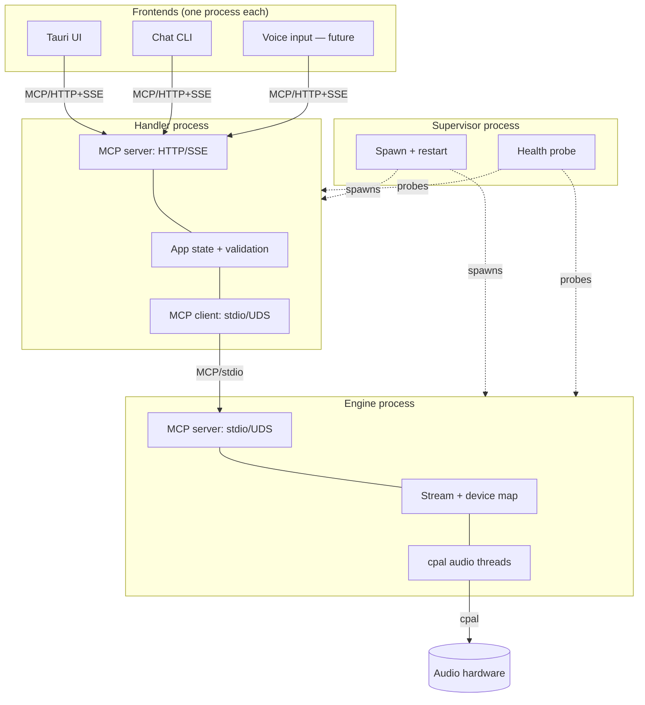
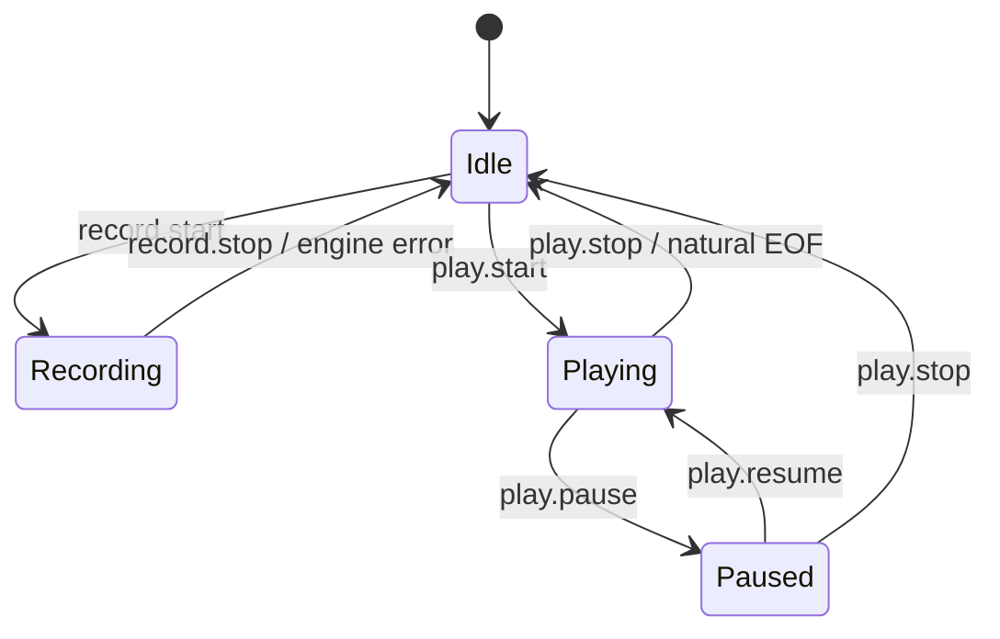

# Module: System Architecture

## 1. Mission

Octave's runtime is split across **three independent processes** plus a tiny supervisor:

- **Engine** — owns the audio hardware. Knows nothing about users, sessions, or intent.
- **Handler** — owns app state and validation. Translates user intent into engine primitives. Knows nothing about hardware.
- **Frontend(s)** — Tauri UI, chat CLI, future voice. Submit commands to the handler. Hold no audio engine state.

A small **supervisor** spawns and restarts engine + handler independently; either can die and the other keeps running. **MCP is the universal wire protocol** between every layer pair. **State changes push to subscribed frontends** so multiple input surfaces stay coherent without polling.

This module exists because the previous "engine-as-library, two facades" design failed the moment two input surfaces (UI + chat) wanted to share one set of hardware. The fix is process isolation by responsibility — what the user described as "perfectly balanced and predefined role for each layer", enforced at the binary boundary so future code can't drift.

## 2. Boundaries

> [!IMPORTANT]
> The whole point of this module is layer separation. If a future commit blurs handler ↔ engine concerns "for speed", the architecture has failed.

| In scope | Out of scope |
|---|---|
| Process layout (1 supervisor + 1 engine + 1 handler + N frontends) | Multi-machine engine (engine is local-only; hardware is local) |
| MCP wire protocol over both Unix domain socket (handler↔engine) and HTTP/SSE (frontends↔handler) | Custom binary protocols (gRPC, Cap'n Proto) — MCP-over-JSON is good enough |
| Push state-change notifications via MCP `notifications/*` (SSE for HTTP transport) | Per-field deltas — push the full state snapshot, frontends diff |
| Session/intent state in handler (current playback session, current take, device selection, take history) | Persistence — state lives only in memory, lost on handler restart |
| Validation state machine in handler (reject `pause` when nothing's playing, etc.) | Authentication / authorization — LAN trusts everyone in v1 |
| Hardware ownership in engine (cpal devices, active streams, RT thread) | Multiple parallel command streams between layers — single stream per pair, multiplexed by request id |
| Independent crash domains (engine restart doesn't touch handler and vice versa) | Hot reload of running processes (binary update needs a full restart) |
| Migration path from current code (octave-mcp → engine, new handler crate, Tauri rewrite as MCP client) | Multi-tenant — one user's session per running supervisor |

## 3. Stack walk



Per-layer breakdown:

### 3.1 Hardware layer

Unchanged from the existing audio modules — see [`record-audio` §3.1](./record-audio.md#31-hardware-layer) and [`playback-audio` §3.1](./playback-audio.md#31-hardware-layer). Single physical machine, one or more audio interfaces (typical: integrated HDA + a USB interface like the Focusrite Scarlett Solo).

### 3.2 Driver / kernel layer

Unchanged — ALSA / Core Audio / WASAPI / ASIO via cpal. The engine process is the only thing in the system that touches these. No frontend, no handler, no supervisor opens an audio device.

### 3.3 OS / platform abstraction — `cpal` (engine-only)

cpal is linked into **only the engine binary**. The handler binary doesn't depend on `octave-player` or `octave-recorder`. The frontend binaries don't either. This is the architectural enforcement — the layer-boundary is a Cargo dependency boundary.

```text
crates/octave-audio-devices  ─┐
crates/octave-player         ─┤── linked into ──> octave-engine binary only
crates/octave-recorder       ─┘
```

`octave-handler` (new crate) and `octave-app` (Tauri) and `chat/` (Node) **never see cpal at compile time**. They can't accidentally bypass the engine because the types they'd need don't exist in their dep graph.

### 3.4 Engine layer

A single binary (`octave-engine`, supersedes `octave-mcp`). Responsibilities:

- Own all `cpal::Device` handles via the existing [`DeviceCatalog`](../../crates/octave-audio-devices/src/lib.rs).
- Own all active streams. Each `start_*_stream` call returns a fresh `StreamId` (UUIDv4 minted by the engine). The engine maps `StreamId -> PlaybackHandle | RecordingHandle`.
- Speak MCP over stdio (default) or Unix domain socket (when handler explicitly passes a UDS path on spawn). Handler chooses; engine doesn't care.
- Run an audio actor thread (mirror of today's `octave-mcp::audio_actor`) so the `!Send` cpal handles stay on a single OS thread.
- Push **`notifications/stream_event`** when a stream changes state (Playing → Paused → Ended, xrun count crosses a threshold, position updates throttled to 10 Hz).

Engine is **stateless about user intent**. It knows that `StreamId X` exists; it does not know that `StreamId X` was opened "for the chat session's recording of the user's vocal take #3". That knowledge lives in the handler.

### 3.5 Handler layer

A single binary (`octave-handler`, new). Responsibilities:

- Speak MCP as a **server** to frontends (HTTP+SSE for LAN) and as a **client** to the engine (stdio/UDS).
- Hold the **AppState** (see [§4.2](#42-state-schemas-handler-side)): current playback session id (if any), current recording session id (if any), take history, user-selected default devices, plus a strict validation state machine.
- Translate user-level commands (`record(mono=true, max_seconds=10)`) into engine primitives (`open_input_device`, `start_input_stream`, internal timer, `stop_stream`).
- Validate every incoming command against the current state and reject with a clear error when the command isn't allowed (`pause` while idle → `NotPlaying`).
- Push **`notifications/state_changed`** to all subscribed frontends whenever AppState changes.

Handler is **stateless about hardware**. It does not know what a `cpal::Device` is. It manipulates engine via MCP tool calls only.

### 3.6 Frontend layer

Three flavours initially:

- **Tauri UI** — `octave-app`, the existing React-on-Tauri shell. Becomes a thin MCP client: connects to handler over HTTP+SSE on localhost, subscribes to `state_changed`, renders. All audio actions are MCP tool calls.
- **Chat CLI** — `chat/`, the standalone Node project. Already an MCP client today (talks to `octave-mcp` directly); switches to talking to the handler.
- **Voice input — future** — separate Node/Python process: speech-to-text → command synthesis → MCP tool calls. Not built in v1; the architecture must not need to change to add it.

Each frontend runs in its own process. None hold engine state. None hold app state — they cache the latest snapshot from `state_changed` for rendering, that's it.

### 3.7 Supervisor layer

A tiny binary (`octave-supervisor`, new). The user runs `octaved` (or `octave-supervisor`) and that's the only command they need. Responsibilities:

- Spawn `octave-engine` + `octave-handler` at startup. Pass the handler the engine's UDS path (or stdio fds) so they can connect.
- Watch each child. If either exits (crash or clean shutdown), restart it. Cap restart frequency (3 restarts in 30s → give up + log + exit, so we don't tight-loop on a deterministic crash).
- Optionally probe health by calling `notifications/ping` over each child's MCP transport every 5s; restart on timeout.
- Forward SIGTERM / SIGINT to children (graceful shutdown).
- Print a single log line per child event so the user can see what's happening.

Supervisor is **stateless about everything**. Doesn't know what audio is, what a session is, what MCP is beyond "ping over JSON-RPC". The model is Erlang/OTP's `simple_one_for_one` supervisor[^otp].

### 3.8 MCP layer

The wire is **MCP everywhere** — both the frontend↔handler boundary and the handler↔engine boundary. Two implications:

- Tools and notifications follow the MCP spec[^mcp-spec]. Frontends don't need to learn a new protocol; if they already speak MCP, they speak our handler.
- The same `octave-mcp` crate (renamed `octave-engine`) becomes the canonical engine surface; the new `octave-handler` exposes the **higher-level intent** surface (record / play / pause) as a separate MCP server with its own tool set. Two distinct MCP surfaces, one for each layer-pair.

External MCP clients (Claude Desktop, future agents on other machines) connect to the **handler's** HTTP+SSE endpoint and get the high-level surface. They don't talk to the engine directly. This is the LAN-exposed surface the user signaled wanting.

### 3.9 UI surface

> [!NOTE]
> This module is below the UI; the UI is a *consumer*. See [`record-audio` §3.10](./record-audio.md#310-ui-layer-if-any) and [`playback-audio` §3.10](./playback-audio.md#310-ui-layer) for actual UI specs. This module's only UI requirement is that frontends **must not** depend on engine crates — enforced by Cargo / package.json.

## 4. Data model & formats

### 4.1 Process spawning + transport contract

| Process | Binary | Spawned by | MCP role | Transport |
|---|---|---|---|---|
| Supervisor | `octave-supervisor` | user / systemd | none | — |
| Engine | `octave-engine` | supervisor | server | stdio (default) or UDS at `$XDG_RUNTIME_DIR/octave/engine.sock` |
| Handler | `octave-handler` | supervisor | server (north) + client (south) | listens on `127.0.0.1:7474` (HTTP/SSE) by default; configurable to `0.0.0.0:7474` for LAN |
| Tauri frontend | `octave-app` | user / desktop env | client | HTTP/SSE → `OCTAVE_HANDLER` env (default `http://127.0.0.1:7474`) |
| Chat frontend | `chat/` | user | client | HTTP/SSE → `OCTAVE_HANDLER` env |

Default ports / paths chosen to avoid collisions with common services. All overridable via env vars before users start packaging.

### 4.2 State schemas (handler-side)

Single source of truth for all frontends. Pushed in full on every change.

```rust
// Wire shape (JSON, schemars-derived JSON Schema available via MCP).
struct AppState {
    /// Monotonically increasing; frontends use it to dedupe pushed snapshots.
    revision: u64,
    /// Currently-active playback, if any. None when nothing's playing.
    playback: Option<PlaybackSessionState>,
    /// Currently-active recording, if any.
    recording: Option<RecordingSessionState>,
    /// User's selected output device id. None means "no preference, use system default".
    selected_output_device: Option<DeviceId>,
    /// User's selected input device id.
    selected_input_device: Option<DeviceId>,
    /// In-memory take history. Capped at MAX_TAKES (32) — older takes evicted FIFO.
    /// Each entry is metadata only; the WAV files live on disk at the recorded path.
    takes: Vec<TakeMetadata>,
}

struct PlaybackSessionState {
    /// UUID minted by the handler at session start. Distinct from the engine's StreamId.
    session_id: SessionId,
    /// Engine's stream id; handler uses this to address the engine.
    engine_stream_id: StreamId,
    /// What's playing. Either a recorded take or an arbitrary file path.
    source: PlaybackSource,
    /// Most recent engine status snapshot (state, position, duration, xrun_count).
    last_status: PlaybackStatus,
    started_at: SystemTime,
}

struct RecordingSessionState {
    session_id: SessionId,
    engine_stream_id: StreamId,
    /// Where the engine is writing the WAV.
    output_path: PathBuf,
    /// Mono-fold mode (see record-audio §3.4).
    mono: bool,
    last_status: RecordingStatus,
    started_at: SystemTime,
}

struct TakeMetadata {
    take_id: TakeId,
    path: PathBuf,
    sample_rate: u32,
    channels: u16,
    duration_seconds: f64,
    peak_dbfs: f32,
    recorded_at: SystemTime,
    /// Was this take captured as mono-folded stereo? (UI hint.)
    mono_folded: bool,
}
```

### 4.3 Command schemas

Two distinct surfaces:

**Frontend → Handler (high-level intent).** The handler's MCP tool set:

| Tool | Purpose | Args | Returns |
|---|---|---|---|
| `state.get` | Snapshot of `AppState` | — | `AppState` |
| `state.subscribe` | Subscribe to `state_changed` notifications | — | (notification stream) |
| `devices.list` | List input + output devices via the engine's catalog | `direction: input \| output` | `DeviceInfo[]` |
| `devices.select_output` | Set the user's preferred output device | `device_id: DeviceId` | `AppState` |
| `devices.select_input` | Same, for input | `device_id: DeviceId` | `AppState` |
| `record.start` | Begin recording | `device_id?: DeviceId, mono: bool, max_seconds?: f64` | `SessionId` |
| `record.stop` | Stop the active recording | `session_id?: SessionId` | `TakeMetadata` |
| `play.start` | Play a take or arbitrary WAV | `source: { take_id?: TakeId, path?: string }, device_id?: DeviceId` | `SessionId` |
| `play.pause` | Pause the active playback | `session_id?: SessionId` | `PlaybackStatus` |
| `play.resume` | Resume paused playback | `session_id?: SessionId` | `PlaybackStatus` |
| `play.stop` | Stop the active playback | `session_id?: SessionId` | `PlaybackStatus` |
| `play.seek` | Seek within active playback | `session_id?: SessionId, position_seconds: f64` | `PlaybackStatus` |
| `takes.delete` | Remove a take from history (and unlink the WAV) | `take_id: TakeId` | `AppState` |

`session_id` parameters are optional because at most one session per direction exists (single-session enforcement); explicit ids are accepted for symmetry with future multi-session work.

**Handler → Engine (low-level primitives).** The engine's MCP tool set as shipped after [phase 1 rename](#16-glossary):

| Tool | Purpose | Args |
|---|---|---|
| `output_list` / `input_list` | Enumerate devices | — |
| `output_describe` / `input_describe` | Capabilities for one device | `device_id: DeviceId` |
| `output_start` | Build + start a playback stream | `device_id, source: file_path \| buffer, buffer_size` |
| `input_start` | Build + start a recording stream | `device_id, sample_rate, channels, buffer_size, output_path` |
| `output_pause` / `output_resume` / `output_stop` / `output_seek` | Transport on the active output stream | `stream_id, ...` |
| `output_status` / `output_levels` / `input_status` / `input_levels` | Read-only snapshots | `stream_id` |
| `input_stop` / `input_cancel` | Terminal ops on the active input stream (finalise vs discard) | `stream_id` |

Tool names are snake_case (more LLM-friendly than dotted notation; both are valid MCP, snake_case is the convention every reference server uses). Cross-direction transport (`stream_pause` etc.) is reserved for a future tier when concurrent multi-stream lands; today single-session-per-direction means `output_*` and `input_*` namespacing carries the load.

### 4.4 Notification schemas

Push events from handler → frontends and engine → handler:

| Notification | Source | Payload | Throttle |
|---|---|---|---|
| `notifications/state_changed` | handler | full `AppState` snapshot | coalesce within 16 ms (~60 fps) |
| `notifications/stream_event` | engine | `{ stream_id, kind: state \| position \| xrun \| error, ... }` | position events at 10 Hz; state/error fire immediately |
| `notifications/ping` | supervisor | `{ ts }` | 5s |

Coalescing: if multiple state changes happen within the throttle window, only the most recent snapshot is pushed. Frontends always see consistent states, never partial transitions.

### 4.5 Persistence

**N/A — v1 is in-memory only.** When the handler restarts, takes vanish from history (the WAV files on disk survive — the user can re-import them). When the engine restarts, all streams die. Persistence (project files, session save / restore) is its own future module.

## 5. Algorithms & math

**N/A — this module is structural.** The audio algorithms live in [`record-audio`](./record-audio.md) and [`playback-audio`](./playback-audio.md), unchanged. The validation state machine in [§7.4](#74-validation-state-machine) is logic, not math.

## 6. Performance & budgets

> [!WARNING]
> Process boundaries add latency. Audio-thread budgets are still owned by the engine (and unchanged from the audio modules); the new budgets here are about command roundtrip and state propagation.

| Metric | Budget | Measured at |
|---|---:|---|
| Command roundtrip (frontend → handler → engine → ack) | ≤ 5 ms p50, ≤ 20 ms p99 | localhost loopback, 1 KB request, no audio under load |
| State change → push delivered to all frontends | ≤ 10 ms p99 | handler-local fanout, ≤ 5 frontends connected |
| Engine cold start (supervisor spawns engine, handler can issue first command) | ≤ 500 ms | release build, dev `cargo run` is excluded |
| Handler cold start | ≤ 200 ms | release build |
| Per-process memory (steady state, no audio) | ≤ 10 MB handler, ≤ 50 MB engine, ≤ 5 MB supervisor | resident set, single take in history, no streams active |
| Audio-thread RT budget | unchanged from [`playback-audio` §6.1](./playback-audio.md#61-audio-thread-rt-budgets) | — |

The 5 ms command roundtrip target rules out heavy serialization choices. JSON over MCP is fine; we measured \~0.2 ms encode + \~0.1 ms localhost-loopback + \~0.3 ms decode for a typical tool call.

## 7. Concurrency & threading model

### 7.1 Process model

Four kinds of OS process:

- **Supervisor** — single thread, blocking I/O on child stdio + a timer. No async runtime. ~100 lines of code.
- **Engine** — Tokio runtime for MCP transport, dedicated `octave-engine-audio` OS thread holding the `!Send` cpal handles (mirror of [`octave-mcp::audio_actor`](../../crates/octave-mcp/src/audio_actor.rs)), one cpal-spawned audio thread per active stream.
- **Handler** — Tokio runtime for two MCP transports (server + client) and the state machine. Single state thread (the state lives behind a `tokio::sync::RwLock`); event fanout is async.
- **Frontends** — whatever they like. Tauri uses Tauri's runtime + browser; chat uses Node's event loop.

### 7.2 Wire serialization (handler ↔ engine)

The handler is the **single client** of the engine. Concurrency on the engine side is managed by the engine's audio actor (one thread, command queue). Multiple concurrent handler-side calls are fine — the engine serializes them through its actor. Future multi-handler scenarios (clustered handlers, hot-spare) would require engine-side request multiplexing, which is out of scope for v1.

### 7.3 Wire serialization (frontends ↔ handler)

The handler is **multi-client**. Each frontend gets its own SSE subscription. Tool calls are independent HTTP requests (HTTP/2 or HTTP/1.1 with keep-alive). The handler's `RwLock<AppState>` serializes writers; readers run in parallel. State-change push is broadcast to every subscriber.

### 7.4 Validation state machine

Per-command rules, evaluated by the handler under a write-lock on `AppState` so the check + state transition is atomic:



> [!NOTE]
> Recording and Playback are **independent** state machines — the user can record and play simultaneously (a vocal punch-in over a backing track is the obvious motivation). Both are single-session; v1 doesn't allow two concurrent recordings or two concurrent playbacks.

Reject-with-error rules (a non-exhaustive sample):

| Command | Rejected when | Error |
|---|---|---|
| `record.start` | recording already active | `AlreadyRecording { active_session: SessionId }` |
| `record.stop` | no recording active | `NotRecording` |
| `play.pause` | no playback active OR state ≠ Playing | `NotPlayable { current: PlaybackState }` |
| `play.resume` | no playback active OR state ≠ Paused | `NotResumable { current: PlaybackState }` |
| `play.seek` | no playback active OR state == Ended | `NotSeekable { current: PlaybackState }` |
| `devices.select_*` | device id not in current device list | `UnknownDevice { id: DeviceId }` |

### 7.5 Cancellation / shutdown semantics

- **Frontend disconnect** — handler cleans up SSE subscription. State is preserved (other frontends still see it).
- **Handler shutdown** — handler sends `stream.stop` for every active engine stream, then closes its connection to the engine. Supervisor sees handler exit, restarts it. New handler starts with empty `AppState`.
- **Engine shutdown** — engine drops all active streams (close the cpal handles, finalize any in-flight WAVs). Supervisor sees engine exit, restarts it. Handler reconnects, learns its previous `engine_stream_id`s are gone, resets active sessions to None.
- **Supervisor SIGTERM** — supervisor sends SIGTERM to both children, waits up to 3 s, escalates to SIGKILL. Frontends see their SSE streams close.

## 8. Failure modes & recovery

| Failure | Cause | Detect | User-visible | Auto recovery | Manual recovery |
|---|---|---|---|---|---|
| Engine crash | bug in engine, hardware-driver hang, OOM | supervisor sees child exit | Frontend SSE pushes `state_changed { playback: None, recording: None, error: "engine restarted" }` | supervisor restarts engine; handler reconnects; sessions LOST | user re-issues commands |
| Handler crash | bug in handler, OOM | supervisor sees child exit | Frontends' SSE streams close (504 / connection reset) | supervisor restarts handler; frontends reconnect; AppState LOST | user re-issues commands |
| Engine + handler version skew | rolling update, manual swap | wire-level handshake fails on connect | handler logs `engine_version_mismatch` and exits; supervisor restarts; loops up to 3× then bails | none | user updates both binaries |
| Frontend disconnect | network blip, app close | handler sees SSE EOF | nothing user-visible (other frontends unaffected) | frontend reconnects on its own | — |
| Supervisor crash | bug in supervisor | user notices everything dies | nothing comes back | none | user restarts `octaved` |
| Handler can't reach engine on connect | engine bind not yet ready | first MCP request fails | handler retries with backoff (50ms / 200ms / 1s, 3 attempts) | within ~2 s | none |
| Frontend can't reach handler | handler not running, wrong port | initial GET fails | frontend shows "handler offline — start `octaved`" | frontend retries on user action | start the supervisor |
| Concurrent conflicting commands (UI clicks Record at the exact moment chat issues record.start) | race | second command sees `AlreadyRecording` (handler atomicity) | one input wins, other gets clear error | none — by design | the loser issues `stop` first |
| Engine-stream-id stale after engine restart | engine restarted between handler's last cached id and next call | engine returns `UnknownStream` | handler receives error, clears its `last_status` cache, broadcasts `state_changed` with sessions=None | handler-side | user re-issues commands |
| LAN frontend on a slow link | high-latency Wi-Fi, SSE throttled | state pushes arrive late | UI feels sluggish (200-500 ms instead of <50 ms) | none v1 | use wired connection |
| Hardware unplug | USB removal | engine cpal error callback | engine closes the affected stream, pushes `stream_event { kind: error }` | handler updates AppState, pushes `state_changed` to frontends | user re-plugs, re-issues |

## 9. API surface

The full surface is in [§4.3](#43-command-schemas). Per-operation contracts (selected) are below.

### 9.1 Handler operations (frontend-facing)

```rust
// `record.start` — begin a recording session.
pub fn record_start(
    device_id: Option<DeviceId>,
    mono: bool,
    max_seconds: Option<f64>,
) -> Result<SessionId, RecordStartError>;

pub enum RecordStartError {
    AlreadyRecording { active_session: SessionId },
    UnknownDevice { id: DeviceId },
    EngineUnreachable,
    EngineRejected(String),
}
```

Pre: no recording active. Post: AppState carries the new `recording`. Notification: `state_changed`.

```rust
// `play.start` — play a take or arbitrary WAV.
pub fn play_start(
    source: PlaybackSourceArg, // either { take_id } or { path }
    device_id: Option<DeviceId>,
) -> Result<SessionId, PlayStartError>;

pub enum PlayStartError {
    AlreadyPlaying { active_session: SessionId },
    UnknownTake { id: TakeId },
    SourceUnreadable { reason: String },
    UnknownDevice { id: DeviceId },
    EngineUnreachable,
    EngineRejected(String),
}
```

Pre: no playback active, source resolvable. Post: AppState carries the new `playback`. Notification: `state_changed`.

### 9.2 Engine operations (handler-facing)

Engine operations carry forward the existing tool set with the wire renames applied in [phase 1](#16-glossary): `playback_*` → `output_*`, `recording_*` → `input_*`, `*_get_status` → `*_status`, `*_get_levels` → `*_levels`, `playback_session_id` / `recording_session_id` → `stream_id`. Internal Rust enums (`Command::PlaybackStart`, etc.) keep their old names — only the MCP wire surface is the contract.

### 9.3 Stability tier

| Surface | Tier | Notes |
|---|---|---|
| Handler MCP tools (§4.3 first table) | `experimental` v0.x → `stable` at v1.0 | LAN-exposed; agents (Claude Desktop etc.) consume directly |
| Engine MCP tools (§4.3 second table) | `internal` | only the handler is supposed to call these; not LAN-exposed |
| Notification schemas (§4.4) | `experimental` | shape may shift as we learn what frontends actually need |

## 10. MCP exposure

Already covered in §3.8 + §4.3 + §4.4. Two separate MCP surfaces:

- **Handler MCP** — the LAN-exposed surface. External agents (Claude Desktop) connect here. v1 trusts everyone on the LAN; auth is a future module.
- **Engine MCP** — local-only, single-client (the handler). Engine binds either stdio (when supervisor spawned it via stdio) or a UDS at `$XDG_RUNTIME_DIR/octave/engine.sock`. Never bound to a network interface.

## 11. UI surface

N/A — see §3.9. The UI side of every user-meaningful operation is specified in the consuming module (record-audio, playback-audio). This module's only constraint on UI: **frontends do not link engine crates**, enforced by Cargo / package.json.

## 12. Test strategy

### 12.1 Unit tests

- **Handler validation state machine**: every (command, current state) pair → expected outcome (accept + state transition / reject + error). Fully deterministic; runs without a real engine via an in-memory engine mock.
- **Supervisor restart logic**: mock children that exit on cue; assert restart count, backoff, give-up cap.
- **Engine actor**: existing tests in `octave-player` / `octave-recorder` / `octave-audio-devices` carry over unchanged.

### 12.2 Integration tests

- **Engine binary against handler binary**: spawn both as real processes, drive the handler over MCP, assert engine state via the engine's own debug surface.
- **Multi-frontend coherence**: two MCP clients connect to the handler, one issues `record.start`, both must receive `notifications/state_changed` within 50 ms with the same `revision` number.
- **Crash + restart**: kill the engine mid-recording, assert handler observes the disconnect, pushes `state_changed { recording: None }` within 1 s, supervisor restarts engine, next `record.start` succeeds.

### 12.3 Audio quality tests

Inherited from the audio modules; not re-tested at this layer.

### 12.4 Performance benchmarks

- **Command roundtrip**: harness sends 1 000 sequential `state.get` calls, asserts p50 ≤ 5 ms, p99 ≤ 20 ms.
- **State fanout**: 5 subscribed frontends, handler issues a state change, measure max delivery latency.

### 12.5 Property tests

- The validation state machine is small enough to exhaustively enumerate in unit tests; no fuzzing needed.
- Wire JSON: `serde_json` round-trip property test on every command + notification shape.

### 12.6 Manual / human-ear tests

- "I record from the chat while the UI is showing the device picker" — UI updates in real-time without polling.
- "I kill the engine while recording" — UI shows a useful error, the partial WAV survives on disk.

## 13. Open questions

1. **Engine UDS vs stdio.** Handler-spawned engines could use stdio; supervisor-spawned ones can't (supervisor can't proxy stdio). UDS is the more general path. Resolve: ship UDS only; remove stdio from the engine binary.
2. **MCP notification spec maturity.** The MCP spec[^mcp-spec] supports `notifications/*` but transport-level push semantics over HTTP/SSE are still settling in client SDKs. Resolve: prototype with `@modelcontextprotocol/sdk`'s SSE transport; fall back to long-poll if push is unstable.
3. **State snapshot vs delta.** `state_changed` pushes a full `AppState`. With take history capped at 32, this is ~5 KB per push — tolerable. If the take cap grows or per-track waveform data lands in state, switch to a delta protocol or split takes into a separate `notifications/take_added`. Resolve: revisit when state size > 50 KB.
4. **Handler ↔ engine versioning.** The handshake should include both versions. Mismatch → handler exits, supervisor logs a clear error. Resolve: define a `version` field in the MCP `initialize` request's `clientInfo` / `serverInfo` and check on connect.
5. **Multiple concurrent playbacks (multi-stem).** v1 is single-session. Eventually a "play backing track + monitor mic with effects" workflow needs two playbacks. Resolve: the engine already supports multiple stream ids; the handler's single-session enforcement is the only blocker. Lift it when the use case arrives.
6. **Voice input architecture.** Speech-to-text upstream, MCP downstream — straightforward, but the STT process (Whisper local? cloud?) has its own resource profile. Resolve: defer to its own module plan when the work starts.
7. **Auth on the LAN-exposed handler.** Anyone on your Wi-Fi can issue `record.start` once the handler binds `0.0.0.0`. Token-based auth is the obvious next step. Resolve: ship v1 with bind defaulting to `127.0.0.1`; expose an explicit `--lan` flag the user opts into knowingly; design auth in a follow-up module.
8. **Persistence of takes across handler restarts.** Currently restart = lose history. The on-disk WAVs survive; we'd just need to re-index them. Resolve: a tiny SQLite (or JSON) take index in `~/.local/state/octave/takes.json`, written on every `state_changed`, read on handler startup. Worth doing in v1.5.
9. **Engine on a different machine?** "Engine is local because hardware is local" is mostly true, but a future "remote interface over the network" use case (the audio interface lives in another room) might want engine on machine A and handler on machine B. Resolve: out of scope; the architecture doesn't preclude it (engine speaks MCP; could expose HTTP just like the handler), but no plan for v1.
10. **Logging aggregation.** Each process logs to its own stderr today. With a supervisor in the picture, supervisor could tee both children's stderr into one stream. Resolve: ship v1 with per-process logs; add aggregation if the user complains.

## 14. Acceptance criteria

- [ ] Three binaries build and run: `octave-supervisor`, `octave-engine` (renamed from `octave-mcp`), `octave-handler` (new).
- [ ] `octaved` is the single user-visible command; it spawns engine + handler and reports both reachable.
- [ ] Tauri shell (`octave-app`) no longer depends on `octave-player` or `octave-recorder` at the Cargo level. Verified by `cargo tree --no-default-features -p octave-app | grep -E "octave-(player|recorder|audio-devices)"` returning nothing.
- [ ] Tauri UI behaviour identical to today (record / play / pause / device pick) — but every user action now flows through the handler via MCP.
- [ ] Chat CLI (`chat/`) works against the handler with no code change to its tool surface (handler exposes the high-level surface that's a strict superset of what the engine exposes today).
- [ ] Two frontends connected simultaneously: starting a recording from one updates the other within 50 ms.
- [ ] Killing the engine process restarts it within 2 s; UI surfaces a clear "engine restarted" message; user can issue a new recording immediately.
- [ ] `cargo test --workspace` passes; new tests cover the validation state machine and the engine-restart recovery path.
- [ ] `cargo clippy --workspace --all-targets -- -D warnings` clean.
- [ ] All affected module plans (`record-audio`, `playback-audio`, `mcp-layer`) carry an "after this lands" cross-reference to this doc.

## 15. References

[^mcp-spec]: Anthropic, "Model Context Protocol Specification" (2024-11-25 → current). <https://spec.modelcontextprotocol.io/>

[^otp]: Joe Armstrong et al., "OTP Design Principles — Supervisor Behaviour", Erlang/OTP documentation. The "spawn + restart with crash-frequency cap" pattern in §3.7 is `simple_one_for_one` adapted for two named children. <https://www.erlang.org/doc/system/sup_princ.html>

[^reaper-osc]: Cockos, "REAPER Open Sound Control" — long-running example of a DAW with a wire-protocol-only control surface. Inspiration for "the wire is the contract".

[^bitwig-controller]: Bitwig Studio, "Controller API" — another DAW with a strict layer between control surface and engine. Confirms the pattern scales.

[^mcp-rust]: rmcp crate, used by the existing `octave-mcp`. <https://docs.rs/rmcp> — carries forward into the engine binary.

## 16. Glossary

**Supervisor**: The tiny process that spawns and restarts engine + handler. Holds no application state.

**Engine**: The audio-hardware-owning process. Speaks MCP; its tools are low-level primitives (`output.start_stream`, `stream.pause`).

**Handler**: The intent + state-owning process. Speaks MCP both to frontends (server, north) and to the engine (client, south). Its tools are high-level (`record.start`, `play.pause`).

**Frontend**: Any process that submits commands to the handler (Tauri UI, chat CLI, future voice). Holds no state beyond cached snapshots from `state_changed`.

**Session**: Handler-side concept — a logical recording or playback. Identified by `SessionId` (UUID minted by handler).

**Stream**: Engine-side concept — a single open cpal stream. Identified by `StreamId` (UUID minted by engine). One session maps to exactly one stream during its lifetime.

**Take**: A finished recording. Has `TakeId`, `path`, metadata. Lives in handler's history; the WAV lives on disk.

**Notification**: A push event over MCP from server to client. The handler pushes `state_changed`; the engine pushes `stream_event` to the handler.
